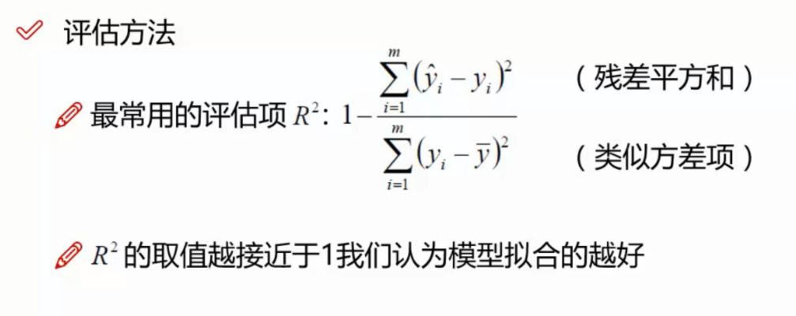

## 线性回归

 

--------

 

--------

 

--------

 

--------

 

--------

 

--------

 

--------

### 梯度下降方法

> 批量梯度下降

    容易得到最优解，但是由于每次考虑所有样本，速度很慢

> 随机梯度下降

    每次找一个样本，迭代速度快，但不一定每次都朝着收敛的方向

> 小批量梯度下降

    每次更新选择一小部分数据来算，实用！
    32、64、128
