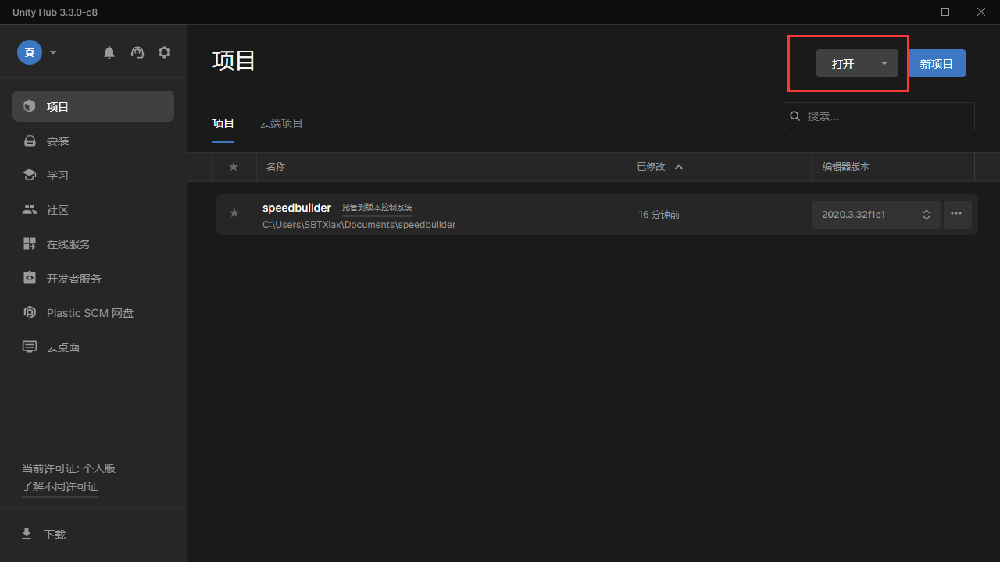
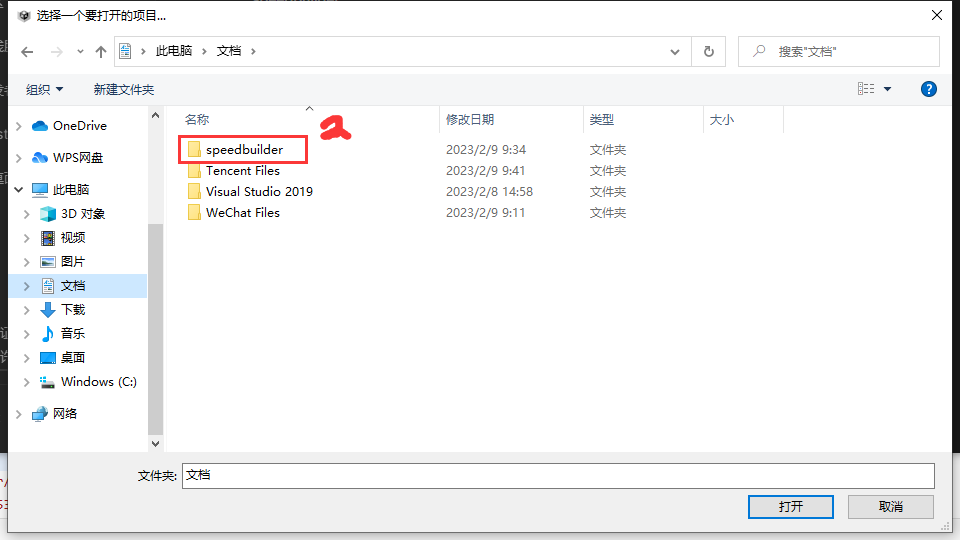
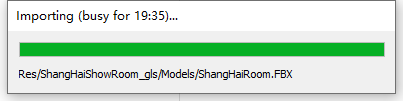
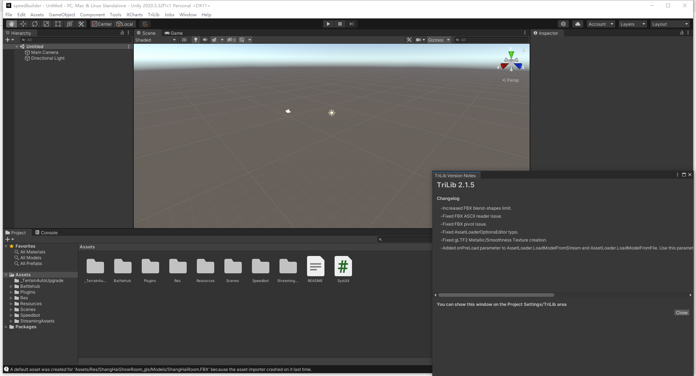
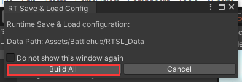

[TOC]
# 前言

继按流程操作完【环境配置】里的“Unity安装配置”和“Sourcetree安装配置”教程之后，就可以打开拉取完的项目进行开发了。下面是对应的流程步骤和提示。

# 1 选择对应路径打开工作项目

直接在UnityHub里面点击打开点击按钮，**选择speedbuilder路径**，点击打开就能开始打开项目了！

# 2 Unity的弹窗选择

选择speedbuilder路径打开项目之后，Unity会弹窗提示是否选择自动更新API，此时默认许可即可。

注意后面的选择弹窗**不要进入安全模式**（进入安全模式会有问题）。

# 3 工作项目初加载及所需操作

初次打开项目可能需要的时间比较长，耐心等待即可（若长时间没加载成功，建议任务管理器**重启unity**再点击项目试一遍）

项目加载成功后如下：

**一定要点击 build all 才能正确打开项目**

如此操作后一般不会出现报错，之后就可以选择对应的脚本/模型进行开发了！