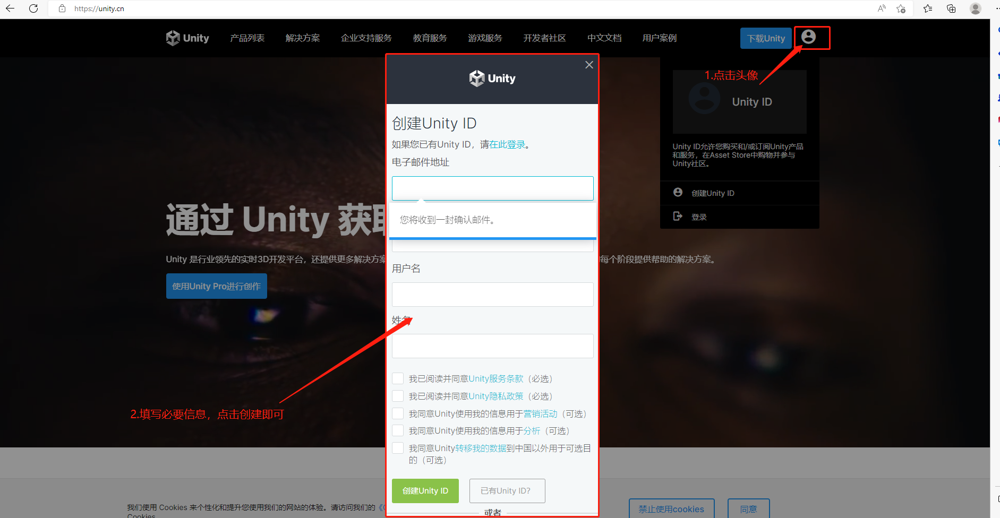
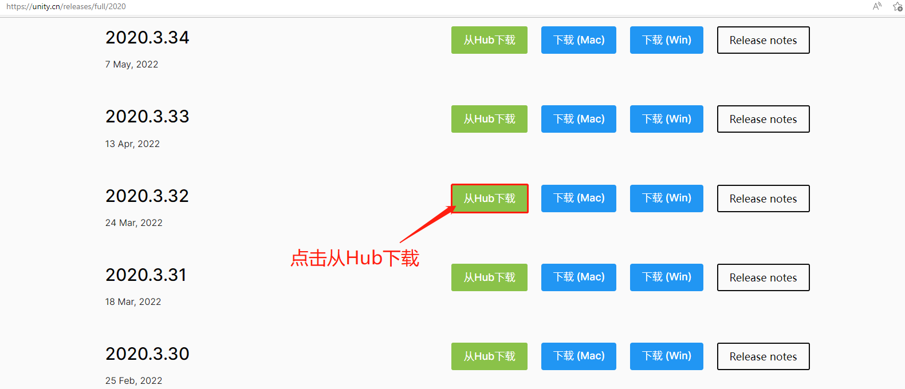
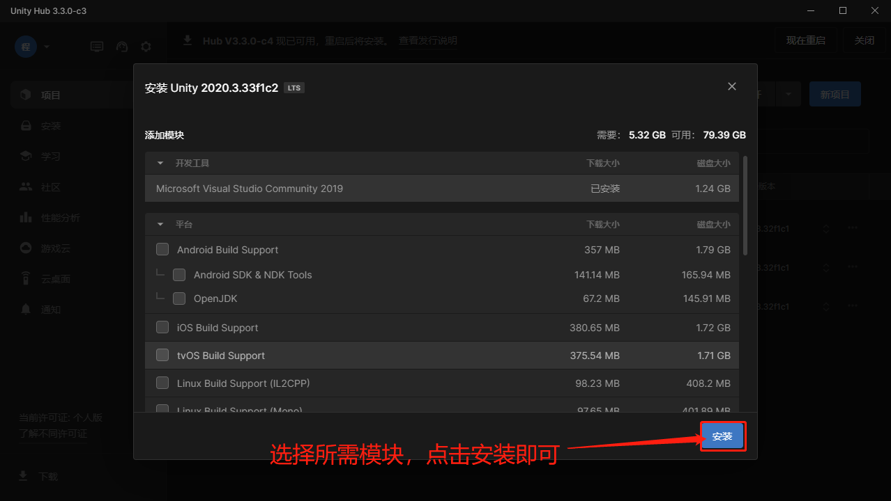
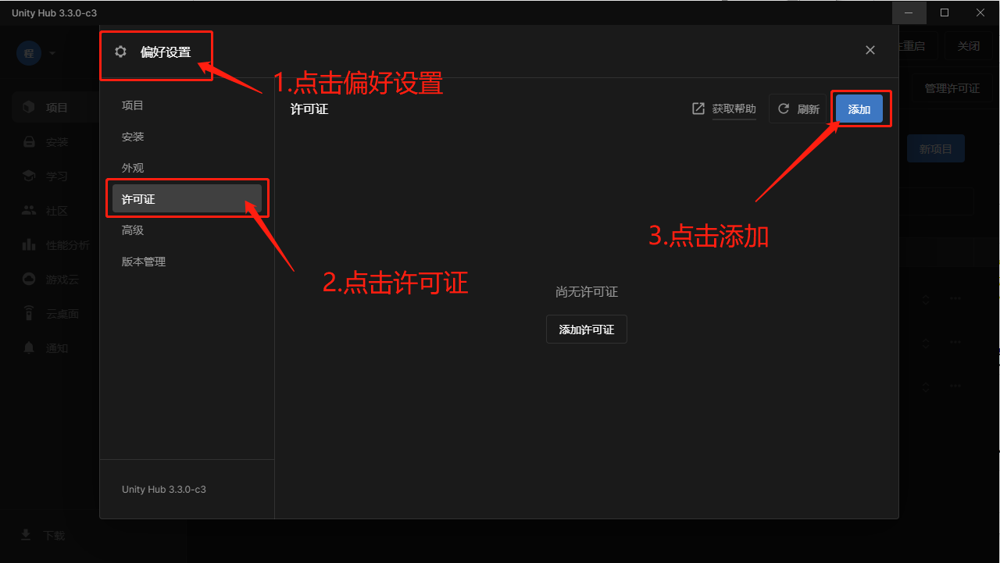
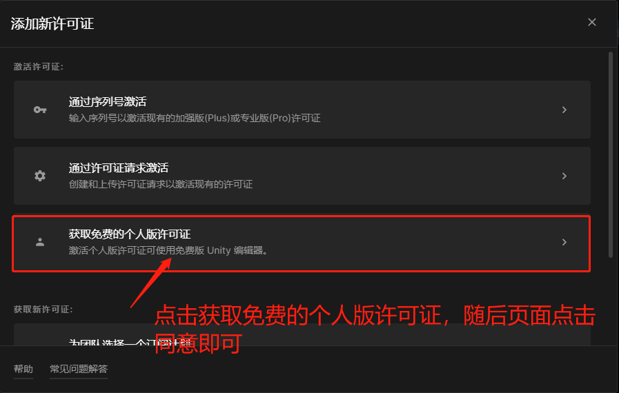

[TOC]
# 前言

Unity Editor 版本：**2020.3.32f1c1**

**以下是安装Unity个人版教程** 

#1.Unity 个人账户注册

[访问Unity官网](https://unity.cn "访问Unity官网") ,点击右上角头像，根据提示，注册账户

#2.Unity Hub 安装

下载地址：https://unity.com/cn/download ，下载完成后，双击UnityHubSetUp安装包，一直下一步直至安装完成，安装完成后，在UnityHub中登录自己的个人账户

#3.Unity 下载及安装

Unity所需版本：**2020.3.32f1c1**，访问https://unity.cn/releases/full/2020 通过UnityHub进行下载

随后会打开UnityHub，自行选择模块进行安装

#4.Unity 个人许可证申请

在UnityHub中找到偏好设置按钮->许可证->添加

然后点击获取免费版个人许可证,点击同意即可

