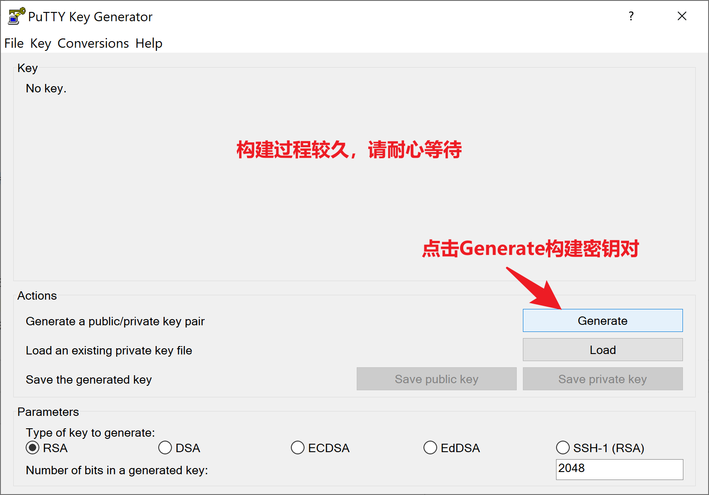

[TOC]
# 前言
在看本文档进行操作前，请先进行[新人账号](https://dt.speedbot.net/web/#/5/67 "新人账号")、[公司邮箱申请](https://dt.speedbot.net/web/#/5/84 "公司邮箱申请")。注册完成后，联系主管卞振伟，申请加入gitlab/coding中的开发组 

# 1.git的安装方式如下

[Git安装包下载](https://cdn.npmmirror.com/binaries/git-for-windows/v2.39.0.windows.2/Git-2.39.0.2-64-bit.exe "Git安装包下载")[阿里源下载速度快]

一直点击下一步直至安装完成

# 2.sourcetree的安装方式如下，只用装git
SoureceTree下载：https://www.sourcetreeapp.com/
**无过程图的部分请直接点下一步**

# 3.sourcetree配置Git密钥

    前置条件：存在公司gitlab账号

将**上图中红框内的密钥**赋值到http://git.speedbot.net/  的SSH密钥里

**保存为私钥，路径自选**

将**前文的私钥**配置到软件中

# 4 拉取工作项目

进行此项前，先**联系部门同事获取仓库权限**

第一次克隆会提示你输入[git.speedbot.net](https://git.speedbot.net/ "git.speedbot.net")的账号密码

# 5 SourceTree 运行卡顿

在代码目录下执行以下指令能缓解卡顿

> git gc
> git prune

# 6 SourceTree 无法正常打开

删除以下路径下内容：
> C:\Users\%username%\AppData\Local\Atlassian