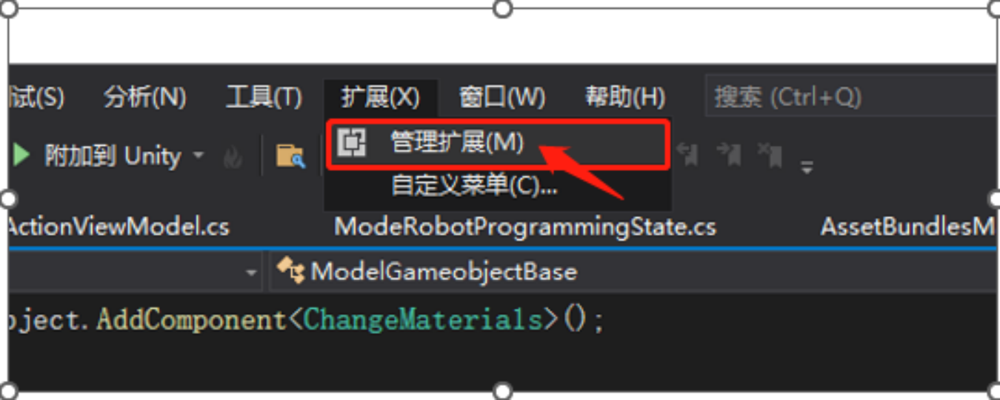
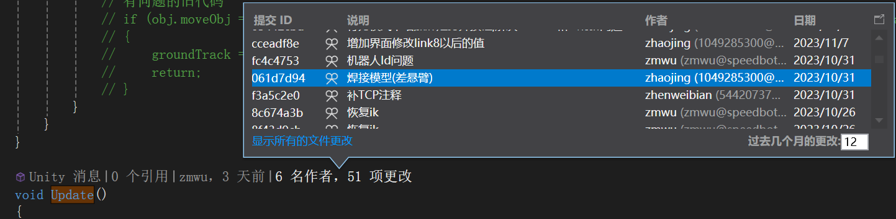
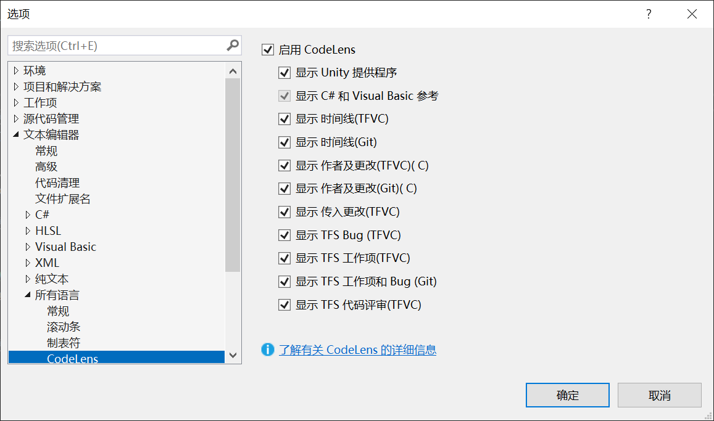

[TOC]

# 0 概述

提高Visual Studio团队协作效率

# 1 编码格式

在Visual Studio开发代码时，由于不同人员使用的电脑配置不同，会导致在git提交后文件的编码格式可能会被调整，从而影响中文注释的阅读。

为了解决这个问题，可以安装 "**Force UTF-8**" 插件，**它可以强制每次保存成UTF-8（无BOM）编码的文件**。这样，即使文件被多个人修改，也可以保持一致的编码格式，确保中文注释可以被正确地阅读。

## 1.1 扩展->管理扩展

## 1.2 下载插件  Force UTF-8(No BOM)

# 1.3 关闭所有VS窗口，重新启动VS

# 2 显示修改记录

需要安装Visual Studio专业版，社区版不具备此功能

## 2.1 功能效果

## 2.2 配置方法

