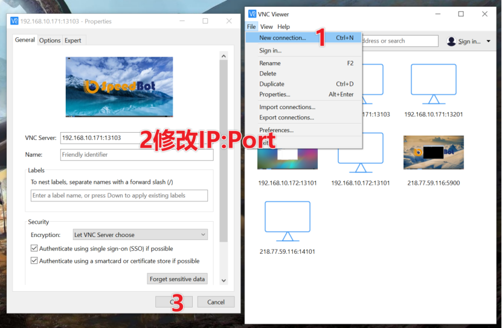
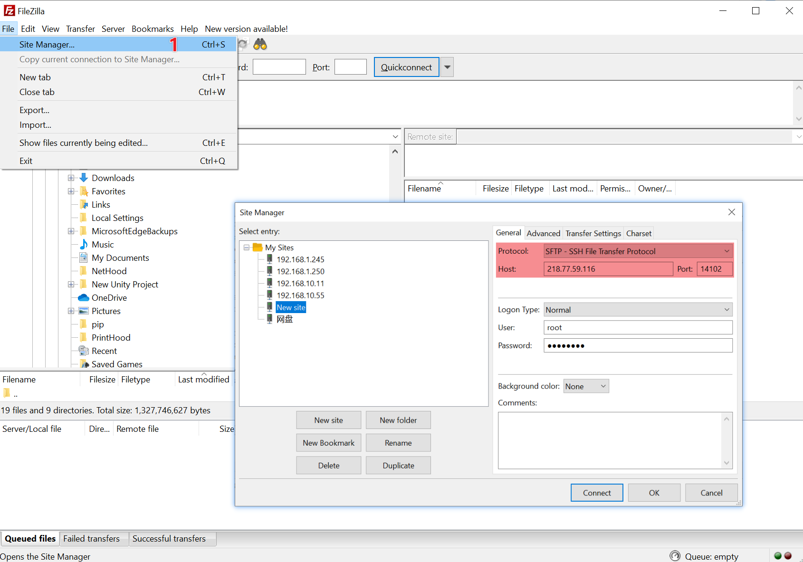

# 1 VNC连接

下载安装VNC Viewer：https://www.realvnc.com/en/connect/download/viewer/



# 2 开启SSH

用VNC连接容器后，在终端执行以下指令

```
apt-get install openssh-servervi /etc/ssh/sshd_config
```

将#PermitRootLogin prohibit-password修改为：
PermitRootLogin yes

```
passwd rootservice ssh restart
```

ssh -p port root[@ip](https://github.com/ip)即可使用ssh

# 3 传文件


