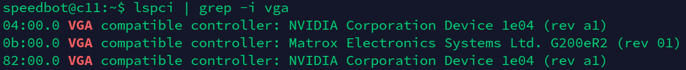
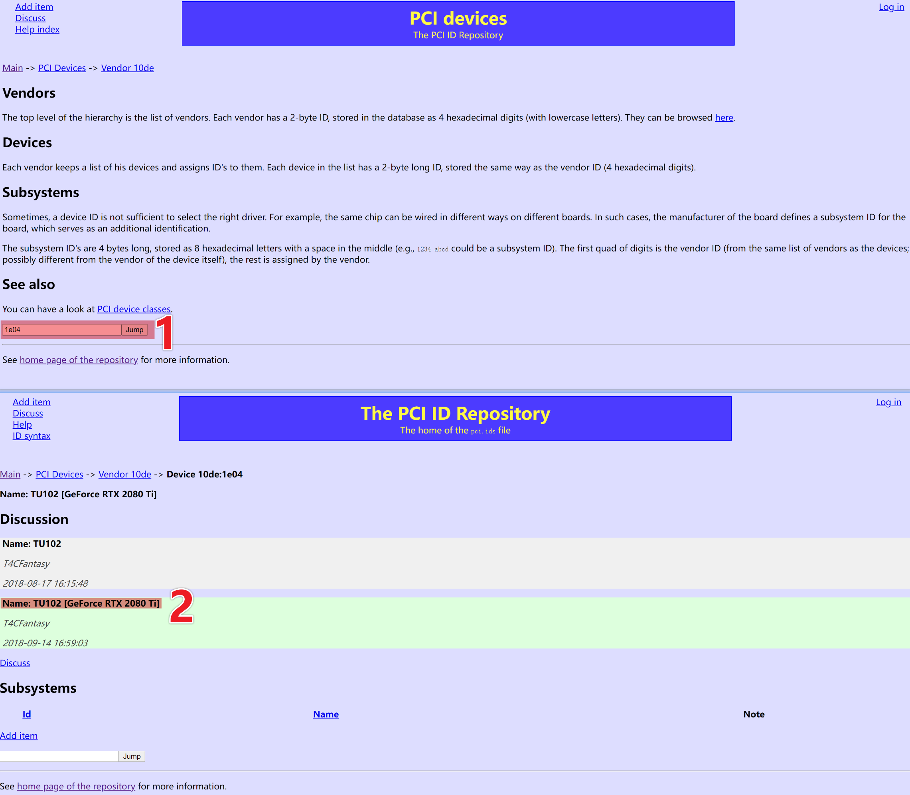
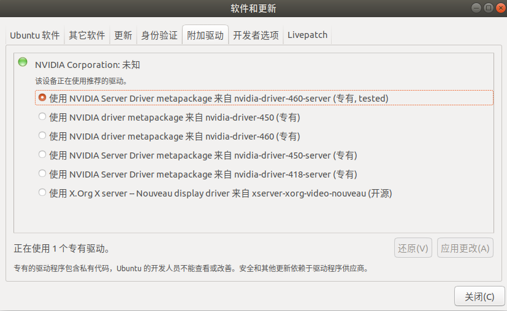
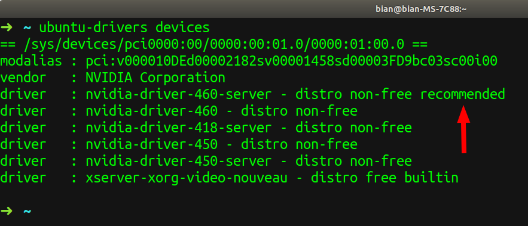

## 0 图形界面开关 和 产看显卡型号

**关闭**

```
sudo service gdm stopsudo systemctl set-default multi-user.targetsudo reboot
```

**开启**

```
sudo service gdm startsudo systemctl set-default graphical.targetsudo reboot
```

**如果以上方法不行，请追加以下方法**

**关闭**

在/etc/modprobe.d/blacklist.conf后面**追加**
blacklist nouveau

**开启**

在/etc/modprobe.d/blacklist.conf后面**删除**
blacklist nouveau

### Linux(Ubuntu)系统查看显卡型号

```
lspci | grep -i vga
```



返回的是一个十六进制数字代码**1e04**

在以下网站内检索十六进制数字代码**1e04**，即可查看显卡型号。
http://pci-ids.ucw.cz/mods/PC/10de?action=help?help=pci【该网站需要翻墙】



## 1 系统自带软件安装

在 **软件和更新[software & updates]** 软件中，**附加驱动[Additional Drivers]** 选项下，系统会自动检测你电脑的显卡驱动，点击选择你显卡的驱动应用即可，如下图



## 2 指令安装

添加Nvidia源

```
sudo add-apt-repository ppa:graphics-drivers/ppa
```

**查看显卡硬件型号**

```
ubuntu-drivers devices
```



从上图可以看出，我的显卡是：NVIDIA Corporation [GeForce GTX 1660Ti]
推荐安装的版本号是：nvidia-driver-460-server - distro non-free recommended

```
sudo ubuntu-drivers autoinstall # 同意安装推荐版本# 或sudo apt install nvidia-driver-460-server # 指定版本安装
```

## 3 官方下载后安装

[Nvidia驱动下载](https://www.nvidia.com/Download/index.aspx)

首选切换非图像化界面ctrl +alt +f1
关闭xserver

```
sudo init 3 或者 sudo /etc/init.d/lightdm stopsudo ./NVIDIA-XXXX.RUN
```

## ubuntu18.04还需要执行

```
sudo dpkg --add-architecture i386sudo apt updatesudo apt install build-essential libc6:i386$ cat /etc/modprobe.d/blacklist-nvidia-nouveau.confblacklist nouveauoptions nouveau modeset=0sudo bash -c "echo blacklist nouveau > /etc/modprobe.d/blacklist-nvidia-nouveau.conf"sudo bash -c "echo options nouveau modeset=0 >> /etc/modprobe.d/blacklist-nvidia-nouveau.conf"sudo init 5
```

## 执行完后重启

```
sudo init 5
```

# 4 卸载驱动

```shell
sudo ./NVIDIA-Linux-x86_64-<version>.run --uninstall
```

