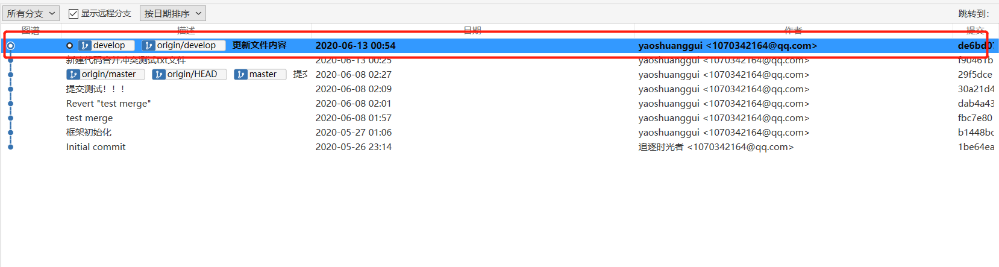

[TOC]

# 前言

SourceTree 是 Windows 和 Mac OS X 下免费的 Git 和 Hg 客户端管理工具，同时也是Mn版本控制系统工具。支持创建、克隆、提交、push、pull 和合并等操作。

工欲善其事必先利其器，Git分布式版本控制系统是我们日常开发中不可或缺的。目前市面上比较流行的Git可视化管理工具有SourceTree、Github Desktop、TortoiseGit，综合网上的一些文章分析和自己的日常开发实践心得个人比较推荐开发者使用SourceTree，因为SourceTree同时支持Windows和Mac，并且界面十分的精美简洁，大大的简化了开发者与代码库之间的Git操作方式。

**后续再增加一个简化版的**

# 三个主流可视化管理工具对比：

#1. SurceTree代码提交：

## a. 首先切换到需要修改功能代码所在的分支

## b. 将修改的代码提交到暂存区

## c. 将暂存区中的代码提交到本地代码仓库

**注意：多人同时开发项目的时候，不推荐默认选中立即推送变更到origin/develop，避免一些不必要的麻烦**

## d. 代码拉取更新本地代码库，并将代码推送到远程仓库

勾选需要推送的分支，点击推送到远程分支

代码成功推送到远程代码库

## e. 在Gitee中查看推送结果

#2. SourceTree分支切换，新建，合并

## a. 分支切换

**双击切换**

**单击鼠标右键切换**

## b. 新建分支

**注意：在新建分支时，我们需要在哪个主分支的基础上新建分支必须先要切换到对应的主分支才能到该主分支上创建分支**

## c. 合并分支

**注意：在合并代码之前我们都需要将需要合并的分支拉取到最新状态（避免覆盖别人的代码，或者丢失一些重要文件）!**

在master分支上点击右键，选择合并feature-0613至当前分支即可进行合并

分支合并成功

#3. SourceTree代码冲突解决

假设有一个提交文件遇到冲突的情景

以项目中的【代码合并冲突测试.txt】文件为例

在pingrixuexilianxi2中添加内容，并提交到远程代码库，添加的内容如下

在pingrixuexilianxi中添加内容，提交代码（不选择立即推送变更到origin/master），拉取代码即会遇到冲突：

冲突文件中的内容

**直接打开冲突文件手动解决冲突**

