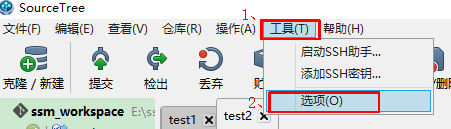
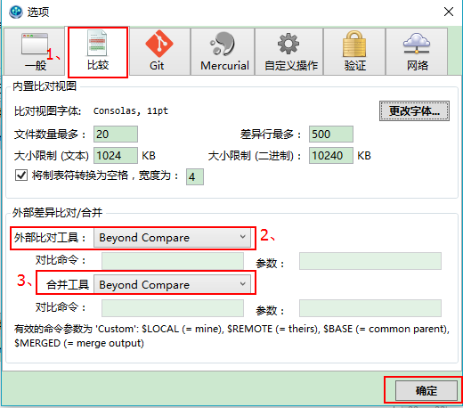
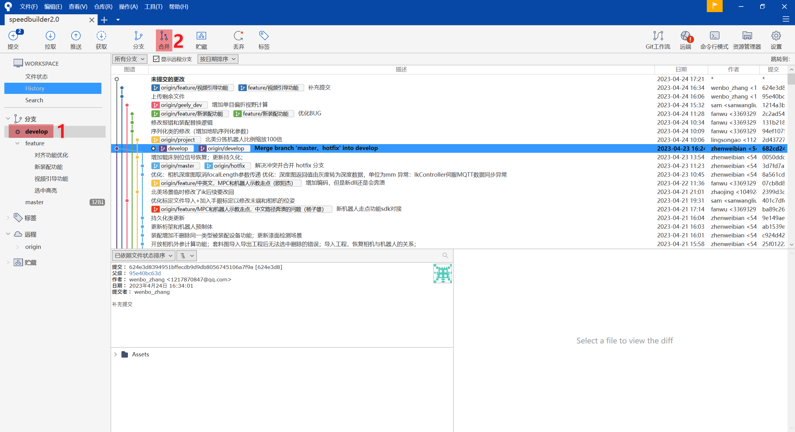
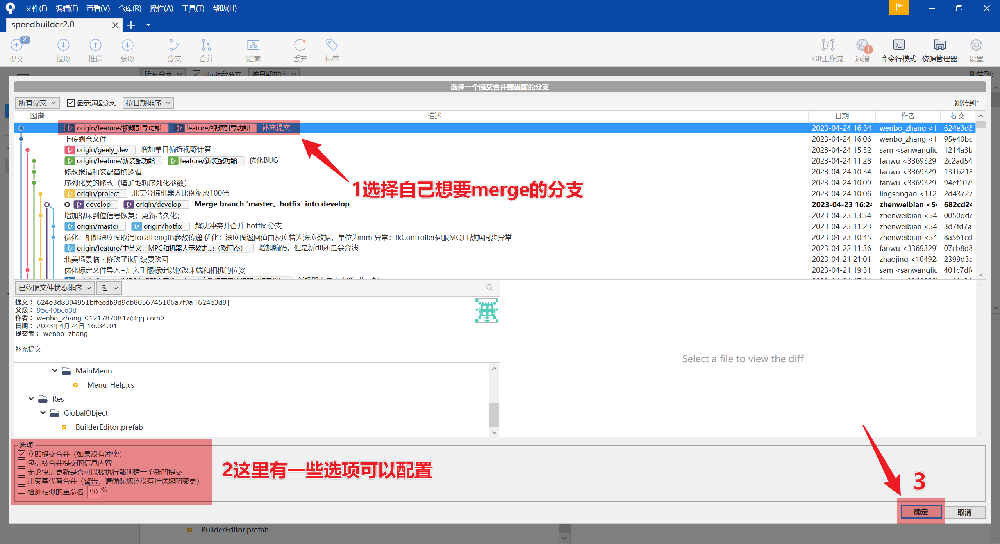
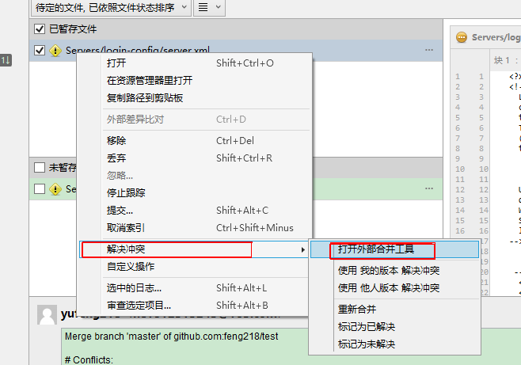
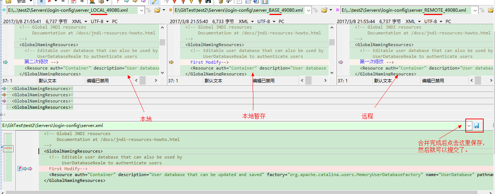
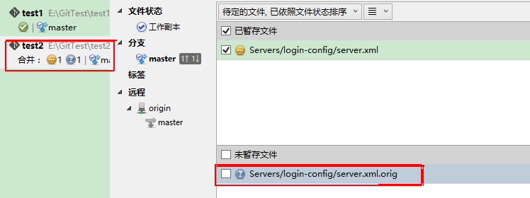
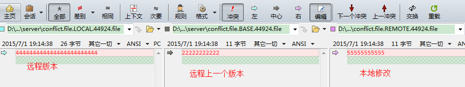

[TOC]


# 1、配置外部比较工具

**请先安装SourceTree和BCompare**

（1）打开sourcetree ----> 工具 ----> 选项。



（2）按照下图所示的配置：



（3）在用户目录中找到 .gitconfig 文件并打开，例如，C:\Users\%用户名%\.gitconfig。

增加如下的信息并保存。

```yaml
[user]
    name = 配置的git账号
    email = 配置git时的邮箱
[core]
    autocrlf = true
[difftool "sourcetree"]
    cmd = 'd:/Program Files (x86)/Beyond Compare 3/BComp.exe' \"$LOCAL\" \"$REMOTE\"
[mergetool "sourcetree"]
    cmd = 'd:/Program Files (x86)/Beyond Compare 3/BComp.exe' \"$LOCAL\" \"$REMOTE\" \"$BASE\" \"$MERGED\"
    trustExitCode = true
[diff]
    tool = sourcetree
[difftool]
    prompt = false
[merge]
    tool = sourcetree
[mergetool]
    prompt = false
```

# 2、Merge分支产生冲突

实例：从feature分支合并到develop分支





# 3、解决冲突

 （1）在本地副本的已暂存文件 ----> 右键 ----> 解决冲突 ----> 打开外部合并工具



启动Beynod Compare软件需要一会时间，接着可以看到如下所示的信息：



（2）接着关闭Beynod Compare工具，冲突的那个感叹号没有了，并且会有一个 .orig 的文件生成。接着选中那个.orig文件，单击右键 ----> 移除。

接着 commit、push



# 附加：另外一种可能出现冲突的情况

拉取时出现如下所示：

```bash
it -c diff.mnemonicprefix=false -c core.quotepath=false pull local-server-aggregator develop
/opt/gitlab/embedded/service/gitlab-shell/bin/gitlab-shell:3: warning: Insecure world writable dir /usr in PATH, mode 040777
From 192.168.0.200:weitoo/server-aggregator
 * branch            develop    -> FETCH_HEAD
Updating b0c5c94..40cef3b
error: Your local changes to the following files would be overwritten by merge:
    server/conflict.file
Please, commit your changes or stash them before you can merge.
Aborting
```

上面信息提示需要暂存本地修改，才能拉取服务器上新的代码。

（1）接着进行暂存的处理操作：

- 点击贮存(Stash),随便起一个名字，里面存的都是距离上次服务器版本到本地修改之间的差异，千万别删掉了,合并成功无误了再删掉。

- pull拉取服务器代码，这个时候，本地的代码变成了服务器上的代码

- 点击贮藏->应用贮藏区 ，这个时候是把之前的修改合并到本地上，这个时候会提示冲突，如下所示：

```bash
git -c diff.mnemonicprefix=false -c core.quotepath=false stash apply stash@{0}
Auto-merging server/server.xml
CONFLICT (content): Merge conflict in server/server.xml
```

（2）可以在sourcetree里看到有感叹号，代表冲突文件，和上面解决冲突方法类似，但是稍微不同，最左边成了远程版本，中间为远程上一个版本，最后才是本地修改。

这个是和我们操作方式有关：我们是先暂存本地修改，先拉取远程代码，这个时候local 就成了远程代码，最后我们用暂存的合并进去，remote就成了本地修改。



（3）与上面处理冲突的方法一样。