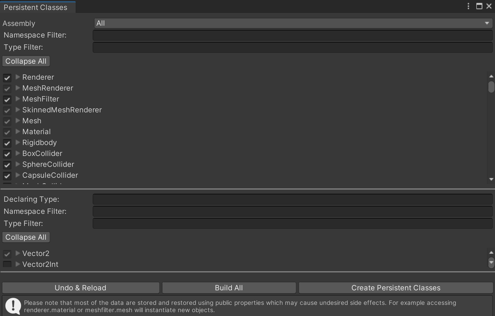

[TOC]

用户文档链接：**[用户文档及更新日志](https://dt.speedbot.net/web/#/37/473 "用户文档及更新日志")**

为了实现用户界面和核心功能，设计了菜单栏、工具栏、停靠面板、转换句柄和五个视图

- 场景视图
- 层级视图
- 自定义属性视图
- 控制台视图
- 模型视图

用户界面可以提供方便的菜单栏和工具栏，使您能够快速访问软件的核心功能。停靠面板可以让您轻松管理打开的文件，并切换不同的视图来查看和编辑数据。例如，您可以使用场景视图查看整个场景，使用层级视图查看数据结构，或者使用模型视图来编辑对象属性。此外，转换句柄可以帮助您轻松操作视图和其他用户界面元素。总之，这些功能都能帮助您更高效地使用软件，并让用户界面看起来更加简洁和统一。

# 1 工程结构

Battlenhub：Runtime插件

Plugins：其余插件

> 二级目录以文件夹方式区分不同插件

> README.md更新插件描述

Res：资源原始文件

Resources：允许按需动态加载游戏资源到场景中，资源会进行一次压缩，而且也会加密，主要存储预制体等二次加工过的文件。

资源存储规范

1. Res和Resources下文件夹及命名一一映射
2. Res和Resources文件夹下，Models文件夹存储标准化模型资源，Project文件夹存储与业务相关的模型资源(如项目定制场景的模型文件)

> Resource.Load ：编辑时和运行时都可以通过Resource.Load来直接读取
> Resources.LoadAssetAtPath() ：它可以读取Assets目录下的任意文件夹下的资源，它可以在编辑时或者编辑器运行时用，它但是它不能在真机上用，它的路径是”Assets/xx/xx.xxx” 必须是这种路径，并且要带文件的后缀名。

Scenes：场景文件

Speedbot：SpeedBot研发人员开发的程序

> 二级目录以文件夹方式区分，文件名用功能命名
>
> README.md更新文件夹下功能描述

StreamingAssets：它和Resources的区别是，Resources会压缩文件，但是它不会压缩原封不动的打包进去。并且它是一个只读的文件夹，就是程序运行时只能读不能写。它在各个平台下的路径是不同的，不过你可以用Application.streamingAssetsPath 它会根据当前的平台选择对应的路径。


# 2 持久化类

## 2.1 持久化类作用

如果类没有被持久化，那么会出现以下问题：

1. 自定义属性栏无法正常显示类的信息；
2. SpeedBuilder无法将脚本导出到本地，并生成本地项目工程。由于未持久化的类无法在本地项目中正常存在，所以无法实现工程的导入和导出。

持久化类的主要目的是为了让您完全控制保存哪些内容以及如何保存，而不需要使用反射或编写大量样板代码。

## 2.2 持久化类协同和应用

**持久化类修改：**

在Unity编辑器中，可以通过以下步骤访问持久化类编辑器：

1. 在菜单栏中点击"Tools"；
2. 在下拉菜单中选择"Runtime SaveLoad"；
3. 在下拉菜单中选择"Persistent Classes"；
4. 最后点击"Editor"按钮即可打开持久化类编辑器。




请注意，使用持久化类编辑器前，您需要了解它的基本用法和操作流程

**持久化类协同：**

您可以通过以下步骤将Assets\Battlehub\RTSL_Data\Mappings\Editor路径下的**ClassMappingsStorage.prefab**和**SurrogatesMappingsStorage.prefab**预制体同步更新到git仓库中：

1. 打开您的git客户端工具；
2. 将您的工作目录切换到Assets\Battlehub\RTSL_Data\Mappings\Editor路径下；
3. 运行"git add ClassMappingsStorage.prefab SurrogatesMappingsStorage.prefab"命令，将这两个文件添加到暂存区；
4. 运行"git commit -m [commit message]"命令，提交更新；
5. 运行"git push"命令，将更新推送到远程git仓库。

请注意，在执行上述操作前，您需要确保已经配置好了您的git客户端，并且已经与远程仓库建立了连接。

**持久化类应用：**

在Unity编辑器中，可以通过以下方式清除持久化类：

1. 在菜单栏中点击"Tools"；
2. 在下拉菜单中选择"Runtime SaveLoad"；
3. 在下拉菜单中选择"Persistent Classes"；
4. 最后点击"Clean"按钮即可更新持久化类。在此之后，所有点击操作都点是。

# 3 开发注意事项

## 3.1 统一协作编码格式

由于不同人员使用的电脑配置不同，会导致在git提交后文件的编码格式可能会被调整，从而影响中文注释的阅读
团队统一编码格式为：**UTF-8（无BOM）**
Visual Studio开发可以参照配置：[Visual Studio协作编码格式](https://dt.speedbot.net/web/#/5/475 "Visual Studio协作编码格式")

## 3.2 中英文转换

### 3.2.1 软件UI上的文本内容，均应该支持中英文

```csharp
using Battlehub;
using Battlehub.RTCommon;

ILocalization localization = IOC.Resolve<ILocalization>();
// 输入中英文内容，根据软件语言设置，转化为合适的语言类型，返回string
string res = localization.GetString("中英文内容");
```

中英文对照内容在**Assets\Battlehub\RTEditor\Content\Runtime\RTEditor\Resources\RTEditor.StringResources.CN.xml**文件中维护

### 3.2.2 获取当前用户偏好设置(语言)

```csharp
using Battlehub;
using Battlehub.RTCommon;
using Battlehub.RTEditor;

ISettingsComponent setting = IOC.Resolve<ISettingsComponent>();
switch (setting.Language)
{
    case LanguageType.Chinese:
        break;
    case LanguageType.English:
        break;
}
```