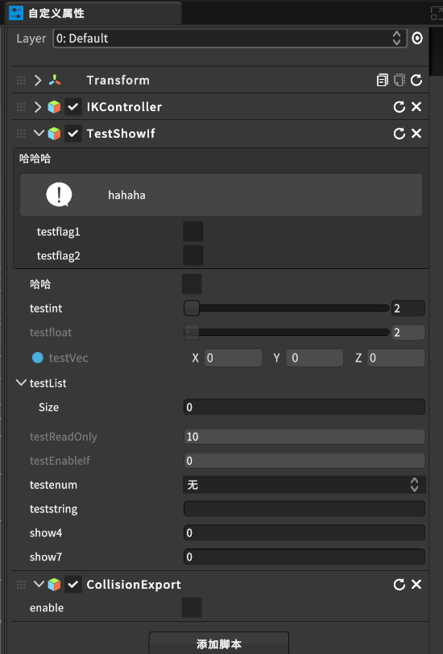

[TOC]


# 0 概述
数据类型属性（Drawer Attributes）：用于改变自定义属性视图中的显示和交互方式，提供更好的编辑器支持和可视化效果。例如，可以添加按钮、滑动条或单选框等

# 1 启动自定义属性视图显示

在Unity Editor下，执行**Tools->Runtime Editor->Configuration**


将TestShowIf赋值ComponentEditor预制体，然后Save Editors Map


# 2 样例参考

参考TestShowIf.cs，挂载至模型上，在builder中选中该模型，则属性面板显示样例效果



```csharp
using Battlehub;
using UnityEngine;

public class TestShowIf : MonoBehaviour
{
    public bool testflag1;

    public bool testflag2;

    public bool testflag3;

    public int testint;

    public float testfloat;

    public TestEnum testenum;

    public string teststring;

    [ShowIf("testflag1", true)]
    public int show1;

    [ShowIf("Or", "testflag2", "testflag3")]
    public int show2;

    [ShowIf("testint", 1)]
    public int show3;

    [ShowIf("testfloat", 0f)]
    public int show4;

    [ShowIf("testenum", TestEnum.Test1)]
    public int show5;

    [ShowIf("And", "testflag1", "testflag3")]
    public int show6;
    /// <summary>
    /// 错误参数测试
    /// </summary>
    [ShowIf("And", null, null)]
    public int show7;

    [ShowIf("teststring", "test")]
    public int show8;

    public enum TestEnum
    {
        None,
        Test1,
        Test2
    }

    void Start()
    {
    }

    void Update()
    {
    }
}
```