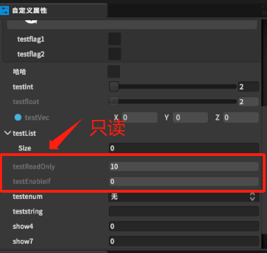

将某个类中使用ReadOnly的参数，在自定义属性的类的界面中显示设置为不可编辑修改。

# 1. ReadOnlyAttribute类
```csharp
using UnityEngine;
namespace Battlehub.Utils
{
    public class ReadOnlyAttribute : PropertyAttribute
    {

    }
}
```

# 2. 使用
```csharp
    [ReadOnly]
    public Vector3 testVec;
    [ReadOnly]
    public List<int> testList;
```
