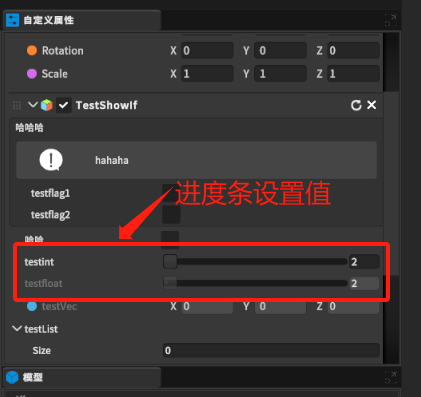

设置参数的取值范围，只支持int和float类型。

# 1. RangeAttribute类
```csharp
using System;

namespace UnityEngine
{
    //
    // 摘要:
    //     Attribute used to make a float or int variable in a script be restricted to a
    //     specific range.
    [AttributeUsage(AttributeTargets.Field, Inherited = true, AllowMultiple = false)]
    public sealed class RangeAttribute : PropertyAttribute
    {
        public readonly float min;
        public readonly float max;

        //
        // 摘要:
        //     Attribute used to make a float or int variable in a script be restricted to a
        //     specific range.
        //
        // 参数:
        //   min:
        //     The minimum allowed value.
        //
        //   max:
        //     The maximum allowed value.
        public RangeAttribute(float min, float max);
    }
}
```

需传最小值和最大值两个参数。

# 2. 使用

```csharp
    [Range(2, 20)]
    public int testint;

    [Range(2, 20),ReadOnly]
    public float testfloat;
```

