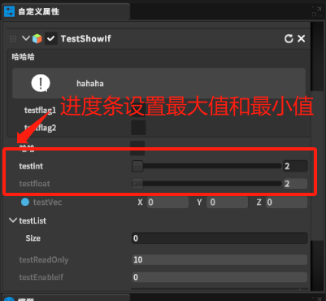

限制该类参数的最小值和最大值，在自定义属性面板已进度条的形式显示。只支持float和int类型。

# 1. RangeAttribute类
```csharp
#region 程序集 UnityEngine.CoreModule, Version=0.0.0.0, Culture=neutral, PublicKeyToken=null
// C:\Program Files\Unity\Hub\Editor\2020.3.32f1c1\Editor\Data\Managed\UnityEngine\UnityEngine.CoreModule.dll
#endregion

using System;

namespace UnityEngine
{
    //
    // 摘要:
    //     Attribute used to make a float or int variable in a script be restricted to a
    //     specific range.
    [AttributeUsage(AttributeTargets.Field, Inherited = true, AllowMultiple = false)]
    public sealed class RangeAttribute : PropertyAttribute
    {
        public readonly float min;
        public readonly float max;

        //
        // 摘要:
        //     Attribute used to make a float or int variable in a script be restricted to a
        //     specific range.
        //
        // 参数:
        //   min:
        //     The minimum allowed value.
        //
        //   max:
        //     The maximum allowed value.
        public RangeAttribute(float min, float max);
    }
}
```

# 2. 使用

```csharp
    [Range(2, 20)]
    public int testint;

    [Range(2, 20),ReadOnly]
    public float testfloat;
```

