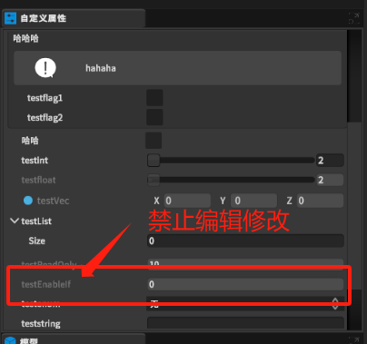

根据该类某个bool类型的变量，设置该变量在自定义属性的类的界面中为不可编辑状态。

# 1. EnableIfAttribute类
```csharp
    public class EnableIfAttribute : System.Attribute
    {
        public string fieldName;
        public EnableIfAttribute(string name)
        {
            fieldName = name;
        }
    }
```

# 2. 使用
```csharp
    [EnableIf("testflag1")]
    public int testEnableIf;
```
