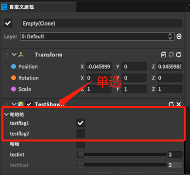

将该类bool类型的参数设置成某个名称的多选或单选组，其功能和Toggle一样。

# 1. ManyToggleGroupAttribute类和SingleToggleGroupAttribute类
```csharp
    /// <summary>
    /// 多选
    /// </summary>
    public class ManyToggleGroupAttribute : System.Attribute
    {
        public string name
        {
            get;
            private set;
        }
        public ManyToggleGroupAttribute(string name)
        {
            this.name = name;
        }
    }
    /// <summary>
    /// 单选
    /// </summary>
    public class SingleToggleGroupAttribute : System.Attribute
    {
        public string name
        {
            get;
            private set;
        }
        public SingleToggleGroupAttribute(string name)
        {
            this.name = name;
        }
    
```

# 2. 使用
```csharp
    [SingleToggleGroup("哈哈哈")]
    //[BoxGroup("哈哈哈", typeof(bool)),OnValueChanged("hahaha"),TipsPanel("hahaha", TipsType.Normal)]
    public bool testflag1;
    [SingleToggleGroup("哈哈哈")]
    //[BoxGroup("哈哈哈", typeof(bool))]
    public bool testflag2;
```

