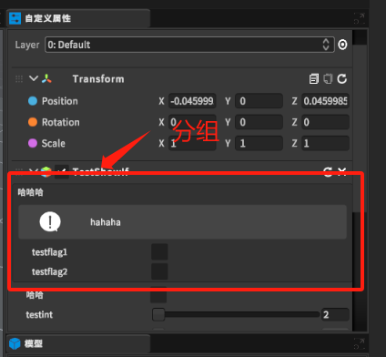

将某个类的多个参数在自定义属性的类的界面以分组的形式显示。
# 1. BoxGroupAttribute类
```csharp
    /// <summary>
    /// 分组
    /// </summary>
    public class BoxGroupAttribute : System.Attribute
    {
        public string name
        {
            get;
            private set;
        }
        public Type type
        {
            get;
            private set;
        }
        public BoxGroupAttribute(string name,Type type)
        {
            this.name = name;
            this.type = type;
        }
    }
```
2. 使用
```csharp
    [BoxGroup("哈哈哈", typeof(bool)),OnValueChanged("hahaha"),TipsPanel("hahaha", TipsType.Normal)]
    public bool testflag1;
    //[SingleToggleGroup("哈哈哈")]
    [BoxGroup("哈哈哈", typeof(bool))]
    public bool testflag2;
```
