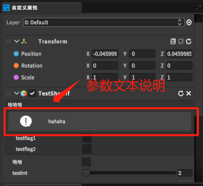

在自定义属性的类的界面中，对参数进行说明。

# 1. TipsPanelAttribute类
```csharp
    /// <summary>
    /// 参数提示
    /// </summary>
    public enum TipsType
    {
        Normal,
        Warnning,
        Erro,
    }

    public class TipsPanelAttribute : System.Attribute
    {
        public string tips;

        public TipsType type;

        public TipsPanelAttribute(string content,TipsType type)
        {
            tips = content;
            this.type = type;
        }
    }
```
需传两个参数，第一个参数为文本内容，第二个参数为提醒类型，分普通，警告，错误三个类型。

# 2. 使用
```csharp
    [BoxGroup("哈哈哈", typeof(bool)),OnValueChanged("hahaha"),TipsPanel("hahaha", TipsType.Normal)]
    public bool testflag1;
```

