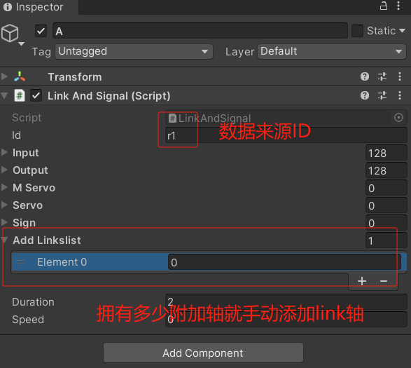
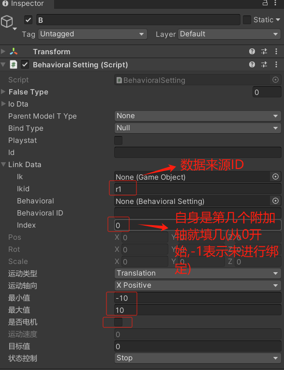
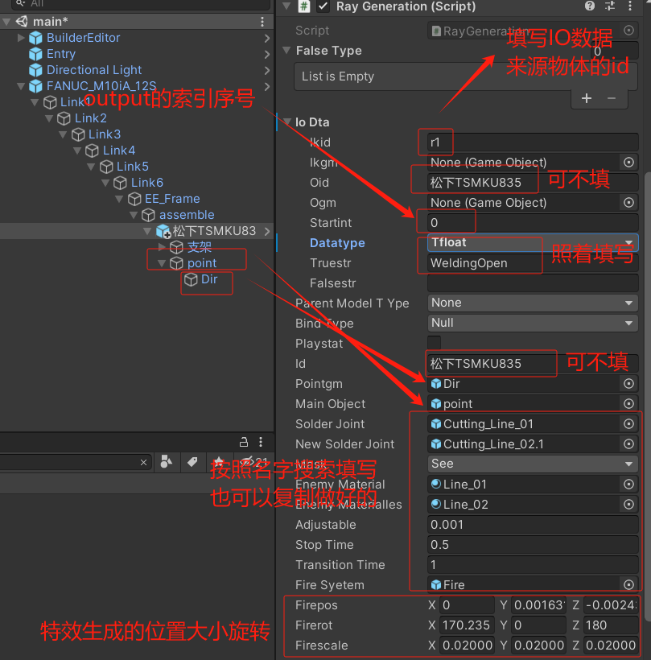
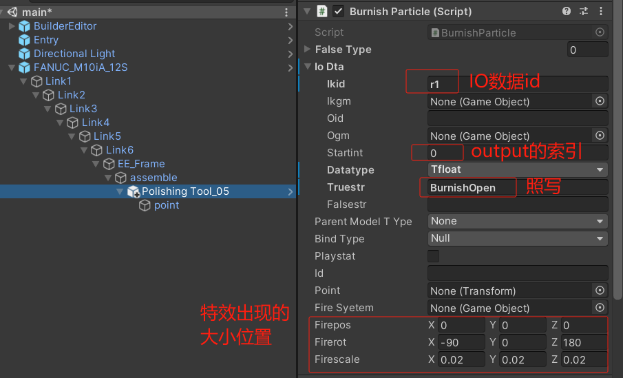
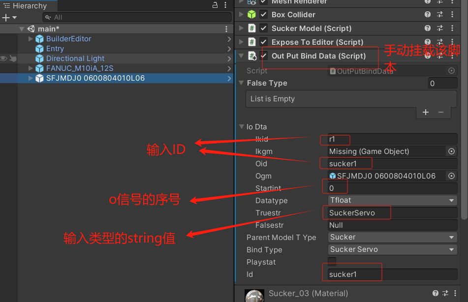
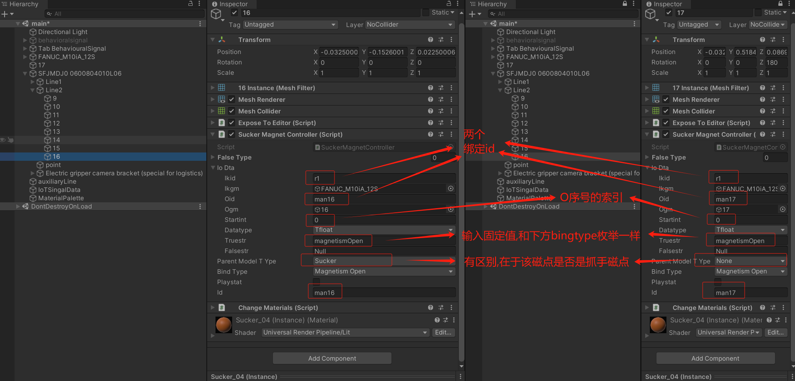
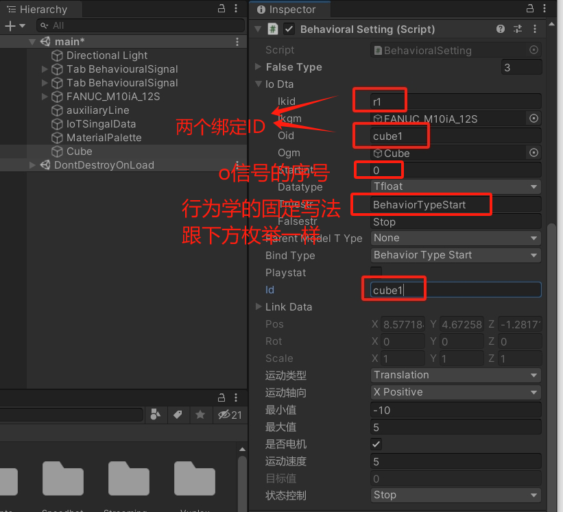
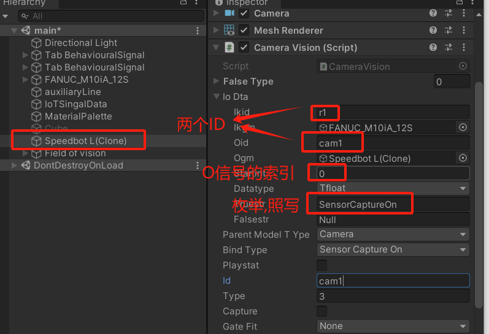

[TOC]
# 1 脚本介绍
## 功能介绍
1、LinkBase脚本(也可以用LinkAndSignal替用)
该脚本提供纯附加轴绑定,不涉及IO内容

2.LinkAndSignal脚本
该脚本提供附加轴绑定, 提供IO绑定

3.机器人和桁架脚本,已经继承了LinkAndSignal脚本,功能同上

注:以上所有功能都需要挂载在物体上,通过mqtt的id,数据采取

## 区别
1和2的区别:
LinkBase和LinkAndSignal,区别在于是否有IO,LinkAndSignal脚本有IO控制(可用LinkAndSignal替用LinkBase,不适用IO就行)

2和3的区别:
机器人是从link8开始才是附加轴,桁架分型号(单臂,双臂)单笔桁架从link5开始是附加轴,双臂从link9开始是附加轴
LinkAndSignal脚本是从0开始就是附加轴

# 2 附加轴编译器提前绑定
LinkAndSignal举例使用方法:
使用方式如下图,按下图配置就行

#IO编译器提前绑定
下图案例种IO数据来源r1为FANUC_M10iA_12S机器人,未红色标准的都是可自动获取的,不需要填写
注:特效篇的point物体不可改名,否则导入导出会有问题
## 焊接特效篇

## 打磨特效篇

## 伺服控制篇

## 磁点控制篇

## 电机控制篇

### 行为运动学控制

### 物流设备控制

## 相机拍照篇

