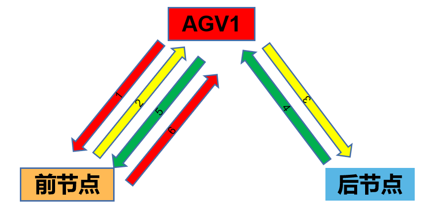

# 0 代理

代理类型的节点区别于其他节点，其不处理上一节点传递过来的数据，而是通过声明agent代理的工作流后，分发数据至agent：
- 1、代理类节点含n个agent(用户声明)，负责处理任务；
- 2、代理类节点不执行任务，只使将数据分配到agent上；
- 3、代理类节点需要重写agent的流向和数据处理的计算。

# 1 AGV节点

AGV节点是代理节点类型，其agent工作流已被编写，如下：

注意：2、4线条，AGV并不是回到了充电区，而是从前一节点到后一节点直接抵达，由于是逻辑图，故而出现连向AGV1的图谱

| 规则     | 说明                                  | 公式                                 |
| -------- | ------------------------------------- | ------------------------------------ |
| 红色线条 | AGV无框                               | /                                    |
| 黄色线条 | AGV携带满框                           | /                                    |
| 绿色线条 | AGV携带空框                           | /                                    |
| AGV数量  | 当工作区请求AGV无需等待的最少AGV数量  | 红、黄、绿线条请求时无需等待的最小值 |
| 料框数量 | 当工作区请求AGV无需等待的最少料框数量 | 红、黄、绿线条请求时无需等待的最小值 |
  |