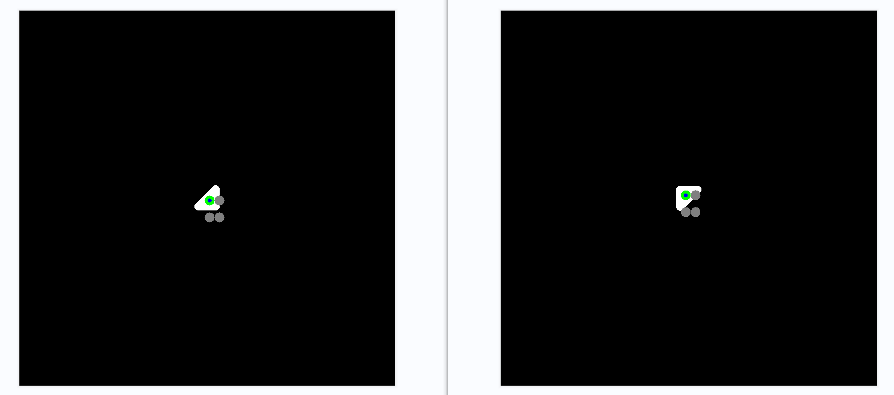
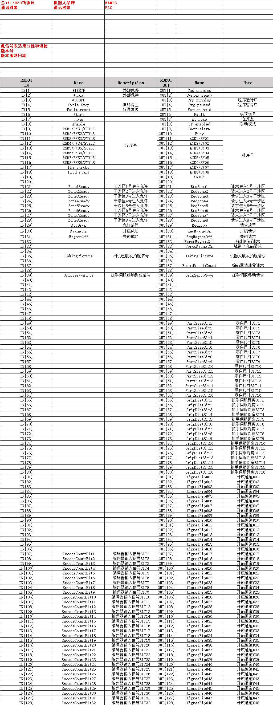

[TOC]


接口分为：
- 软件向控制规划模块下发设备信息
- 控制规划模块反馈同步状态信息

# 0 非业务关联接口

非业务功能相关的接口

## 0.1 客户端请求错误

**请求方式：POST(HTTP)**
**URL：http://127.0.0.1:9000/xxxx**
**指令说明：当请求的URL不属于解析范畴、请求的json不符合接口格式时，返回的错误信息**

**返回值：**

```json
{
	"code": 400,
	"msg": "Bad Request",
}
```

| 参数 | 参数类型 | 说明                   | 实例值                         |
| ---- | -------- | ---------------------- | ------------------------------ |
| code | int      | 返回码                 | 200为接口响应成功；400为失败   |
| msg  | string   | 对返回码的文本描述内容 | 若执行失败，返回的具体错误信息 |

200 - 请求成功
301 - 资源（网页等）被永久转移到其它URL
404 - 请求的资源（网页等）不存在
500 - 内部服务器错误


# 1 机器人

机器人和桁架接口一致


## 1.1 同步机器人状态

```json
[{
	"io_state": [0, 0, 0, 0, 0, 0, 0, 0], // 一个元素代表八个磁点。一个位对应一个磁点
	"joint_state": [0.0, 0.0, 0.0, 0.0, -90.0, 0.0],
	"servo_state": 0.0
}]
```
注意事项
1.通道名字是机器人的名字加上_tree作为通道名
2.地址格式http://192.168.60.186:40009/receiveTree

------

## 1.2 行为树节点同步

```json
[{
   "name": "nodename"
}]
```

| 参数 | 参数类型 | 说明   | 实例值   |
| ---- | -------- | ------ | -------- |
| name | string   | 节点名 | nodeName |


# 2 物流设备

## 2.1 内置(软件自带)

**请求方式：POST(HTTP)**
**URL：http://127.0.0.1:9000/motion/IndustrialEquipment**
**指令说明：下发辊床控制信号**

```json
{
	"id": "389e60f9-1424-40f7-a783-e8fd07b7985f",
	"type": 0,
	"command": 0,
	"data":{
		"target": ""
	}
}
```

| 参数    | 参数类型 | 说明                                                         | 实例值      |
| ------- | -------- | ------------------------------------------------------------ | ----------- |
| id      | string   | 设备id                                                       | "conveyer1" |
| type    | int      | 类型详细见表格下方                                           | 0           |
| command | int      | 到位前的信号命令： 0:停止; 1:正向运动; 2:反向运动；3：自定义运动,此时增加data类数据 | 0           |
| data    | object   | 含数据结果的对象，有且仅当command=3时存在                    | 无          |
| target  | string   | 字符串，数据由'-'分割，携带一组两个数值的数据，例如"3-5"，其中第一组移动目标工位，第二组值起始工位(可缺省，若存在先瞬移至该工位) | "1-3"       |

其中type:

- roll = 0  // 默认滚动指令(单层或者上层辊床)
- lowerRoll = 1 // 下层辊床滚动
- upDownMove = 2 // 单层辊床上下横移
- leftRightMove = 3 // 单层辊床左右移动
- belt = 4 // 传送带
- lowerBelt = 5 // 下层传送带
- turntable = 6 // 转台顺时针逆时针转动[逆时针为正]
- archBelt = 7 //  曲面传送带

**返回值：**

```json
{
	"code": 200,
	"msg": "OK"
}
```

| 参数 | 参数类型 | 说明                   | 实例值                         |
| ---- | -------- | ---------------------- | ------------------------------ |
| code | int      | 返回码                 | 200为接口响应成功；400为失败   |
| msg  | string   | 对返回码的文本描述内容 | 若执行失败，返回的具体错误信息 |

**到位信号**
**请求方式：POST(HTTP)**
**URL：/motion/rollbed**
**指令说明：到位信号**

```json
{
	"id": "",
	"command": 0
}
```

| 参数    | 参数类型 | 说明                                               | 实例值 |
| ------- | -------- | -------------------------------------------------- | ------ |
| id      | string   | 设备id                                             | ""     |
| type    | int      | 类型详细见表格下方                                 | 0      |
| command | int      | 到位前的信号命令： 0:停止; 1:正向运动; 2:反向运动; | 0      |

其中type:

- roll = 0  // 默认滚动指令(单层或者上层辊床)
- lowerRoll = 1 // 下层辊床滚动
- upDownMove = 2 // 单层辊床上下横移
- leftRightMove = 3 // 单层辊床左右移动
- belt = 4 // 传送带
- lowerBelt = 5 // 下层传送带
- turntable = 6 // 转台顺时针逆时针转动[逆时针为正]
- archBelt = 7 //  曲面传送带

## 2.2 自定义设备

**请求方式：POST(HTTP)**
**URL：http://127.0.0.1:9000/motion/CustomEquipmentCommand**
**指令说明：下发自定义设备控制信号**

```json
{
	"id": "389e60f9-1424-40f7-a783-e8fd07b7985f",
	"data": [
		{
			"name": "link1",
			"command": 0,
		},
		{
			"name": "link2",
			"command": 0,
		}
	]
}
```

| 参数    | 参数类型 | 说明                                            | 实例值      |
| ------- | -------- | ----------------------------------------------- | ----------- |
| id      | string   | 设备id                                          | "conveyer1" |
| data    | object   | 模型的子节点运动属性                            | 无          |
| name    | string   | 子节点名称                                      | "link1"     |
| command | int      | 控制命令： 0:停止; 1:开始运动; 2:反向；3:复位； | 0           |

**返回值：**

```json
{
	"code": 200,
	"msg": "OK"
}
```

| 参数 | 参数类型 | 说明                   | 实例值                         |
| ---- | -------- | ---------------------- | ------------------------------ |
| code | int      | 返回码                 | 200为接口响应成功；400为失败   |
| msg  | string   | 对返回码的文本描述内容 | 若执行失败，返回的具体错误信息 |

**请求方式：POST(HTTP)**
**URL：http://127.0.0.1:9000/motion/CustomEquipmentQuery**
**指令说明：自定义设备控制信号查询接口**

```json
{
	"id": "389e60f9-1424-40f7-a783-e8fd07b7985f",
	"data": [
		{
			"name": "link1",
		},
		{
			"name": "link2",
		}
	]
}
```

| 参数 | 参数类型 | 说明                 | 实例值      |
| ---- | -------- | -------------------- | ----------- |
| id   | string   | 设备id               | "conveyer1" |
| data | object   | 模型的子节点运动属性 | 无          |
| name | string   | 子link名称           | "link1"     |

**返回值：**

```json
{
	"code": 200,
	"msg": "OK",
	"data":{
		"name1": 0, // 子link名称:commad。 Key:子link名称；Value:command(int)
		"name2": 0,
	}
}
```

| 参数    | 参数类型 | 说明                                                     | 实例值                         |
| ------- | -------- | -------------------------------------------------------- | ------------------------------ |
| code    | int      | 返回码                                                   | 200为接口响应成功；400为失败   |
| msg     | string   | 对返回码的文本描述内容                                   | 若执行失败，返回的具体错误信息 |
| data    | object   | 模型的子节点运动属性                                     | 无                             |
| name    | string   | 子link名称                                               | "link1"                        |
| command | int      | command; 控制命令： 0:停止; 1:开始运动; 2:反向；3:复位； | 0                              |

# 3 相机设备


## 3.1 请求相机拍照接口

客户端软件的IP,9000
**请求方式：POST(HTTP)**
**URL：http://127.0.0.1:9000/sbt/sensor**
**指令说明：请求相机拍照接口**

```json
{
	"id": "相机标识符",
	"type": 0
}
```

| 参数 | 参数类型 | 说明                                                         | 实例值    |
| ---- | -------- | ------------------------------------------------------------ | --------- |
| id   | string   | 软件内选中相机，Id在其右侧属性栏页面上                       | "camera1" |
| type | int      | 1：RGBA原始图 <br>2：RGBA深度图 <br>3：RGBA原始图 和 RGBA深度图<br> | 1         |

**返回值：**

```json
{
	"code": 200,
	"msg": "success",
	"data": {
		"width": 2068,
		"height": 1520,
		"origin": "", // 不存在则为""空字符串
		"origin_depth": "" // 不存在则为""空字符串
	}
}
```

| 参数         | 参数类型 | 说明                                                         | 实例值                                                       |
| ------------ | -------- | ------------------------------------------------------------ | ------------------------------------------------------------ |
| code         | int      | 返回码                                                       | 200为接口响应成功；400为失败                                 |
| msg          | string   | 对返回码的文本描述内容                                       | 若执行失败，返回的具体错误信息                               |
| data         | object   | 含数据结果的对象                                             | 无                                                           |
| width        | int      | 图像分辨率的宽                                               | 2068                                                         |
| height       | int      | 图像分辨率的高                                               | 1520                                                         |
| origin       | string   | 图像的字节数组转Base64String后的字符串<br />一种三分量、32位无符号规范化格式，其中8位R分量以sRGB非线性编码存储在字节0中，8位G分量以sRGB非线性编码存储在字节1中，8位B分量以sRGB非线性编码存储在字节2中 | 原始图。图像的字节数组转Base64String后的字符串，使用时需要先通过Base64转成字节数组 |
| origin_depth | string   | 单通道深度图字节数组流转Base64String后的字符串<br />一种单组件、32位带符号浮点格式 |                                                              |

## 3.2 相机接口数据解析

### 3.2.0 Base64编码和解码(C++)

**Base64编码和解码(C++)**：**[https://github.com/ReneNyffenegger/cpp-base64](https://github.com/ReneNyffenegger/cpp-base64)**

### 3.2.1 原始图数据解析

**原始图数据解析**

**返回值：BGR**

```cpp
#include <iostream>
#include <fstream>
#include <string>
#include <vector>
#include <opencv2/opencv.hpp>

using namespace std;

#include "base64.h"

int main() {
    // 读取文件 相机HTTP返回的json中origin字段数据
    std::ifstream file(R"(C:\Users\zhenwei\Desktop\2.txt)");
    if (!file.is_open()) {
        std::cout << "无法打开文件 1.txt" << std::endl;
        return -1;
    }

    // 读取文件内容到字符串
    std::string encodedData((std::istreambuf_iterator<char>(file)), std::istreambuf_iterator<char>());

    // 解码 Base64 数据
    std::string decodedData = base64_decode(encodedData);

    // 将解码后的数据保存到内存缓冲区
    const char* buffer = decodedData.c_str();
    size_t bufferSize = decodedData.size();

    // 从内存缓冲区中读取图像数据
    cv::Mat image = cv::Mat(1, bufferSize, CV_8U, (void*)buffer);

    // 将图像数据从内存缓冲区中恢复为图像
    image = cv::imdecode(image, cv::IMREAD_UNCHANGED);

    // 检查图像是否成功加载
    if (image.empty()) {
        std::cout << "无法解码图像数据" << std::endl;
        return -1;
    }

    // 遍历图像的像素
    for (int row = 0; row < image.rows; ++row) {
        for (int col = 0; col < image.cols; ++col) {
            // 访问像素值
            cv::Vec3b pixel = image.at<cv::Vec3b>(row, col);
            unsigned char blue = pixel[0]; // 蓝色通道
            unsigned char green = pixel[1]; // 绿色通道
            unsigned char red = pixel[2]; // 红色通道

            // // 在控制台输出像素值
            std::cout << "Pixel at (" << row << ", " << col << "): B=" << (int)blue << " G=" << (int)green << " R=" << (int)red << std::endl;
        }
    }

    // 显示图像
    cv::imshow("Image", image);
    cv::waitKey(0);

    return 0;
}
```

### 3.2.2 深度图数据解析

**返回值：深度距离(mm)**

```cpp
#include <iostream>
#include <fstream>
#include <string>
#include <vector>
#include <opencv2/opencv.hpp>

#include "base64.h"

int main() {
    // 读取文件 相机HTTP返回的json中origin_depth字段数据
    std::ifstream file(R"(C:\Users\zhenwei\source\repos\opencv\3.txt)");
    if (!file.is_open()) {
        std::cout << "无法打开文件 1.txt" << std::endl;
        return -1;
    }

    // 读取文件内容到字符串
    std::string encodedData((std::istreambuf_iterator<char>(file)), std::istreambuf_iterator<char>());

    // 解码 Base64 数据
    std::string decodedData = base64_decode(encodedData);

    // 将解码后的数据保存到内存缓冲区
    const char* buffer = decodedData.c_str();
    size_t bufferSize = decodedData.size();
    std::cout << "Size: " << bufferSize << std::endl;

	// 图像尺寸,先height后widht
	auto size = cv::Size(2349, 3072);

    // 从内存缓冲区中读取图像数据
    cv::Mat depthImg = cv::Mat(size.width, size.height, CV_32S, (void*)buffer);
    std::cout << depthImg.cols << "  " << depthImg.rows << std::endl;

    // builder的深度图反转后才能与RGB图正好对应
    cv::flip(depthImg, depthImg, 0); // 在垂直方向上翻转图像


    // 深度图可视化
    double min_val, max_val;
    cv::minMaxLoc(depthImg, &min_val, &max_val);
    std::cout << min_val << "  " << max_val << std::endl;
    cv::Mat float_depthImg;
    depthImg.convertTo(float_depthImg, CV_32F);
    std::cout << "Min: " << min_val << "  Max:" << max_val << std::endl;
    float_depthImg = (float_depthImg - min_val) / (max_val - min_val) * 255.0;
    cv::Mat byte_depthImg;
    float_depthImg.convertTo(byte_depthImg, CV_8U);
    cv::namedWindow("depthImg", cv::WINDOW_NORMAL);
	cv::resizeWindow("depthImg", 800, 600); // 调整窗口大小为800x600
    cv::imshow("depthImg", byte_depthImg);
	cv::waitKey(0);

    // // 遍历深度数据
    // for (int row = 0; row < depthImg.rows; ++row) {
    //     for (int col = 0; col < depthImg.cols; ++col) {
    //         float value = depthImg.at<float>(row, col);
    //         // // 在控制台输出像素值
    //         std::cout << "row: " << row << "  col: " << col << "  val: " << value << std::endl;
    //     }
    // }

    return 0;
}
```

### 3.2.3 数据解析转点云数据

**环境：PCL1.12.0**

```cpp
#include <iostream>
#include <fstream>
#include <string>
#include <vector>
#include <opencv2/opencv.hpp>
#include "base64.h"
#include <pcl/point_types.h>
#include <pcl/io/pcd_io.h>
#include <pcl/io/ply_io.h>
#include <opencv2/opencv.hpp>
#include <pcl/point_types.h>

using namespace std;
typedef pcl::PointXYZRGBA PointT;
typedef pcl::PointCloud<PointT> PointCloud;

bool isFileExists_ifstream(string& name) {
    ifstream f(name.c_str());
    return f.good();
}

int main() {
    // 读取文件 相机HTTP返回的json中origin_depth字段数据
    std::ifstream file(R"(C:\Users\zhenwei\source\repos\opencv\3.txt)");
    if (!file.is_open()) {
        std::cout << "无法打开文件 3.txt" << std::endl;
        return -1;
    }

    // 读取文件内容到字符串
    std::string encodedData((std::istreambuf_iterator<char>(file)), std::istreambuf_iterator<char>());
    // 解码 Base64 数据
    std::string decodedData = base64_decode(encodedData);
    // 将解码后的数据保存到内存缓冲区
    const char* buffer = decodedData.c_str();
    size_t bufferSize = decodedData.size();
    std::cout << "Size: " << bufferSize << std::endl;
    // 图像尺寸,先height后widht
    auto size = cv::Size(2349, 3072);
    // 从内存缓冲区中读取图像数据
    cv::Mat depthImg = cv::Mat(size.width, size.height, CV_32S, (void*)buffer);
    std::cout << depthImg.cols << "  " << depthImg.rows << std::endl;

    cv::flip(depthImg, depthImg, 0); // 在垂直方向上翻转图像

    // 深度图可视化
    double min_val, max_val;
    cv::minMaxLoc(depthImg, &min_val, &max_val);
    std::cout << min_val << "  " << max_val << std::endl;
    cv::Mat float_depthImg;
    depthImg.convertTo(float_depthImg, CV_32F);
    std::cout << "Min: " << min_val << "  Max:" << max_val << std::endl;
    float_depthImg = (float_depthImg - min_val) / (max_val - min_val) * 255.0;
    cv::Mat byte_depthImg;
    float_depthImg.convertTo(byte_depthImg, CV_8U);
    cv::namedWindow("depthImg", cv::WINDOW_NORMAL);
	cv::resizeWindow("depthImg", 800, 600); // 调整窗口大小为800x600
    cv::imshow("depthImg", byte_depthImg);
	cv::waitKey(0);

    // 读取文件 相机HTTP返回的json中origin字段数据
    std::ifstream file2(R"(C:\Users\zhenwei\source\repos\opencv\2.txt)");
    if (!file2.is_open()) {
        std::cout << "无法打开文件 2.txt" << std::endl;
        return -1;
    }

    std::string encodedData2((std::istreambuf_iterator<char>(file2)), std::istreambuf_iterator<char>());
    std::string decodedData2 = base64_decode(encodedData2);
    const char* buffer2 = decodedData2.c_str();
    size_t bufferSize2 = decodedData2.size();
    cv::Mat image = cv::Mat(1, bufferSize2, CV_8U, (void*)buffer2);
    image = cv::imdecode(image, cv::IMREAD_UNCHANGED);

    // 显示图像
    cv::namedWindow("Image", cv::WINDOW_NORMAL);
	cv::resizeWindow("Image", 800, 600); // 调整窗口大小为800x600
    cv::imshow("Image", image);
    cv::waitKey(0);

    // 相机内参
    double fx = 3779.99993853271;
    double fy = 3780.00000822133;
    double cx = 1536;
    double cy = 1174.5;

    pcl::PointCloud<pcl::PointXYZRGB>::Ptr cloud(new pcl::PointCloud<pcl::PointXYZRGB>);
    // 遍历图像的像素
    for (int row = 0; row < depthImg.rows; ++row) {
        for (int col = 0; col < depthImg.cols; ++col) {
            float value = depthImg.at<float>(row, col);
            // 在控制台输出像素值
            // std::cout << "row: " << row << "  col: " << col << "  val: " << value << std::endl;
            pcl::PointXYZRGB p;
            p.z = value;
            p.x = (row - cx) * p.z / fx;
            p.y = (col - cy) * p.z / fy;

            cv::Vec3b pixel = image.at<cv::Vec3b>(row, col);
            unsigned char blue = pixel[0]; // 蓝色通道
            unsigned char green = pixel[1]; // 绿色通道
            unsigned char red = pixel[2]; // 红色通道
            uint8_t r = static_cast<uint8_t>(red);
            uint8_t g = static_cast<uint8_t>(green);
            uint8_t b = static_cast<uint8_t>(blue);
            uint32_t rgb = ((uint32_t)r << 16 | (uint32_t)g << 8 | (uint32_t)b);
            p.rgb = *reinterpret_cast<float*>(&rgb);
            cloud->push_back(p);
        }
    }
    cloud->height = 1;
    cloud->width = cloud->points.size();
    cout<<"point cloud size ="<<cloud->points.size()<<endl;
    cloud->is_dense = false;
    string filename = "./pointcloud.pcd";
    bool ret = isFileExists_ifstream(filename);
    if (ret)
    {
        cout << ",/pointcloud.pcd文件存在" << endl;
    }
    else
    {
		pcl::io::savePCDFile(filename, *cloud);
		cout<<"Point cloud saved."<<endl;
    }

    // 清除数据并退出
    cloud->points.clear();

    return 0;
}
```

## 3.3 请求相机列表接口

客户端软件的IP,9000
**请求方式：POST(HTTP)**
**URL：http://127.0.0.1:9000/sensor/queryCameralist**
**指令说明：请求相机列表接口**

```json
```

| 参数 | 参数类型 | 说明                                                         | 实例值    |
| ---- | -------- | ------------------------------------------------------------ | --------- |
| id   | string   | 软件内选中相机，Id在其右侧属性栏页面上                       | "camera1" |
| type | int      | 1：RGBA原始图 <br>2：RGBA深度图 <br>3：RGBA原始图 和 RGBA深度图<br> | 1         |

**返回值：**

```json
{
	"code": 200,
	"msg": "success",
	"data": {
		"width": 2068.0,
		"height": 1520.0,
		"origin": "", // 不存在则为""空字符串
		"origin_depth": "" // 不存在则为""空字符串
	}
}
```


# 4 小件二次物流设备接口

## 4.1 请求传感器状态

**请求方式：POST(HTTP)**
**URL：http://127.0.0.1:9000/logistic/sensor**
**指令说明：查询传感器信号**

```json
{
	"id": "传感器标识符"
}
```

| 参数 | 参数类型 | 说明                                   | 实例值  |
| ---- | -------- | -------------------------------------- | ------- |
| id   | string   | 传感器标识符，从软件传感器的属性栏获取 | sensor1 |

**返回值：**

```json
{
	"code": 200,
	"msg": "success",
	"data": {
		"result": 0,
		"status": 1
	}
}
```

| 参数   | 参数类型 | 说明                   | 实例值                         |
| ------ | -------- | ---------------------- | ------------------------------ |
| code   | int      | 返回码                 | 200为接口响应成功；400为失败   |
| msg    | string   | 对返回码的文本描述内容 | 若执行失败，返回的具体错误信息 |
| data   | object   | 含数据结果的对象       | 无                             |
| result | int      | 通知结果               | 0：通知成功；1：失败           |
| status | int      | 0：未触发；1：已被触发 | 1                              |

------

## 4.2 请求零件到位状态

**请求方式：POST(HTTP)**
**URL：http://127.0.0.1:9000/logistic/steel**
**指令说明：该接口用于向builder软件查询暗室小件到位信号**

```json
{
	"line_type": 2,
	"line_id": 1
}
```

| 参数      | 参数类型 | 说明         | 实例值                          |
| --------- | -------- | ------------ | ------------------------------- |
| line_type | int      | 输送线类型   | 0：托盘线；1：大件线；2：皮带线 |
| line_id   | int      | 线体设备编号 | 1，2，3，4，5...                |

**返回值：**

```json
{
	"code": 200,
	"msg": "success",
	"data": {
		"result": 0,
		"status": 1,
		"value": 1024
	}
}
```

| 参数   | 参数类型 | 说明                       | 实例值                         |
| ------ | -------- | -------------------------- | ------------------------------ |
| code   | int      | 返回码                     | 200为接口响应成功；400为失败   |
| msg    | string   | 对返回码的文本描述内容     | 若执行失败，返回的具体错误信息 |
| data   | object   | 含数据结果的对象           | 无                             |
| result | int      | 通知结果                   | 0：通知成功；1：失败           |
| status | int      | 0未就绪，1已就绪，可以拍照 | 1                              |
| value  | uint     | 编码器值                   | 实时返回当前编码器值           |

## 4.3 下发图片拍照时编码器值

**请求方式：POST(HTTP)**
**URL：http://127.0.0.1:9000/logistic/encoder**
**指令说明：该接口用于builder软件向hub下发图片拍照时编码器值**

```json
{
	"id": "编码器标识符",
	"value": 1024
}
```

| 参数  | 参数类型 | 说明                                   | 实例值   |
| ----- | -------- | -------------------------------------- | -------- |
| id    | string   | 编码器标识符，从软件编码器的属性栏获取 | encoder1 |
| value | int      | 编码器数值                             | 1024     |

------

# 5 流程图接口

## 5.1 为流程图服务提供获取机器人位姿的功能
**请求方式：POST(HTTP)**
**URL：http://127.0.0.1:9000/query/robot_pos**
**指令说明：在Builder内选中一款机器人后，请求该接口，可以获取机器人位姿**

```json
{
	"poseType": 1
}
```

| 参数     | 参数类型 | 说明                                   | 实例值 |
| -------- | -------- | -------------------------------------- | ------ |
| poseType | int      | 位姿类型：<br>0:直角坐标<br>1:关节坐标 | 1      |

**返回值：**

**直角坐标**

```json
{
	"code": 200,
	"msg": "ok",
	"data": "(position.x, position.y, position.z, euler.x, euler.y, euler.z)"
}
```

**关节坐标**

```json
{
	"code": 200,
	"msg": "ok",
	"data": "-1.061551E-06,-1.920873E-06,-1.709937E-06,-4.278863E-13,90.00002,-1.061551E-06" // link1, link2, link3, link4, link5, link6
}
```

## 5.2 为流程图服务提供获取机器人Id的功能
**请求方式：POST(HTTP)**
**URL：http://127.0.0.1:9000/query/robot_id**
**指令说明：在Builder内选中一款机器人后，请求该接口，可以获取机器人Id**

```json
{
}
```

**返回值：**

```json
{
    "code": 200,
    "msg": "ok",
    "data": "KUKA_KR210-2700-2"
}
```

# 6 MQTT数据通信接口

## 6.1 机器人

### 6.1.1 机器人

**请求方式：MQTT**
**Topics：robot/robot/robot_id**（robot_id是变量）
**指令说明：桁架设备数采的数据通信接口**

```json
{
	"robots":[
		{
			"joint_state": [0.0, 0.0, 0.0, 0.0, -90.0, 0.0],
			"io_state": [0, 0, 0, 0, 0, 0, 0, 0], // 一个元素代表八个磁点。一个位对应一个磁点
			"servo_state": [5.0, 1.0]
		}
	]
}
```

| 参数        | 参数类型 | 说明                                                         | 实例值              |
| ----------- | -------- | ------------------------------------------------------------ | ------------------- |
| id          | string   | 单个臂的id                                                   | device1             |
| joint_state | float[]  | 可变长数组，通常为六关节                                     | [10,20,30,40,50,60] |
| io_state    | int[]    | 一个bit对应一个bool信号，预留八个byte(1byte=8bit)，共64个信号 | [0,0,0,0,0,0,0,0]   |
| servo_state | float[]  | 伺服数值的数组                                               | [5.0, 1.0]          |


### 6.1.2 桁架

**请求方式：MQTT**
**Topics：robot/truss/truss_id**（truss_id是变量）
**指令说明：桁架设备数采的数据通信接口**

```json
{
	"robots": [
		{
		    "id": "id1","joint_state": [0, 0, 0, 0],"io_state": [0, 0, 0, 0, 0, 0, 0, 0],"servo_state": [0],
		    "attachment": {"parts group id": "", "part id": "", "rotation": 30.0}
		},
		{
		    "id": "id1","joint_state": [0, 0, 0, 0],"io_state": [0, 0, 0, 0, 0, 0, 0, 0],"servo_state": [0],
		    "attachment": {"parts group id": "", "part id": "", "rotation": 30.0}
		}
	]
}
```

| 参数           | 参数类型 | 说明                                                         | 实例值              |
| -------------- | -------- | ------------------------------------------------------------ | ------------------- |
| id             | string   | 单个臂的id                                                   | device1             |
| joint_state    | float[]  | 预留六个关节的关节值，单位mm                                 | [10,20,30,40,50,60] |
| io_state       | int[]    | 一个bit对应一个bool信号，预留八个byte(1byte=8bit)，共64个信号 | [0,0,0,0,0,0,0,0]   |
| servo_state    | float[]  | 伺服数值的数组                                               | [5.0, 1.0]          |
| attachment     | object   | 当开磁后，桁架具体抓件的时刻才会有此字段，存在此字段时生成零件，无此字段时有零件则自由落体 | object              |
| parts group id | string   | 套料图Id                                                     | "M201009SG10008A07" |
| part id        | string   | 零件Id                                                       | "61#152#140_2"      |
| rotation       | float    | part_rotation，零件抓取姿态用角度，俯视图逆时针为正方向，用以区分同一零件不同抓取姿态，如下图所示 | 30.0f               |



## 6.2 制造设备

### 6.2.1 切割机

**请求方式：MQTT**
**Topics：manufacture/cutter/cutter_id**（cutter_id是变量）
**指令说明：桁架设备数采的数据通信接口**

```json
{
    "robots": [
		{"id": "id1","joint_state": [0.0, 0.0, 0.0, 0.0, 0.0, 0.0],"io_state": [0, 0, 0, 0, 0, 0, 0, 0]},
		{"id": "id2","joint_state": [0.0, 0.0, 0.0, 0.0, 0.0, 0.0],"io_state": [0, 0, 0, 0, 0, 0, 0, 0]}
	]
}
```

| 参数        | 参数类型 | 说明                                                         | 实例值                |
| ----------- | -------- | ------------------------------------------------------------ | --------------------- |
| id          | string   | 单个臂的id                                                   | device1               |
| joint_state | float[]  | 预留六个关节的关节值，单位mm                                 | [1000,20,30,40,50,60] |
| io_state    | int[]    | 一个bit对应一个bool信号，预留八个byte(1byte=8bit)，共64个信号 | [0,0,0,0,0,0,0,0]     |

### 6.2.2 矫平机

**请求方式：MQTT**
**Topics：manufacture/leveler/leveler_id**（cutter_id是变量）
**指令说明：桁架设备数采的数据通信接口**

```json
{
    state:1
}
```

| 参数  | 参数类型 | 说明                 | 实例值 |
| ----- | -------- | -------------------- | ------ |
| state | int      | 0：未启动<br>1：启动 | 1      |

### 6.2.3 喷码机

**请求方式：MQTT**
**Topics：manufacture/inkjet_printing/inkjet_printing_id**（inkjet_printing_id是变量）
**指令说明：桁架设备数采的数据通信接口**

```json
{
    state:1
}
```

| 参数  | 参数类型 | 说明                            | 实例值 |
| ----- | -------- | ------------------------------- | ------ |
| state | int      | 0：未启动<br>1：启动<br>2：喷码 | 1      |

## 6.3 传送设备

### 6.3.1 程控行车

**请求方式：MQTT**
**Topics：conveyer/Program-controlled_driving/id**（id是变量）
**指令说明：桁架设备数采的数据通信接口**

```json
{
    "data": [
		{"id": "id1","joint_state": [0.0, 0.0, 0.0, 0.0, 0.0, 0.0],"io_state": [0, 0, 0, 0, 0, 0, 0, 0]},
		{"id": "id2","joint_state": [0.0, 0.0, 0.0, 0.0, 0.0, 0.0],"io_state": [0, 0, 0, 0, 0, 0, 0, 0]}
	]
}
```

| 参数        | 参数类型 | 说明                                                         | 实例值              |
| ----------- | -------- | ------------------------------------------------------------ | ------------------- |
| id          | string   | 单个臂的id                                                   | device1             |
| joint_state | float[]  | 预留六个关节的关节值                                         | [10,20,30,40,50,60] |
| io_state    | int[]    | 一个bit对应一个bool信号，预留八个byte(1byte=8bit)，共64个信号 | [0,0,0,0,0,0,0,0]   |

### 6.3.2 KBK

**请求方式：MQTT**
**Topics：manufacture/kbk/kbk_id**（kbk_id是变量）
**指令说明：桁架设备数采的数据通信接口**

```json
{
    "data": [
		{"id": "id1","joint_state": [0.0, 0.0, 0.0, 0.0, 0.0, 0.0],"io_state": [0, 0, 0, 0, 0, 0, 0, 0]},
		{"id": "id2","joint_state": [0.0, 0.0, 0.0, 0.0, 0.0, 0.0],"io_state": [0, 0, 0, 0, 0, 0, 0, 0]}
	]
}
```

| 参数        | 参数类型 | 说明                 | 实例值              |
| ----------- | -------- | -------------------- | ------------------- |
| id          | string   | 单个臂的id           | device1             |
| joint_state | float[]  | 预留六个关节的关节值 | [10,20,30,40,50,60] |

# 7 机器人信号表

