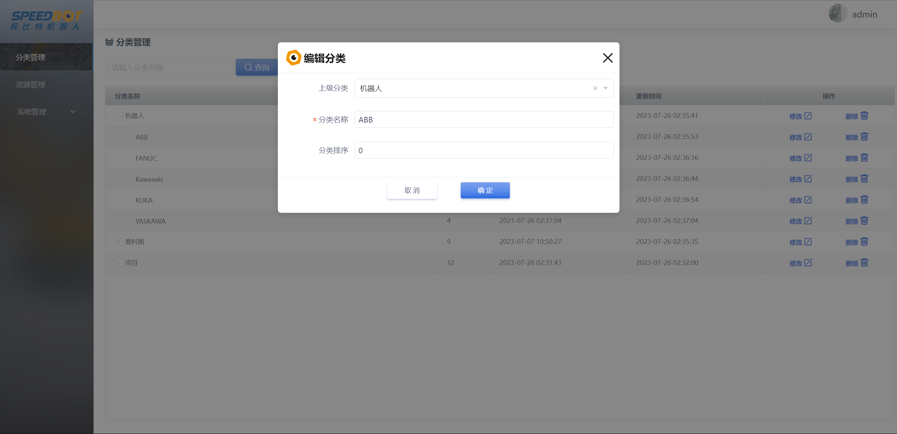
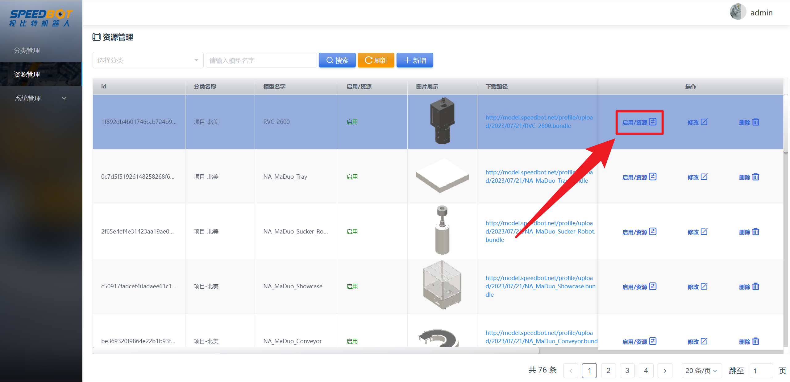

[TOC]
# 1 登录

地址：[视比特机器人云端资源管理后台](https://model.speedbot.net/ "视比特机器人云端资源管理后台")
账号：admin
密码：admin123


# 2 分类管理

## 2.1 新增分类

点击左侧分类管理切换到分类管理界面，点击新增按钮。


填入上级分类、分类名称和分类排序点击确定，创建新的分类。


## 2.2 删除分类

点击分类列表中指定分类的删除按钮可以删除该分类的数据。

注意：只能删除最底层的分类，有子分类的分类不能被删除；

分类被删除后分类下的资源也会被删除！


## 2.3 修改分类

点击分类列表中指定分类的修改按钮，可以修改该分类的数据。




## 2.4 查询分类

在输入框中输入分类名称，点击查询按钮即可进行分类查询。


# 3 资源管理

## 3.1 新增资源

点击左侧资源管理切换到资源管理界面，点击新增按钮。


填入模型名字、所属分类并上传AB包（上限为50M）和封面图（上限为1M）。


## 3.2 删除资源

点击资源列表中指定资源的删除按钮，可以删除该资源的数据。


## 3.3 启用/禁用资源

点击资源列表中指定资源的启用/资源按钮，可以启用/禁用该资源。



## 3.4 修改资源

点击资源列表中指定资源的修改按钮，可以修改该资源的数据。


## 3.5 查询资源

在输入框中输入分类名和模型名字，点击搜索按钮即可进行资源查询。


# 4 接口文档


## 4.1 查询分类列表

**请求方式：POST(HTTP)**
**URL：https://model.speedbot.net/pro-api/speedbot/yunduan/web/sortListByTreeId**
**接口说明：该接口用于查询分类列表接口**

```json
{
    "treeId": "",
    "pageNum": 1,
    "pageSize": 2
}
```

| 参数     | 参数类型 | 说明                         | 实例值                    |
| -------- | -------- | ---------------------------- | ------------------------- |
| treeId   | string   | 全部父类加当前分类的进行拼接 | 非必传(“a-b-c”以横杠连接) |
| pageNum  | int      | 页码                         | 必填                      |
| pageSize | int      | 页数                         | 必填                      |

**返回值：**

```json
{
	"code": 200,
	"msg": "success",
	"rows":[
		{
			"treeId":"全部父类加当前分类的进行拼接",
			"create_time": "创建时间",
			"update_time": "更新时间"
		}
	],
	"total":20
}
```

| 参数        | 参数类型 | 说明                         | 实例值               |
| ----------- | -------- | ---------------------------- | -------------------- |
| code        | int      | 返回码                       | 200为成功；400为失败 |
| msg         | string   | 对返回码的文本描述内容       |                      |
| total       | int      | 总数据条数                   |                      |
| rows        | array    | 分类列表                     |                      |
| treeId      | string   | 全部父类加当前分类的进行拼接 | “a-b-c”以横杠连接    |
| create_time | string   | 创建时间                     |                      |
| update_time | string   | 更新时间                     |                      |

## 4.2 查询资源列表

**请求方式：POST(HTTP)**
**URL：https://model.speedbot.net/pro-api/speedbot/yunduan/web/resourceListByTreeId**
**接口说明：该接口用于查询资源列表接口**

```json
{
    "name": "",
    "treeId": "",
    "pageNum": 1,
    "pageSize": 2
}
```

| 参数     | 参数类型 | 说明                         | 实例值                    |
| -------- | -------- | ---------------------------- | ------------------------- |
| name     | string   | 模型名字                     | 非必传（关键字查询）      |
| treeId   | string   | 全部父类加当前分类的进行拼接 | 非必传(“a-b-c”以横杠连接) |
| pageNum  | int      | 页码                         | 必填                      |
| pageSize | int      | 页数                         | 必填                      |

**返回值：**

```json
{
	"code": 200,
	"msg": "success",
	"rows":[
		{
			"id": "主键id",
			"name": "模型名字",
			"imagePng": "图片下载的完整路径",
			"loadURL": "模型下载的完整路径",
			"loadMD5": "模型文件的md5值",
			"file_name": "文件名称",
			"treeId": "全部父类加当前分类的进行拼接",
			"source_status": 1,
			"create_time": "创建时间",
			"update_time": "更新时间"
		}
	],
	"total":20
}
```

| 参数          | 参数类型 | 说明                         | 实例值               |
| ------------- | -------- | ---------------------------- | -------------------- |
| code          | int      | 返回码                       | 200为成功；400为失败 |
| msg           | string   | 对返回码的文本描述内容       |                      |
| total         | int      | 总数据条数                   |                      |
| rows          | array    | 资源列表                     |                      |
| id            | string   | 资源唯一编码                 |                      |
| name          | string   | 模型名字                     |                      |
| imagePng      | string   | 图片下载的完整路径           |                      |
| loadURL       | string   | 模型下载的完整路径           |                      |
| localMD5      | string   | 模型文件的md5值              |                      |
| file_name     | string   | 文件名称                     |                      |
| treeId        | string   | 全部父类加当前分类的进行拼接 | “a-b-c”以横杠连接    |
| source_status | int      | 启用/禁用资源                | 1表示启用，0表示禁用 |
| create_time   | string   | 创建时间                     |                      |
| update_time   | string   | 更新时间                     |                      |