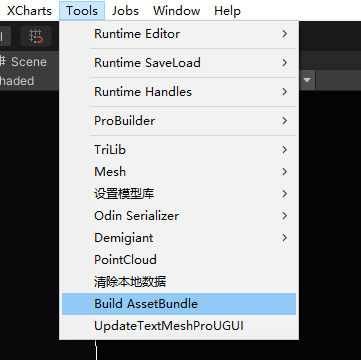
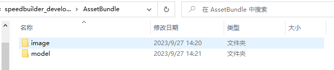
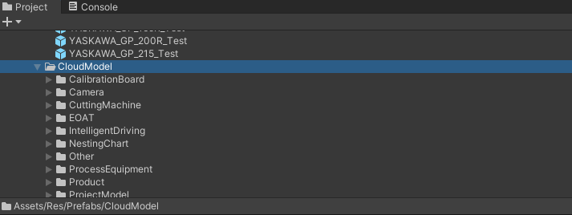
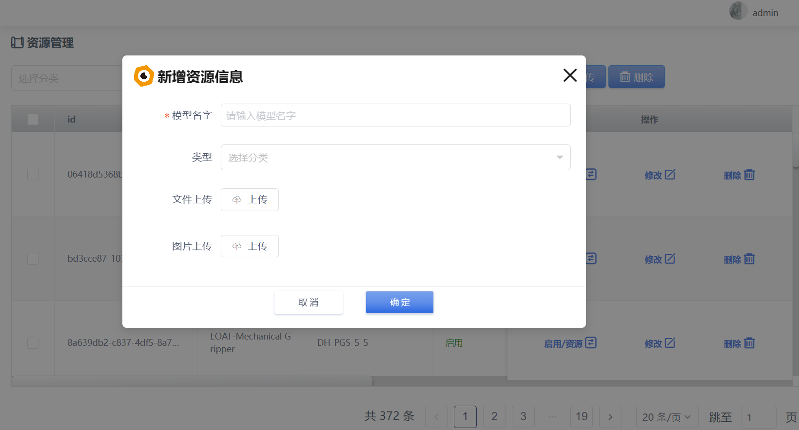
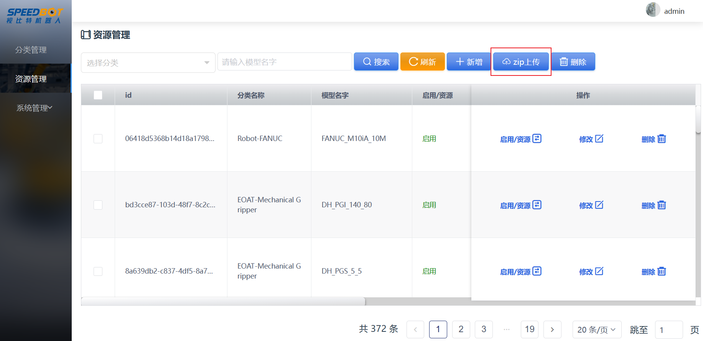
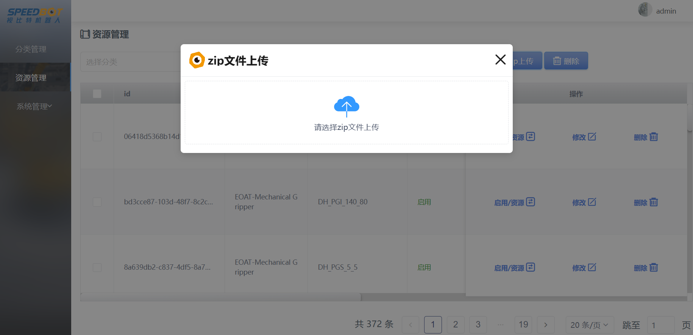

[TOC]
# 1 资源打包

## 1.1 单个资源打包
1、在 Unity中的Project视图中，选中要打包的预制体

2、点击菜单栏Tools->Build AssetBundle进行打包

3、打包完成后自动输出至工程目录AssetBundle文件夹下，bundle文件在AssetBundle/model文件夹下，封面文件在AssetBundle/image文件夹下。

## 1.2 批量资源打包

1、在 Unity中的Project视图中，选中要打包的文件夹

2、点击菜单栏Tools->Build AssetBundle进行打包

3、打包完成后自动输出至工程目录AssetBundle文件夹下，bundle文件在AssetBundle/model文件夹下，封面文件在AssetBundle/image文件夹下。

# 2 资源上传
云端资源后台管理地址：[视比特机器人云端资源管理后台](https://model.speedbot.net/ "视比特机器人云端资源管理后台")
账号：admin
密码：admin123
## 2.1 单个资源上传
1、打开资源管理界面，点击新增按钮

2、填写模型名字、类型，上传bundle文件和封面图片
注意：上传文件和图片需要等到进度条消失后弹出Sucess提示后才算上传成功

## 2.2 批量资源上传
1、打开资源管理界面，点击zip上传按钮

2、将打包好的压缩包进行上传
注意：压缩包中model/image下的各级文件夹的名称代表分类的层级名称，文件夹层级和分类层级需要对应好
