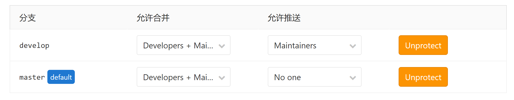
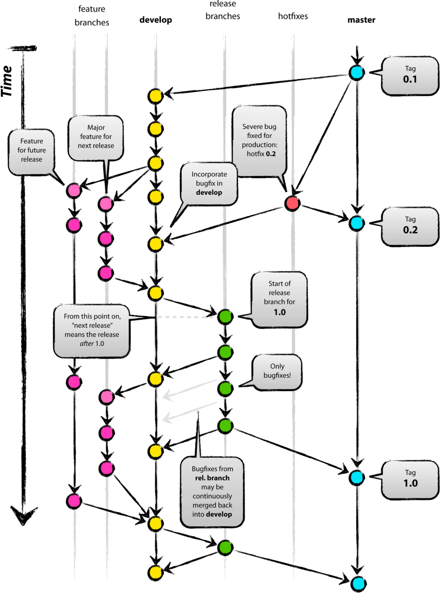

[TOC]

# 1 权限划分

**团队项目请设立群组，管理团队更方便**

- Reporter：克隆代码，不能提交。临时需要，任务结束后请删除
- Developer：克隆代码、开发、提交、push。开发人员
- Maintainer：创建项目、添加tag、保护分支、添加项目成员、编辑项目。核心负责人
- Owner：设置项目访问权限 - Visibility Level、删除项目、迁移项目、管理组成员。开发组leader
- 实习生：**不允许拉入群组** & 只允许**拉入群组中具体的仓库**并**授予**需要的**权限**

个人的feature/xxx分支不强制要求commit message规范

# 2 GitFlow工作流

- **master**——最为稳定功能最为完整的随时可发布的代码；

- hotfix——修复线上代码的 bug；

- **release**——发布定期要上线的功能。

- **develop**——永远是功能最新最全的分支；

- feature——某个功能点正在开发阶段；

**受保护分支**：**master**、**release**、**develop**

**重要版本 & 测试版本**：**发布release tag**

在申请合并到受保护分支时要写清楚具体做了什么改变。例如以下七种commit type：

具体格式：

- feat：新功能
- fix：修复Bug
- docs：文档
- style：格式（不影响代码运行的变动）
- refactor：重构（即不是新增功能，也不是修改bug的代码变动）
- test：添加测试或者修改现有测试
- chore：不修改src或者test的其余修改，例如构建过程或辅助工具的变动

# 3 Git Flow工作流图

