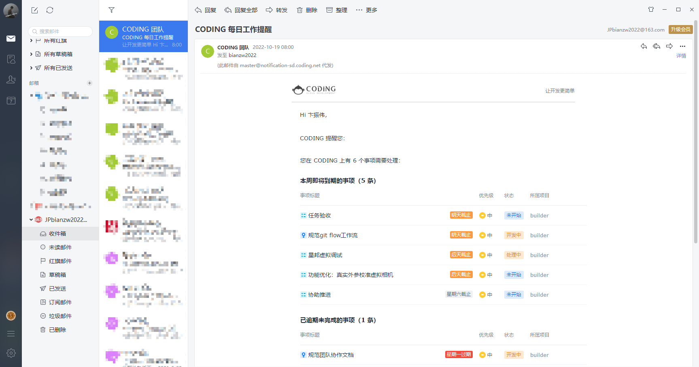
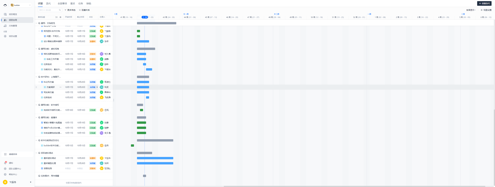

[TOC]

前置条件：已经加入Coding团队，[Coding操作指南](https://dt.speedbot.com/web/#/5/165 "Coding操作指南")

# 1 每日邮件提醒本周工作任务

# 2 登录Coding查看详细任务

# 3 通过Git协同办公

[Git安装配置手册](https://dt.speedbot.com/web/#/5/75 "Git安装配置手册")

[SourceTree安装配置手册](https://dt.speedbot.com/web/#/5/80 "Source安装配置手册")[Git客户端管理工具]

[Gitflow工作流](https://dt.speedbot.com/web/#/gitflow)[Git工作流程规范]