[TOC]

# 1 安装加密软件

### 1.1 Windows操作系统（win7/10/11）

**Windows加密客户端下载：**
**国内：https://nas.speedbot.net/sharing/ERd75FqoX**
**国外：https://drive.google.com/file/d/1qypnjDv9xbDvfHZbWlEfuC4JWeEr5t7y/view?usp=sharing**

**Edge浏览器保留文件：https://www.fayagu.com/1051119.html**
！！！安装前最好关闭第三方杀毒软件！！！

右键单击**IPG公网客户端**，选择**以管理员身份运行**

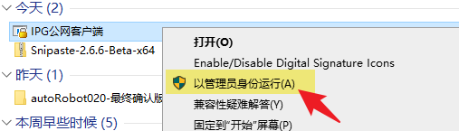

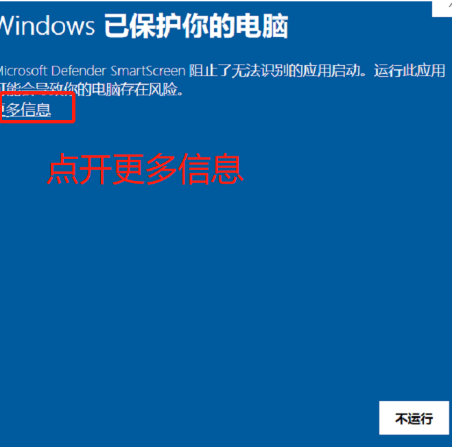


**一直点击下一步完成安装,最后重启电脑。**

- 注意：安装完后软件在右小角不会第一时间显示运行，需要等管理平台授权后软件才会正常显示。

请**[查看本机IP地址](https://jingyan.baidu.com/article/359911f5afd24257fe030629.html "查看本机IP地址")**，并将
**[姓名、所属事业部、所属分组、电脑IP地址]**
信息发送至邮箱：**info@speedbot.net**


### 1.2 Linux操作系统(ubuntu/centos...)

必须安装**指定内核**才能正常使用

| 系统版本    | 内核版本                  |
| ----------- | ------------------------- |
| Ubuntu16.04 | 4.15.0-20-generic_x86_64  |
| Ubuntu16.04 | 4.15.0-142-generic_x86_64 |
| Ubuntu18.04 | 4.15.0-142-generic_x86_64 |
| Ubuntu18.04 | 5.4.0-81-generic_x86_64   |
| Ubuntu18.04 | 5.4.0-89-generic_x86_64   |
| Ubuntu20.04 | 5.11.0-27-generic_x86_64  |

#### 1.2.1 安装内核

```shell
# sudo apt-get install linux-image-版本-generic -y #禁止内核更新
sudo apt-get install linux-image-5.4.0-89-generic -y
# sudo apt-mark hold linux-image-版本-generic #禁止内核更新
sudo apt-mark hold linux-image-5.4.0-89-generic
#安装header
sudo apt-get install linux-headers-5.4.0-89-generic

# 查看nvidiadocker是否可用
nvidia-container-cli -k -d /dev/tty info
```

#### 1.2.2 修改默认启动内核

**查看内核启动顺序**

```shell
grep menuentry /boot/grub/grub.cfg
```

**修改默认开机内核**

```shell
# 修改默认开机内核版本
sudo vi /etc/default/grub # 修改GRUB_DEFAULT项
```

把GRUB_DEFAULT=0修改为 GRUB_DEFAULT="Ubuntu，Linux 5.4.0-89-generic" 这种类型的

`sudo update-grub`，使修改生效。使用reboot重启，`uname -r`核验内核更新是否成功。

#### 1.2.3 安装Linux客户端

**Linux加密客户端下载：https://nas.speedbot.net/sharing/N0280RUs1**
**新公网IP客户端：https://nas.speedbot.net/sharing/80saOHt0k**

执行以下指令安装Linux客户端
```shell
chmod +x AKernel(linux).run
./'AKernel(linux).run'
```

请**[查看本机IP地址](https://jingyan.baidu.com/article/cbf0e500391e8e6eab289364.html "查看本机IP地址")**，并将[姓名、所属事业部、所属分组、电脑IP地址]发送至邮箱：**info@speedbot.net**
手机：**18874177801**


# 2 申请解密和申请外发

### 2.1 Win申请解密流程

**方法一：选中需要解密的文件右键申请解密**

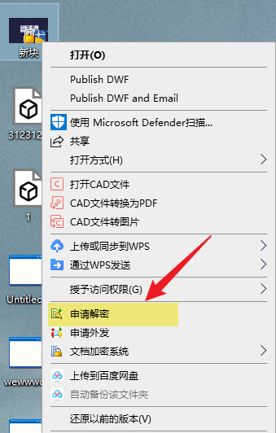

**方法二：客户端界面扫面文件夹解密**

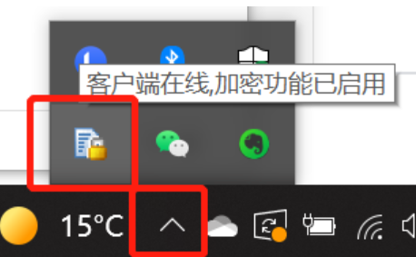

**扫描指定文件夹**

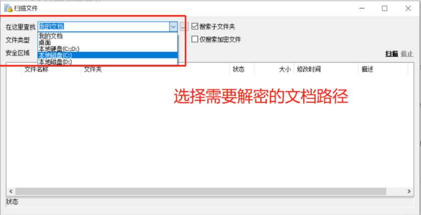

**右键申请解密**

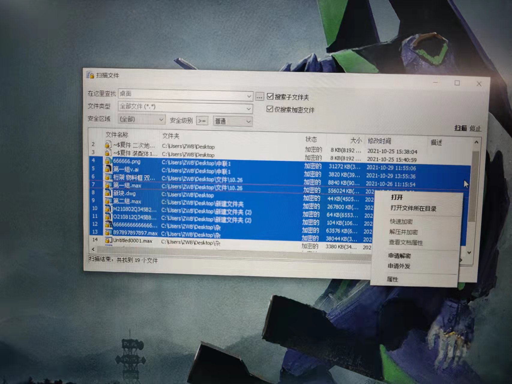

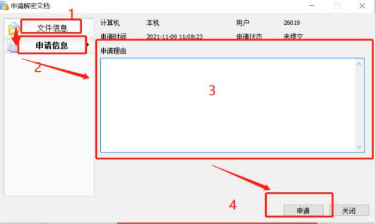

**查看加密申请情况及其他功能**

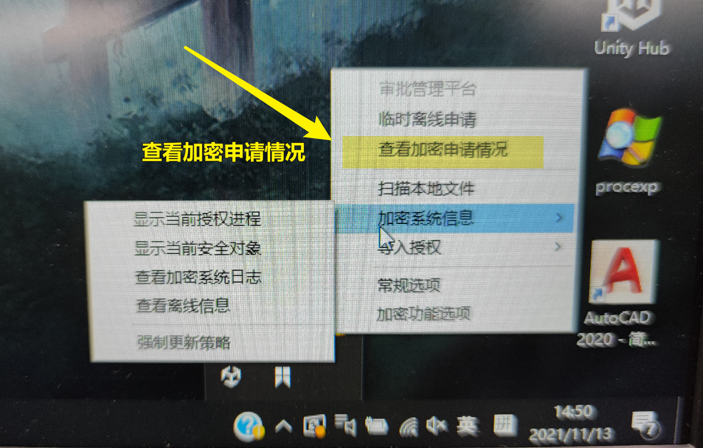

### 2.2 Linux申请解密流程

**Linux软件名：LSDHelper**

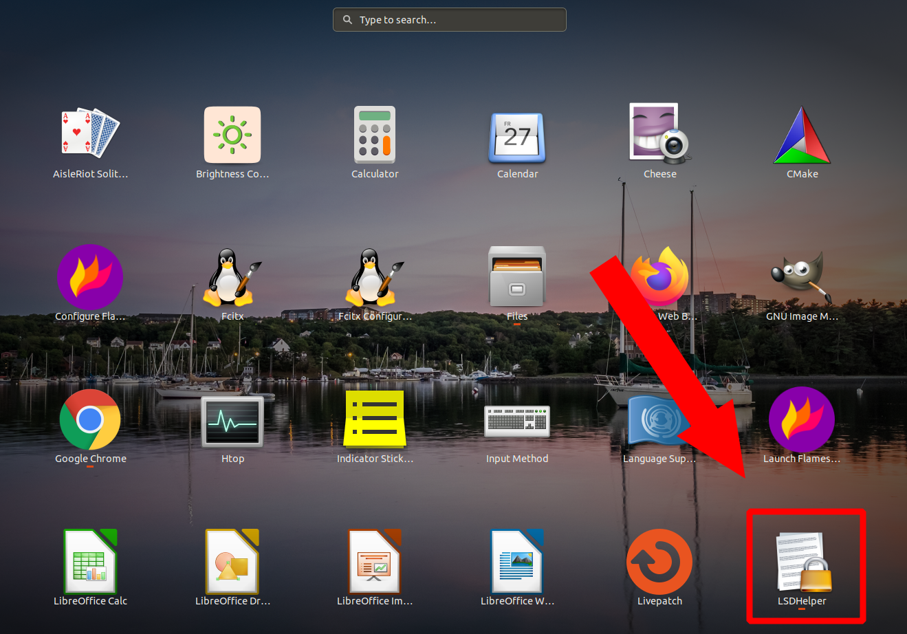

**扫描指定文件夹，批量选中后右键申请解密**

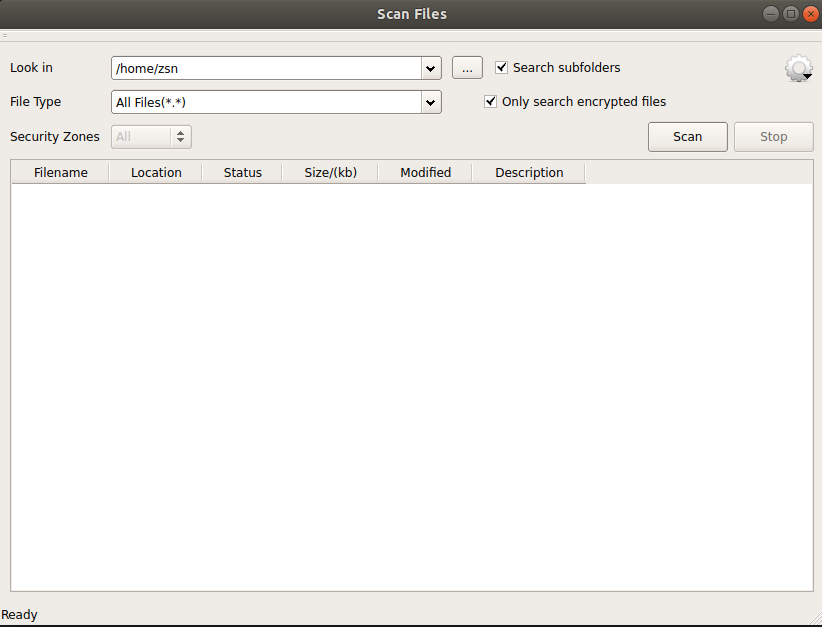

**设置栏具备：查看加密申请情况、切换语言等功能(软件内置中文)**


# 3 申请离线延长【默认一周】

### 3.1 Windos

右键单击加密软件，选择临时离线申请

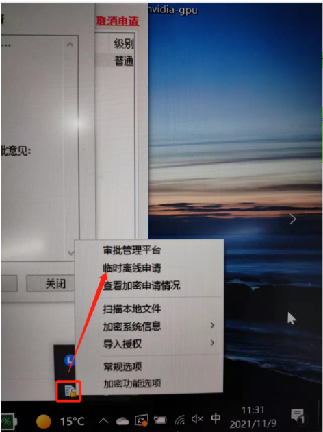

选择开始时间 延长时间 ，填写申请理由，最后点击申请

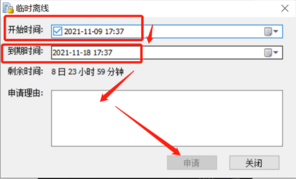

### 3.2 Linux

请发送邮箱进行离线时间延长，请注明需要延长的时间

邮箱：**info@speedbot.net**


**邮件标题**
SpeedBot 忘记密码
SpeedBot 新人账号
SpeedBot 离职注销
SpeedBot 加密软件

**邮件内容**
姓名：
部门：
分组：
邮箱：

# 4 申请外发[Win特有功能]

**方法一：选中需要解密的文件右键申请外发**

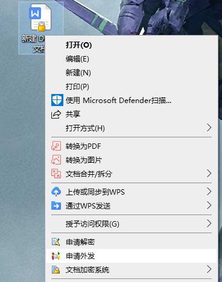

**方法二：客户端界面扫面文件夹解密**

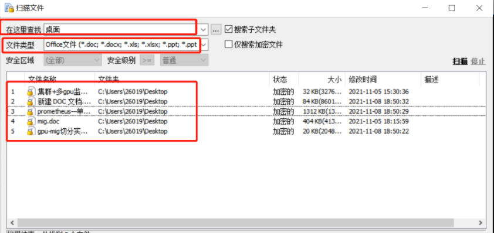

**右键申请解密，填写外发信息**

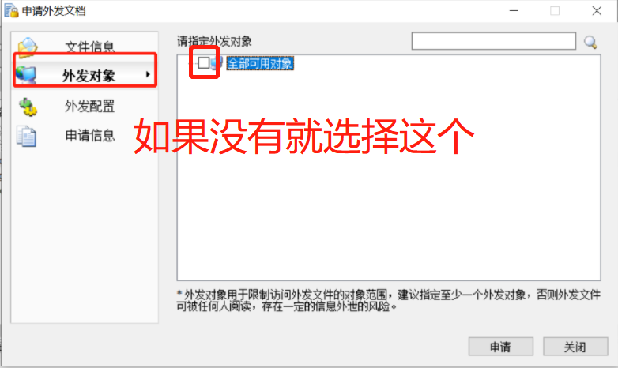

**查看外发申请情况**

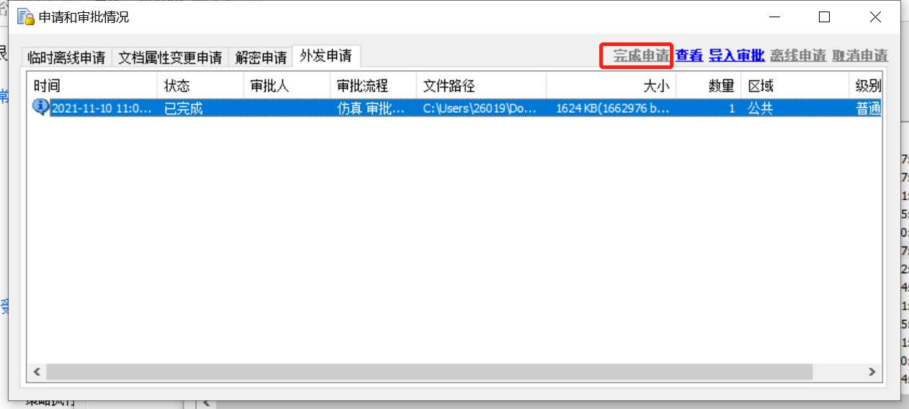

# 5 注销加密软件

**请发送邮箱进行新人账号注册 & 忘记密码 & 离职注销 & 加密软件 ！！！**

邮箱：**info@speedbot.net**


**邮件标题**
SpeedBot 忘记密码
SpeedBot 新人账号
SpeedBot 离职注销
SpeedBot 加密软件

**邮件内容**
姓名：
部门：
分组：
邮箱：