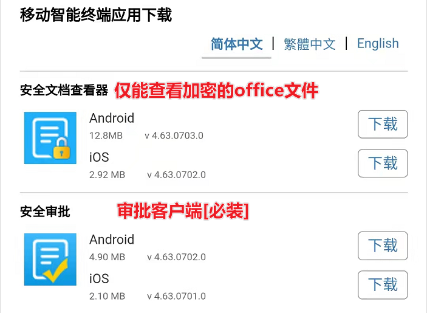

[TOC]

# 0 修改密码（务必修改密码）

**网页地址：http://222.244.113.202:8238/**

**用户名：中文全名(例如张三)，密码默认为空**

点击右上角帮助->修改密码。

# 1 审批移动端

安装包网页或扫描二维码下载：[https://www.tec-development.com/apps/download.html](https://www.tec-development.com/apps/download.html "https://www.tec-development.com/apps/download.html")

**安全审批必装，方便审批**

服务器地址：**222.244.113.202:8238**
账号：**中文名全名(例如张三)**
密码：**默认为空，请优先修改密码**

点击需要审批的文件

点击文件信息可查看详细信息，点击同意或拒绝。

# 2 审批电脑端

**右键右下角图标**，选择**审批管理平台**

登陆后即可看到待审批的申请，双击该申请。

可看到申请信息和文件信息

点击文件信息，双击该文件可查看文件内容，点击批准或拒绝。

