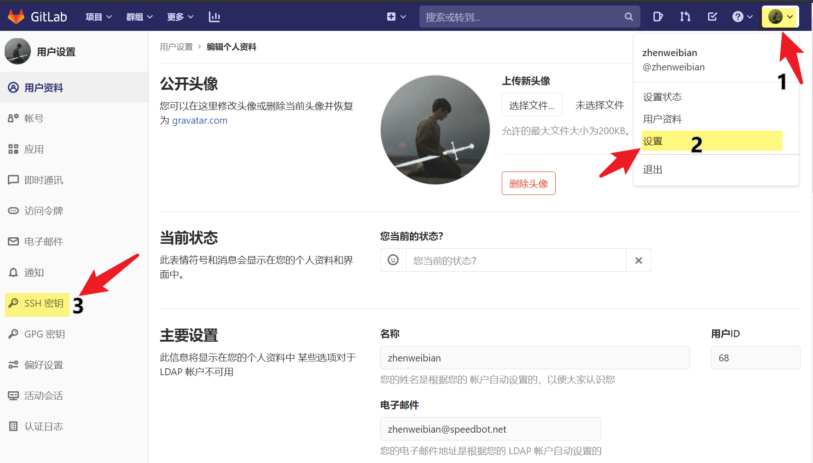
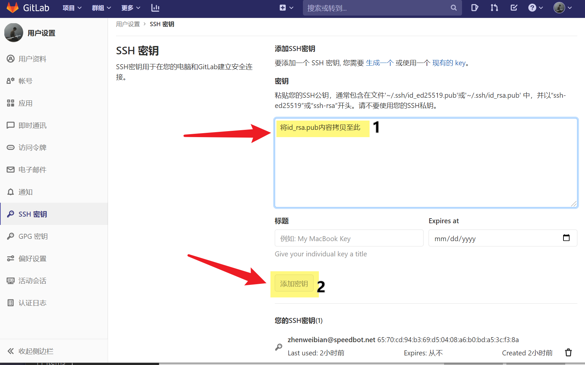

[TOC]


**使用LDAP方式登录！！！**

# 1	Git安装

**Window**

git下载地址：[https://git-scm.com/downloads](https://git-scm.com/downloads "https://git-scm.com/downloads")
阿里源Git地址：[https://registry.npmmirror.com/binary.html?path=git-for-windows/](https://registry.npmmirror.com/binary.html?path=git-for-windows/)

**Debian/Ubuntu**

For the latest stable version for your release of Debian/Ubuntu

```
apt-get install git
```

**MAC**

```shell
brew install git
```

**Fedora**

```
yum install git # (up to Fedora 21)
dnf install git # (Fedora 22 and later)
```

**Arch Linux**

```
pacman -S git
```

# 2	Clone配置

## 2.1 采用SSH 【推荐】

#### 2.1.1 生成SSH
每台主机对应的SSH-KEY不同，在终端执行：**请修改成你的邮箱**
```shell
ssh-keygen -t rsa -C "email@email.com "
```
注意，在命令输入之后会有三次提示问询，连续回车跳过即可。一个帐号可以绑定多个SSH，因此在其他主机上想要使用GitLab时需要重新获取SSH进行绑定。

**Linux or Mac**
	~/.ssh/id_rsa.pub

**Window**
	C/User/用户名/.ssh/id_rsa.pub

#### 2.1.2 在Gitlab配置SSH





## 2.2 采用HTTPS
首次使用时，需要进行git账号的邮箱的配置，具体的指令为：

```shell
git config --global user.name "username"
git config --global user.email "email@email.com"
```

设置完成之后可以通过命令检查

```shell
git config --global  --list
```