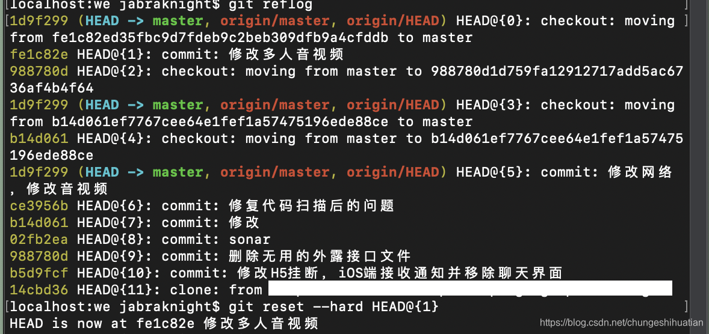

# 1 恢复到某次提交

终端进入对应的Git文件目录中，输入git reflog：

这个排序是从最近你提交的记录开始的，所以根据你提交的记录恢复到你要的代码块就OK，git reset --hard HEAD@{1}就可以了，此时你本地的代码就是你想要的结果。

>  注意：HEAD不是一个分支，只是指向某个COMMIT的指针，git reflo（查看所有分支的所有操作记录（包括commit和reset的操作，包括已经被删除的commit记录，git log则不能察看已经删除了的commit记录）

 git cherry-pick fe1c82e 这个代码也可以恢复, 后面的“fe1c82e”是对应的commitid。

原文链接：https://blog.csdn.net/chungeshihuatian/article/details/100746953