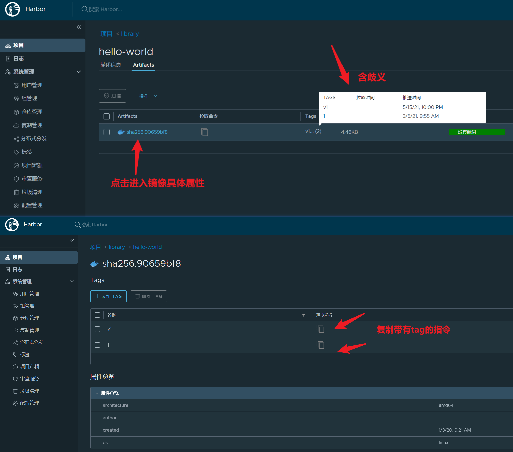

[TOC]

### 1 提示unauthorized

	unauthorized: unauthorized to access repository: xxx/xxx, action: push: unauthorized to access repository: xxx/xxx, action: push

**解决：没有登录镜像仓库，先执行`docker login -u username mirrors.speedbot.net`登录。**

### 2 拉取的镜像没有tag

请复制指定具体的docker镜像指令，见下图

