[TOC]


# 0 概述

URDF（Universal Robot Description Format）——通用机器人描述格式，它是ROS里边使用的一种机器人的描述文件，包含的内容有：连杆、关节，运动学和动力学参数、可视化模型、碰撞检测模型等。

本文的主要内容有两个：
- 通过solidworks将三维模型转化为urdf文件
- 在 **rviz** | **pybullet** 下可视化测试urdf文件

流程如下：
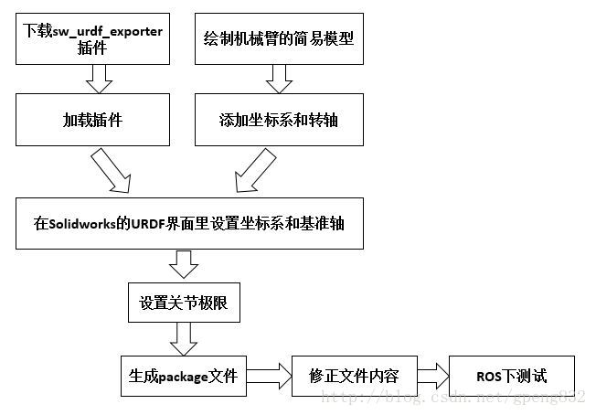

# 1 sw_urdf_exporter插件

## 1.1 插件安装

ROS目前提供了SolidWorks转URDF的插件，叫做sw_urdf_exporter，从[https://wiki.ros.org/sw_urdf_exporter](https://wiki.ros.org/sw_urdf_exporter "https://wiki.ros.org/sw_urdf_exporter")下载sw2urdfSetup.exe文件,下载后点击安装，安装完成后就能在solidworks使用该插件了

## 1.2 插件核验

若打开solidwork后，有如下效果，则安装正常：

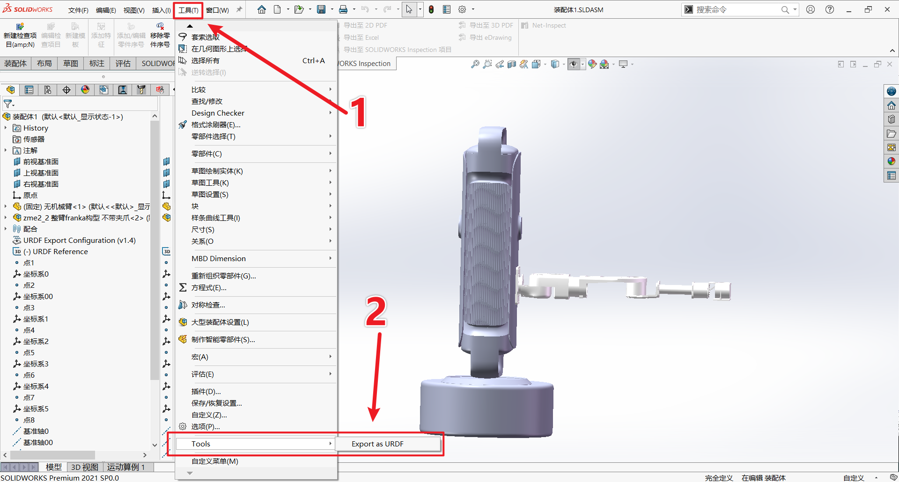

# 2 增加坐标系和转轴

坐标系：定义位置和方向的参考框架
转轴：定义旋转运动的线或轴

假设机械臂是7自由度的，需要增加七组坐标系和转轴，其中坐标系要按照下图的朝向，即Z轴朝向：

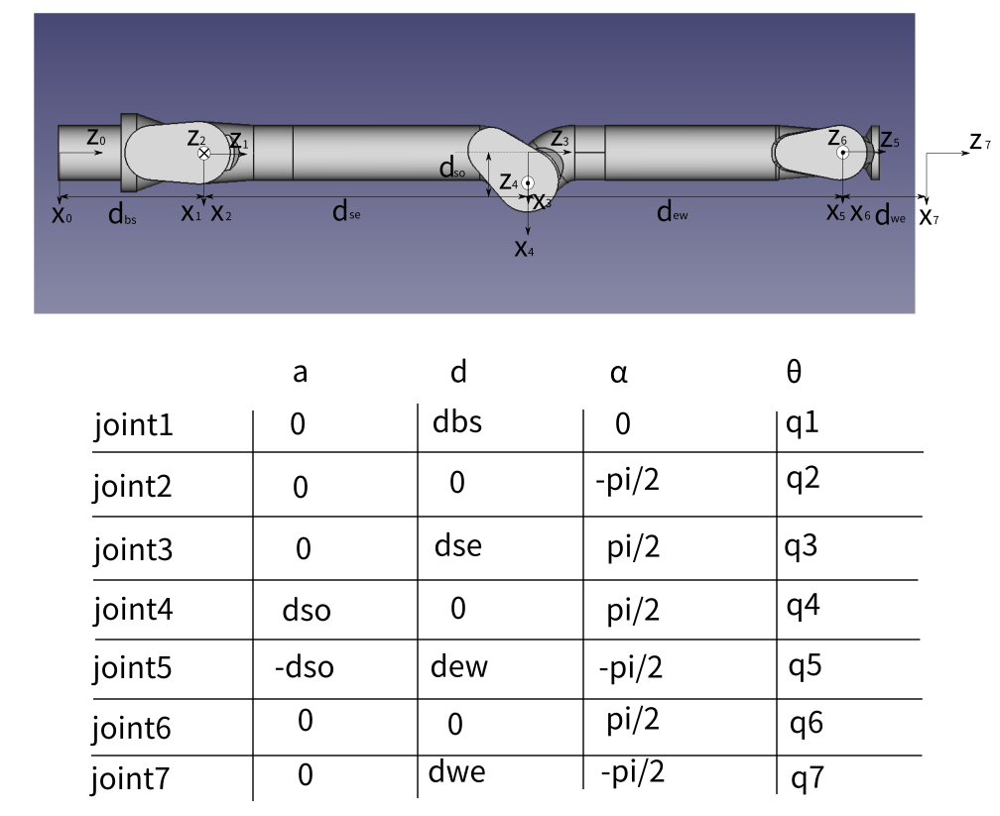

## 2.1 增加坐标系

### 2.1.1 选取中心点

先生成一个中心点，需要注意以下两点：
- 该点是旋转点，故而需要是旋转中心点。若配置错误，则关节模型无法绕中心旋转
- 该点是模型拼接点，故而需要是两关节拼接平面。若配置错误，则模型初始的机械结构空间位置错误

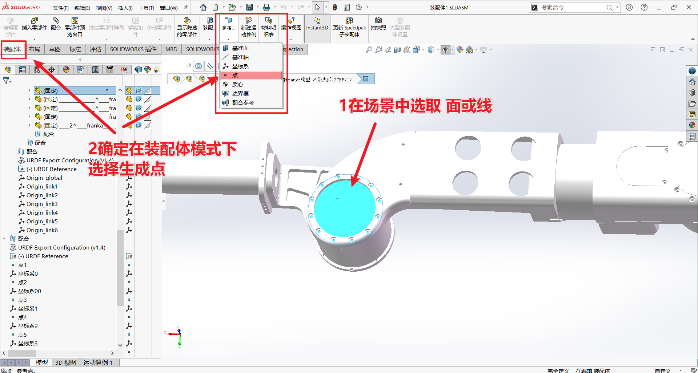

### 2.1.2 你可能需要以下技巧辅助你选点
- 你可以通过鼠标悬浮到目标模型上，选择规则图形的面或者线，在生成点时，会智能在中心生成点。
- 当圆形面或原型线无法完整选取时，可以选取其中一段弧线，在生成点时，会智能在弧心生成点。
- 当模型之间两两遮挡时，你可以通过选中模型，按下&lt;Table&gt;键实现隐藏。再选择被隐藏模型相衔接的模型按下&lt;Shift, Table&gt;键，则被隐藏模型解除隐藏

以上所述规则图形指：圆、长方形等规则对称图形

### 2.1.3 确定生成点

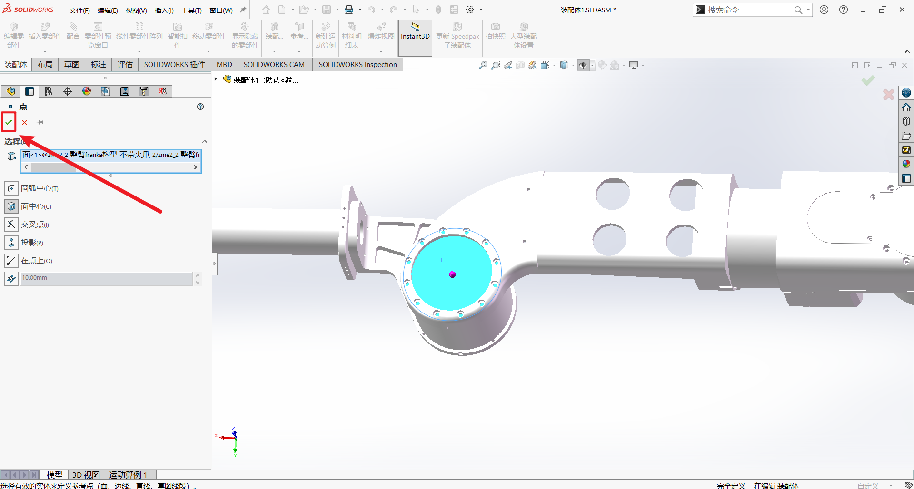

### 2.1.4 创建坐标系

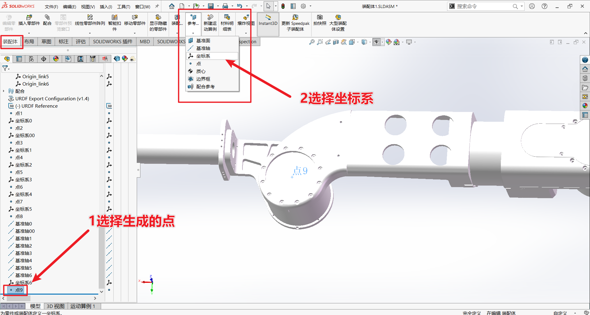

核验坐标系方向是否Z轴符合要求，符合则√完成
若Z轴不符合要求，则通过鼠标选中其他模型做参考系调整坐标系朝向，若不满意在左侧del删除对应xyz轴参考后，重新选择

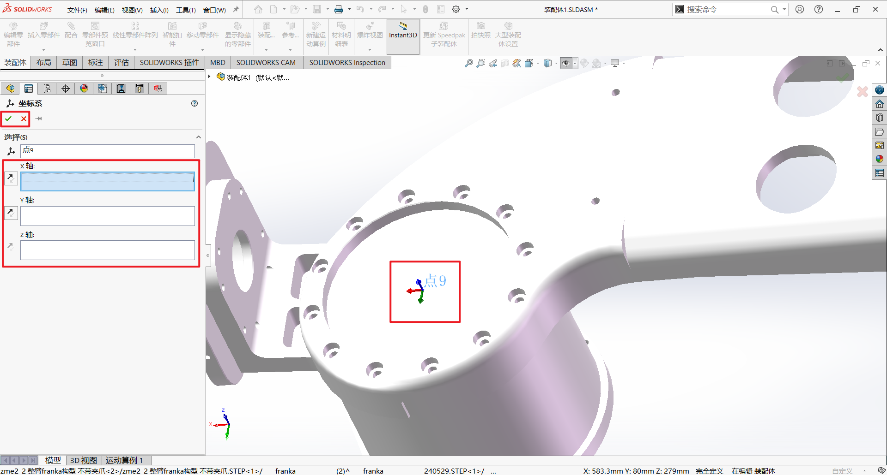

**Z轴要求：**


## 2.2 增加转轴

### 2.2.1 基准线获取

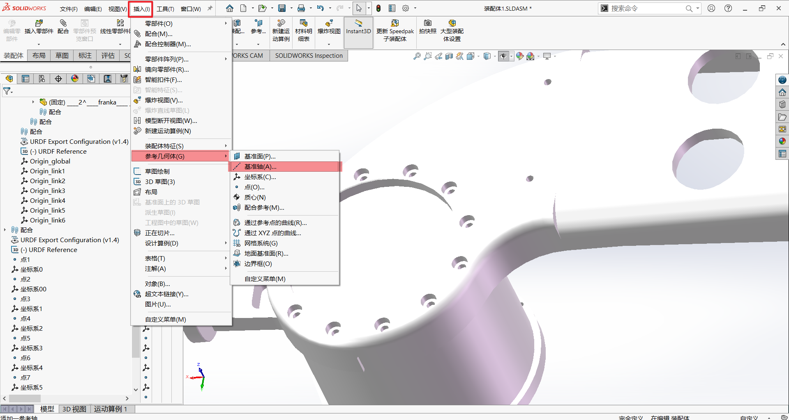

在基准轴模式下，选中一个规则三维体，会自动显示**黄色的基准轴线条**，若符合预期，则选择左侧√

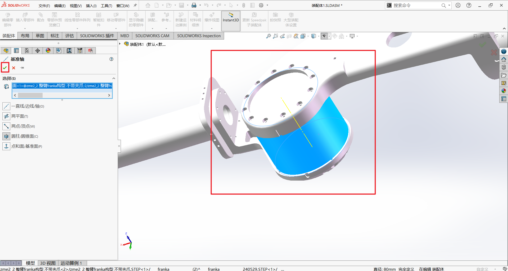

### 2.2.2 你可能需要以下技巧辅助你选线
- 你可以通过鼠标悬浮到目标模型上，选择规则图形的面，在生成点时，会智能在中心生成点。
- 当圆形面无法完整选取时，可以选取其中一段规则弧面，在生成点时，会智能在弧面心生成点。
- 当模型之间两两遮挡时，你可以通过选中模型，按下&lt;Table&gt;键实现隐藏。再选择被隐藏模型相衔接的模型按下&lt;Shift, Table&gt;键，则被隐藏模型解除隐藏

以上所述规则图形指：圆、长方体、圆柱体等规则对称图形

### 2.2.3 核验

确保有七组合理的转轴和坐标系

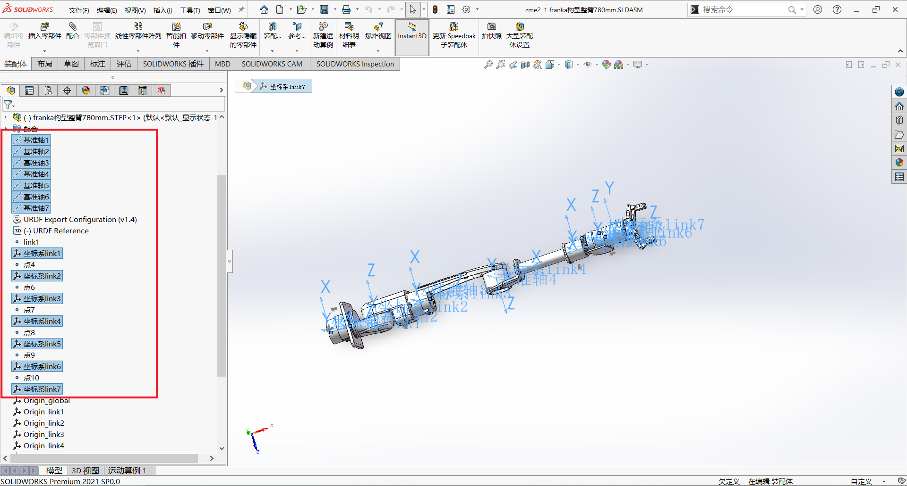

# 3 导出urdf文件

## 3.1 使用sw_urdf_exporter插件


## 3.2 配置urdf关节

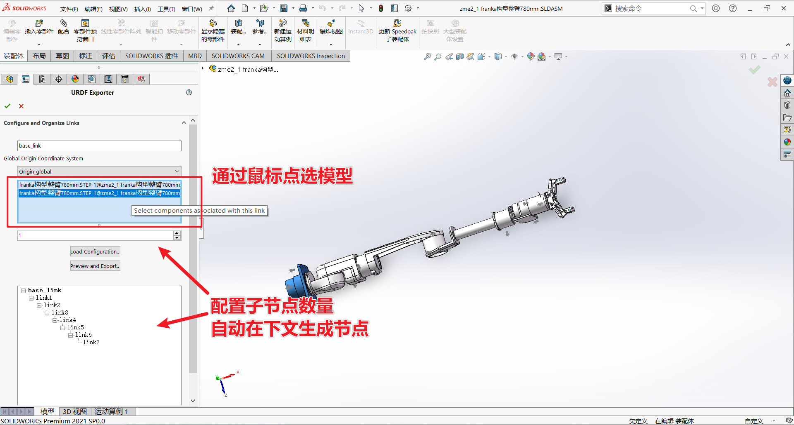

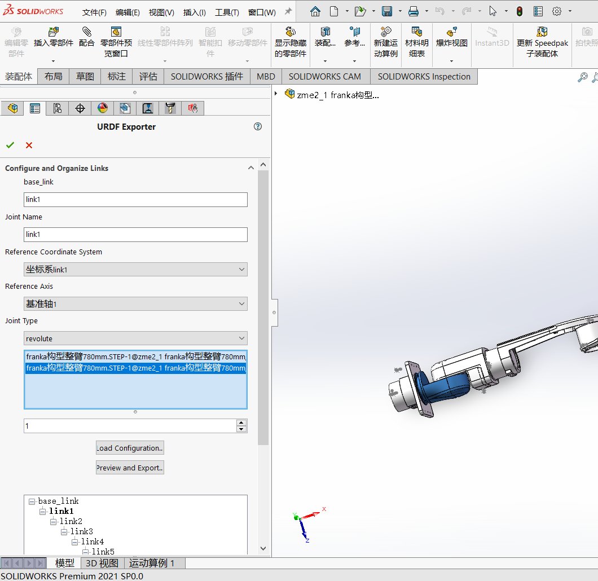

全部关节配置完后，点击左侧[Preview and Export URDF按钮]

## 3.3 配置关节参数

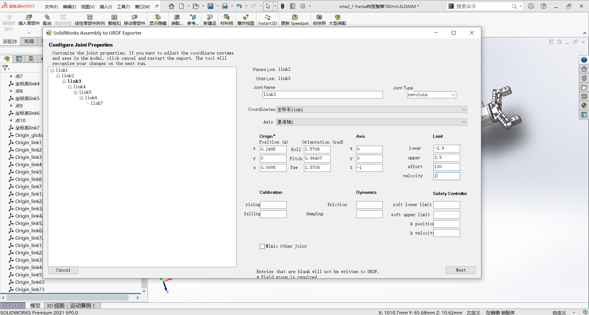

# 4 通过pybullet可视化

**注意事项：**
- 修改python代码中urdf文件路径和名称
- 修改urdf文件中filename字段，改为全局或相对路径，确保可以读取到stl模型
- 以下代码需要用conda安装，pip安装不会报错，但是运行会产生错误

```python
import pybullet as p
import pybullet_data
import time
'''
静态显示Panda机械臂
'''
def main():
    # 连接到 PyBullet 模拟器
    physicsClient = p.connect(p.GUI)
    p.setAdditionalSearchPath(pybullet_data.getDataPath())  # 设置搜索路径以找到URDF文件

    # 加载平面和 Panda 机械臂 URDF
    # p.loadURDF("plane.urdf")
    # panda = p.loadURDF("./FrankaURDF/panda.urdf", useFixedBase=True)
    # panda = p.loadURDF("/home/zme/Downloads/wgx20240408/GitCodes/IKs/franka_emika_panda_pybullet-master/panda_robot/model_description/panda.urdf", useFixedBase=True)
    # panda = p.loadURDF("./urdf/zmebotI.urdf", useFixedBase=True)
    # panda = p.loadURDF("./ZmeArmII/urdf/ZmeArmII.urdf", useFixedBase=True)
    panda = p.loadURDF("./zme2_1/urdf/zme2_1.urdf", useFixedBase=True)
    # panda = p.loadURDF("./franka_panda/panda.urdf", useFixedBase=True)
    # 设置重力
    p.setGravity(0, 0, -9.81)

    # 获取机械臂的关节数量
    num_joints = p.getNumJoints(panda)

    # 打印每个关节的信息
    for i in range(num_joints):
        joint_info = p.getJointInfo(panda, i)
        print(f"Joint {i}: {joint_info[1].decode('utf-8')}")

    # 模拟循环
    while True:
        p.stepSimulation()
        time.sleep(1. / 240.)

        # 检查键盘事件
        keys = p.getKeyboardEvents()
        if ord('q') in keys and keys[ord('q')] & p.KEY_WAS_TRIGGERED:
            break


    # 断开连接
    p.disconnect()


if __name__ == "__main__":
    main()
```

# 5 Rviz可视化

URDF可视化的步骤如下：

1. 建立机器人描述功能包
2. 建立`urdf`文件夹编写urdf文件
3. 建立`launch`文件夹，编写launch文件
4. 修改`setup.py`配置，编译测试


## 5.1 建立功能包

轻车熟路，先创建一个`chapt8_ws`工作空间，然后建立功能包，包的类型选`ament_python`

```shell
ros2 pkg create fishbot_description --build-type ament_python
```

## 5.2 建立URDF文件

建立URDF文件夹，创建urdf文件

```
touch fishbot_base.urdf
```

完成后src下的目录结构：

```
├── fishbot_description
│   ├── __init__.py
├── package.xml
├── setup.cfg
├── setup.py
└── urdf
    └── fishbot_base.urdf
```

编辑`fishbot_base.urdf`

```xml
<?xml version="1.0"?>
<robot name="fishbot">
    
  <!-- base link -->
  <link name="base_link">
  	<visual>
      <origin xyz="0 0 0.0" rpy="0 0 0"/>
      <geometry>
		<cylinder length="0.12" radius="0.10"/>
      </geometry>
    </visual>
  </link>

  <!-- laser link -->
  <link name="laser_link">
  	<visual>
      <origin xyz="0 0 0" rpy="0 0 0"/>
      <geometry>
		<cylinder length="0.02" radius="0.02"/>
      </geometry>
      <material name="black">
      	<color rgba="0.0 0.0 0.0 0.8" /> 
      </material>
    </visual>
  </link>

  <!-- laser joint -->
    <joint name="laser_joint" type="fixed">
        <parent link="base_link" />
        <child link="laser_link" />
        <origin xyz="0 0 0.075" />
    </joint>
</robot>
```

## 5.3 建立launch文件

在目录`src/fishbot_description`下创建`launch`文件夹并在其下新建`display_rviz2.launch.py`文件。

```
mkdir launch
touch display_rviz2.launch.py
```

完成后的目录结构：

```
├── fishbot_description
│   ├── __init__.py
├── launch
│   └── display_rviz2.launch.py
├── package.xml
├── setup.cfg
├── setup.py
└── urdf
    └── fishbot_base.urdf
```


```python
import os
from launch import LaunchDescription
from launch.substitutions import LaunchConfiguration
from launch_ros.actions import Node
from launch_ros.substitutions import FindPackageShare


def generate_launch_description():
    package_name = 'fishbot_description'
    urdf_name = "fishbot_base.urdf"

    ld = LaunchDescription()
    pkg_share = FindPackageShare(package=package_name).find(package_name) 
    urdf_model_path = os.path.join(pkg_share, f'urdf/{urdf_name}')

    robot_state_publisher_node = Node(
        package='robot_state_publisher',
        executable='robot_state_publisher',
        arguments=[urdf_model_path]
        )

    joint_state_publisher_node = Node(
        package='joint_state_publisher_gui',
        executable='joint_state_publisher_gui',
        name='joint_state_publisher_gui',
        arguments=[urdf_model_path]
        )

    rviz2_node = Node(
        package='rviz2',
        executable='rviz2',
        name='rviz2',
        output='screen',
        )

    ld.add_action(robot_state_publisher_node)
    ld.add_action(joint_state_publisher_node)
    ld.add_action(rviz2_node)

    return ld
```

想要可视化模型需要三个节点参与

- `joint_state_publisher_gui` 负责发布机器人关节数据信息，通过`joint_states`话题发布
- `robot_state_publisher_node`负责发布机器人模型信息`robot_description`，并将`joint_states`数据转换tf信息发布
- `rviz2_node`负责显示机器人的信息

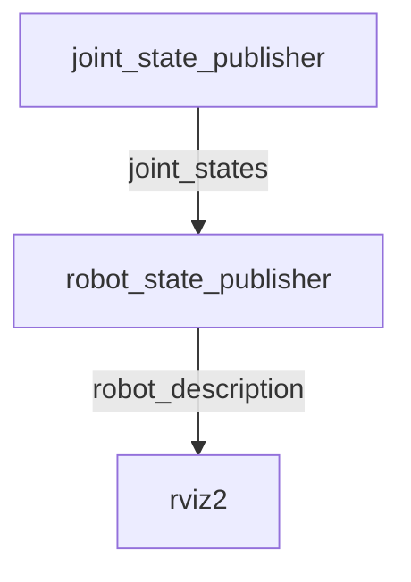

这里我们用到了`joint_state_publisher_gui`和`robot_state_publisher`两个包，如果你的系统没有安装这两个包，可以手动安装:

```
sudo apt install ros-$ROS_DISTRO-joint-state-publisher-gui ros-$ROS_DISTRO-robot-state-publisher
```

> `joint_state_publisher_gui`，还有一个兄弟叫做`joint_state_publisher`两者区别在于`joint_state_publisher_gui`运行起来会跳出一个界面，通过界面可以操作URDF中能动的关节

## 5.4 修改setup.py

导入头文件

```python
from glob import glob
import os
```

加入目录安装

```python
('share/ament_index/resource_index/packages',
['resource/' + package_name]),
('share/' + package_name, ['package.xml']),
```

完整

```python
from setuptools import setup
from glob import glob
import os

package_name = 'fishbot_description'

setup(
    name=package_name,
    version='0.0.0',
    packages=[package_name],
    data_files=[
        ('share/ament_index/resource_index/packages',
            ['resource/' + package_name]),
        ('share/' + package_name, ['package.xml']),
        (os.path.join('share', package_name, 'launch'), glob('launch/*.launch.py')),
        (os.path.join('share', package_name, 'urdf'), glob('urdf/**')),
    ],
    install_requires=['setuptools'],
    zip_safe=True,
    maintainer='root',
    maintainer_email='root@todo.todo',
    description='TODO: Package description',
    license='TODO: License declaration',
    tests_require=['pytest'],
    entry_points={
        'console_scripts': [
        ],
    },
)
```

## 5.5 编译测试

编译

```
colcon build
```

运行测试

```
source install/setup.bash
ros2 launch fishbot_description display_rviz2.launch.py
```

添加robotmodel模块，分别选择link名称如下，即可看到机器人的模型显示

此时看看节点关系图

这里大家可以参考图理一理launch文件中启动的三个节点的关系。

然后打开TF模块，看一下机器人的坐标系关系

最终效果类似如图：

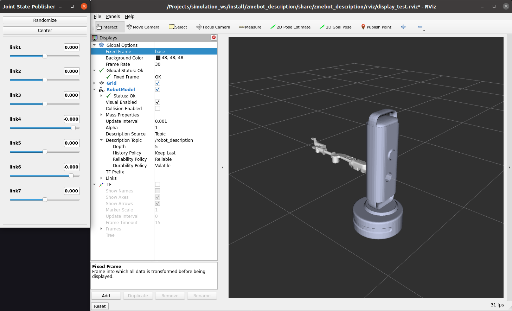