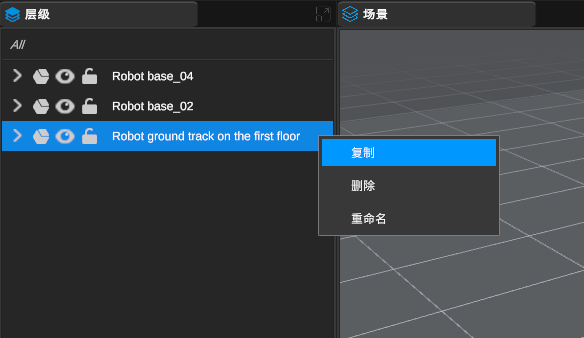

[TOC]

# 1 撤销

点击导航栏中“编辑”按钮，选择撤销

应用程序内快捷键:Ctrl+Z

# 2 反撤销

点击导航栏中“编辑”按钮，选择反撤销

应用程序内快捷键:Ctrl+Y

# 3 复制

方法1：首先在层级结构中选择需要复制的内容或者在场景中选择需要复制的内容，点击导航栏“编辑”中的“复制”按钮

方法2：层级结构中进行复制

方法3：快捷键操作，在层级结构中选择需要复制的内容或者在场景中选择需要复制的内容，应用快捷键Ctrl+D进行快捷复制

# 4 删除

方法1：首先在层级结构中选择需要删除的内容或者在场景中选择需要删除的内容，点击导航栏“编辑”中的“删除”按钮

方法2：层级结构中进行删除

方法3：快捷键操作，在层级结构中选择需要删除的内容或者在场景中选择需要删除的内容，应用快捷键Del进行快捷删除

# 5 偏好设置

在导航栏的“编辑”中可以找到“设置”选项

程序设置可以设置场景大小、场景显示质量等

