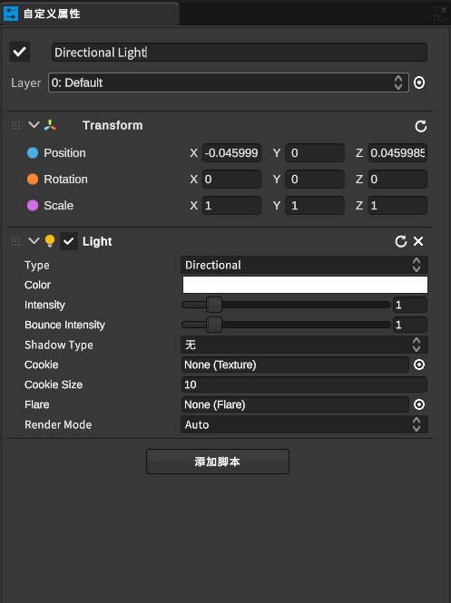

[TOC]

# 1 创建空对象

点击导航栏的“模型”中的“建模”，选择需要添加的3d模型

对象中还包含定向光、点光源、聚光灯三种光源可选择，以下以平行光进行介绍；在导航栏的“模型”中的“光照”选择平行光进行插入

平行光的属性如下：

- Type:光源类型选择，包含平行光、点光源等
- Color：光源颜色选择
- Intensity:光源强度选择
- Bounce Intensity：反射强度
- Shadow Type:阴影类型，包含无、强、弱三种模式
- Cookie：为阴影添加Alpha通道的图片效果
- Cookie：阴影效果大小
- Flare ：耀斑效果
- Render Mode：渲染模式选择

# 2 组功能

将多个三维对象组合成一个单一的组件，以便方便地移动、旋转、缩放或编辑整个组件。解组功能可以将组件分解为其原始的独立对象，以便对其进行单独的编辑。

# 3 导入资源

- 导入模型：用户可以从外部文件导入三维模型，例如常见的3D模型文件格式，如OBJ、FBX、STL等。导入的模型可以在项目中进行编辑、变换、材质设置等操作，从而方便地与现有的设计进行融合。

- 导入点云：用户可以导入点云数据，例如通过激光扫描获得的点云文件。导入的点云可以在软件中进行处理、编辑、重建等操作，从而生成实体模型或进行其他设计分析。

- 导入图片：用户可以导入图片文件，例如用作贴图、纹理、背景等。导入的图片可以在软件中进行编辑、调整尺寸、裁剪等操作，从而用于设计项目中的视觉效果。

- 导入DXF：用户可以导入DXF（Drawing Exchange Format）文件，这是一种常见的二维绘图文件格式，用于交换CAD数据。导入的DXF文件可以在软件中进行编辑、转换为三维模型、进行量测等操作，从而与设计项目中的其他元素进行对齐。

# 4 导出资源

- 导出模型：用户可以选择将当前设计项目中的模型导出为外部文件，例如常见的3D模型文件格式，如OBJ、FBX、STL等。导出的模型文件可以在其他软件中进行编辑、渲染、建模等操作，从而用于不同的设计和应用需求。

- 导出碰撞体：碰撞体是模型的一种特殊形式，用于模拟模型在物理引擎中的碰撞和交互行为。用户可以选择将当前设计项目中的碰撞体导出为外部文件，例如常见的碰撞体文件格式，如COLLADA、Bullet Physics等。导出的碰撞体文件可以用于物理引擎的设置和调试，从而实现更加真实的模型碰撞效果。

# 5 运动学

关节绑定功能通常支持多种类型的关节连接，如旋转关节、平移关节、万向关节等。用户可以选择合适的关节类型，并在虚拟模型中创建关节连接，从而模拟不同类型的物体运动和交互行为。

约束参数：关节绑定功能还允许用户设置关节连接的约束参数，如关节的旋转范围、平移范围、速度限制等。用户可以根据需求设置合适的约束参数，从而控制虚拟模型在仿真中的运动行为。