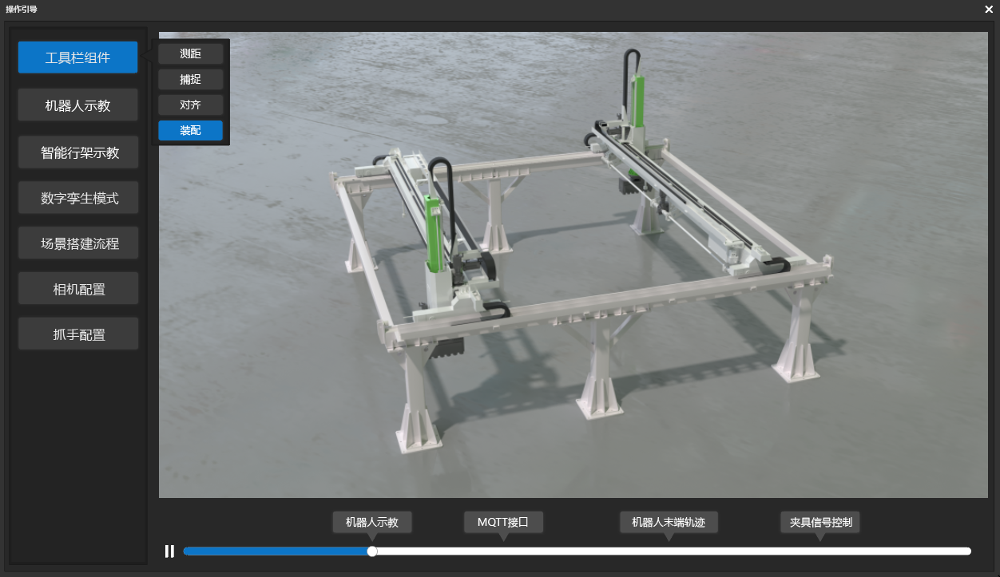
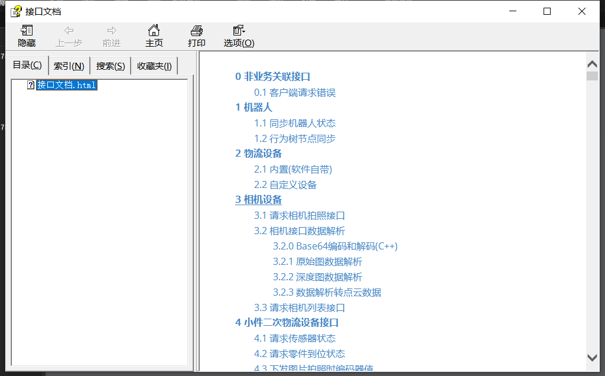

[TOC]

# 1 欢迎屏幕

点击导航栏中“欢迎屏幕”按钮

会再次显示出快捷键，鼠标功能以及界面介绍

# 2 操作引导

【菜单栏 -> 操作引导】 在操作引导窗口左侧选择功能，右侧会播放对应的教程

# 3 用户文档

[用户文档](https://dt.speedbot.net/web/#/48/663 "用户文档")

# 4 接口文档

点击导航栏中“欢迎屏幕”按钮

会出现对应的接口支持使用

