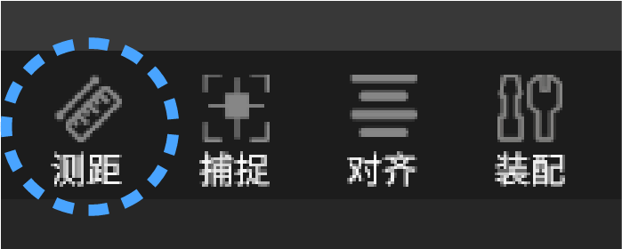
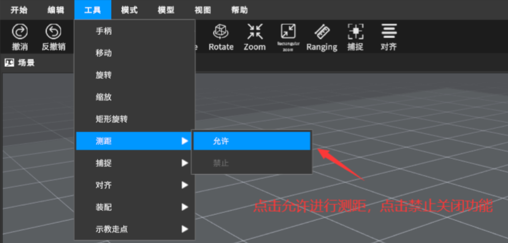
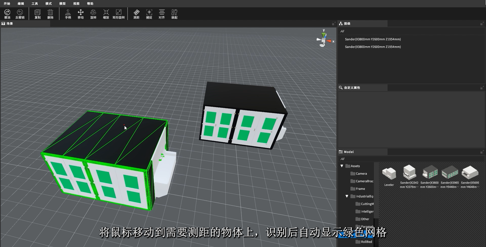
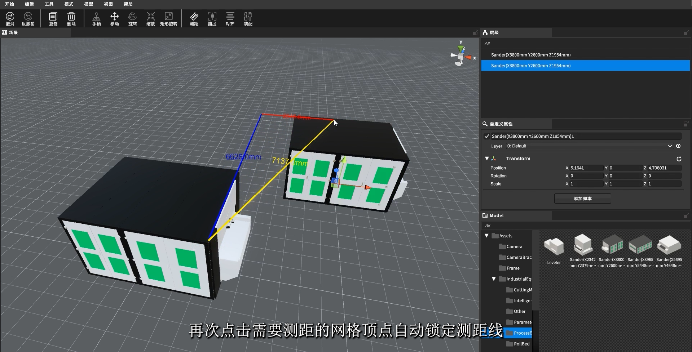
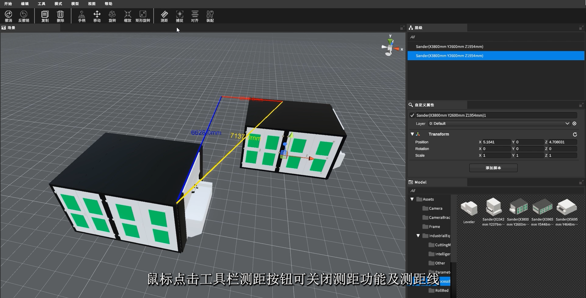
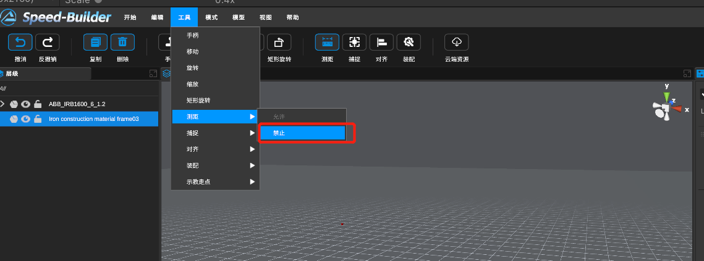
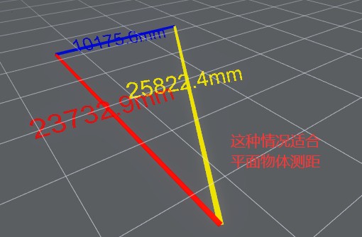

[TOC]

# 0 功能描述

测量物体与物体之间的间距

# 1 视频教程

<video src="https://gitlab.com/MrVBian/Introduction/-/raw/master/%E6%B5%8B%E8%B7%9D.mp4" style="width: 100%; height: 100%;" controls="controls"></video>

# 2 使用流程

## 2.1 开启测距功能（方式一）

点击工具栏->测距按钮->进入测距模式 

## 2.2 开启测距功能（方式二）

点击菜单栏工具->测距->允许 

## 2.3 可测量物体提示

当将鼠标移动到需要测量的物体上时，绿色网格将自动显示，方便使用者选择网格顶点 

## 2.4 使用方式
在选择网格顶点后，再次点击需要测距物体的网格顶点，即可自动锁定测距线 

## 2.5 关闭测距功能（方式一）

点击工具栏->测距按钮->退出测距模式 

## 2.6 关闭测距功能（方式二）
点击菜单栏工具->测距->禁止 

 
 【注：以下情况少一条绿色测距线段】
 
