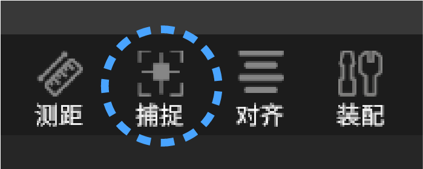
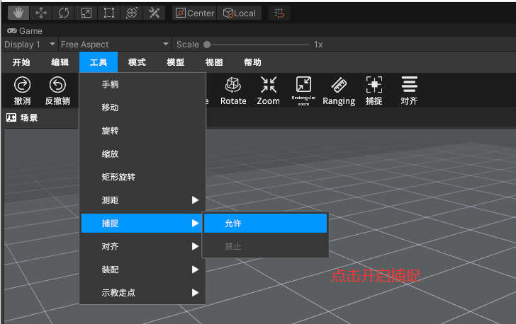
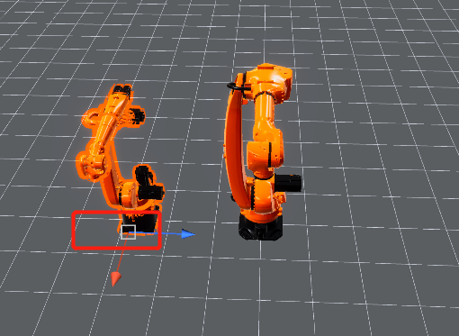
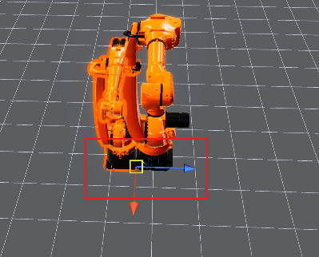
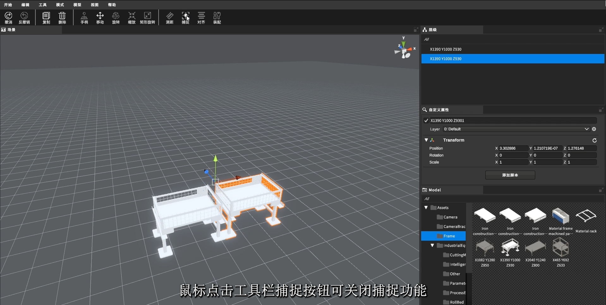
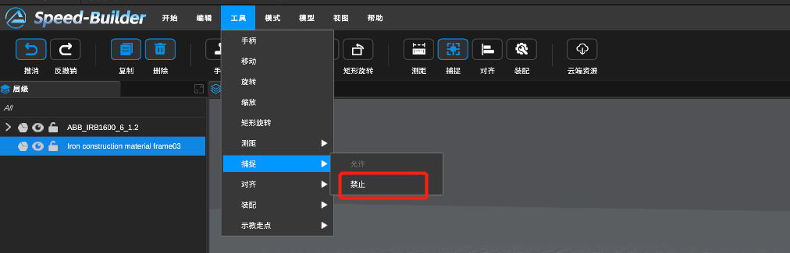

[TOC]

# 0 功能描述
快速且准确贴近两个物体

# 1 视频教程

<video src="https://gitlab.com/MrVBian/Introduction/-/raw/master/%E6%8D%95%E6%8D%89.mp4" style="width: 100%; height: 100%;" controls="controls"></video>

# 2 使用流程
## 2.1 开启捕捉模式（方式一）
点击工具栏->捕捉按钮->进入捕捉模式 

## 2.2 开启捕捉模式（方式二）

点击菜单栏工具->捕捉->允许 

## 2.3 选择捕捉顶点

进入模式，选中物体后，拖动白色顶点到想对齐的顶点 

## 2.4 可对齐顶点提示

出现金黄色框就是可以吸附顶点 

捕捉即网格捕捉，能够辅助用户快速获取模型表面的点。用户在选中单个模型后，启动捕捉功能后，鼠标悬浮mesh上描边显示轮廓(高亮)，同时显示出中心点(高亮)，mesh上所有点均可选中，但靠近高亮线条、点时会自动吸附

## 2.5 关闭捕捉模式（方式一）
点击工具栏->捕捉按钮->退出捕捉模式 

## 2.6 关闭捕捉模式（方式二）

点击菜单栏工具->捕捉->禁止 

