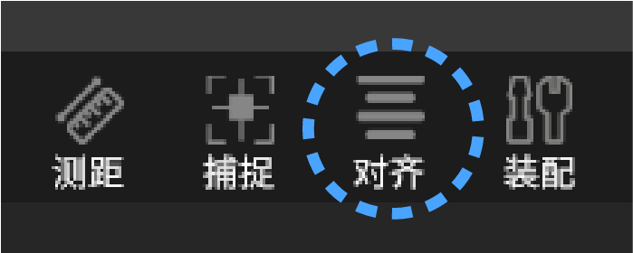
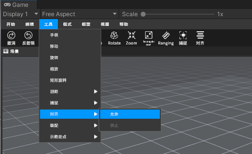
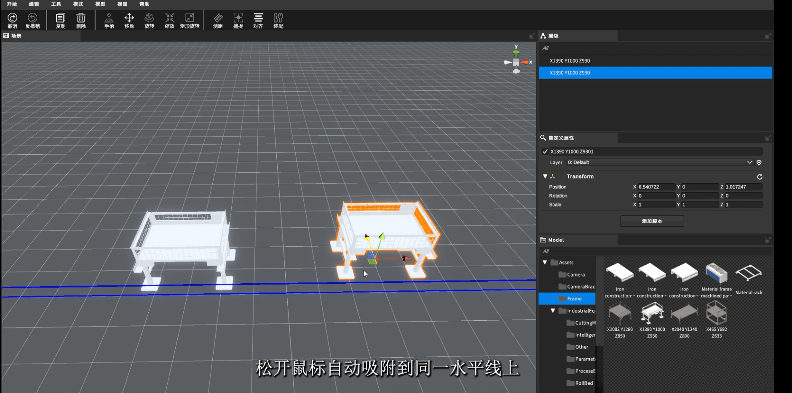
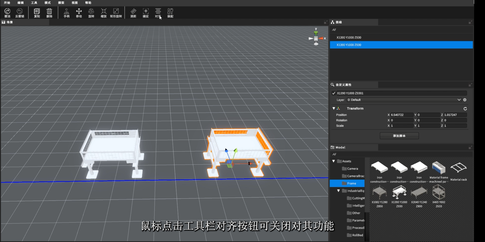
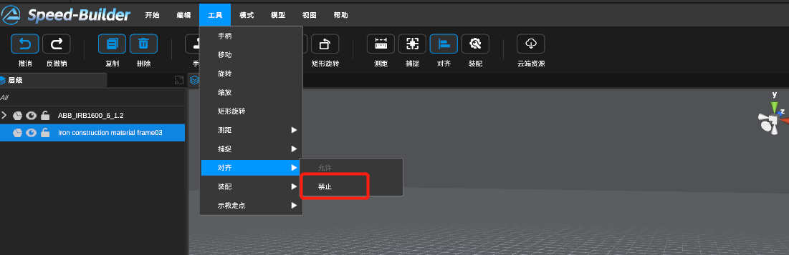

[TOC]

# 0 功能描述

该功能用于多个模型之间排列对齐，借鉴于PPT摆放矩形。当用户试图摆放多个模型完成行列对齐效果时，被选中模型会与周边模型显示出辅助线，当被选中模型与辅助线较近时自动吸附，辅助用户快速完成模型之间行列的对齐效果

# 1 视频教程

<video src="https://gitlab.com/MrVBian/Introduction/-/raw/master/%E5%AF%B9%E9%BD%90.mp4" style="width: 100%; height: 100%;" controls="controls"></video>

# 2 使用流程

## 2.1 开启对齐功能（方式一）

点击工具栏->对齐按钮->进入对齐模式 

## 2.2 开启对齐功能（方式二）

点击菜单栏工具->对齐->允许 

## 2.3 使用方式

将物体拖动到目标物体附近时，将自动显示蓝色对齐线；松开鼠标后，物体将自动吸附到相同的水平线上 

 
 【注：按住M键可以临时打开对齐模型，松开就关闭该模式，如若想长期打开对齐，最好去工具栏手动打开】
 

## 2.4 关闭对齐功能（方式一）

点击工具栏->对齐按钮->退出对齐模式 

## 2.5 关闭对齐功能（方式二）

点击菜单栏工具->对齐->禁止 

