[TOC]

# 0 功能描述

装配是为了快速组装物体，构建成一个场景

# 1 装配规则

- 装配功能启动后，所有未装配的物体都会高亮绿色
- 相机->相机支架
- 机器人相机->机器人抓手->机器人->机器人底座/地轨
- 桁架相机->桁架抓手->桁架两个自由臂

# 2 视频教程

<video src="https://gitlab.com/MrVBian/Introduction/-/raw/master/%E8%A3%85%E9%85%8D.mp4" style="width: 100%; height: 100%;" controls="controls"></video>

# 3 使用流程

## 3.1 开启装配功能（方式一）

点击工具栏->装配按钮->进入装配模式 

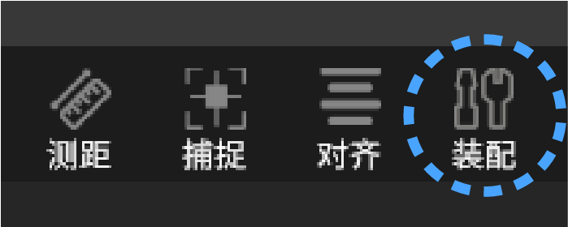

## 3.2 开启装配功能（方式二）

点击菜单栏工具->装配->允许 

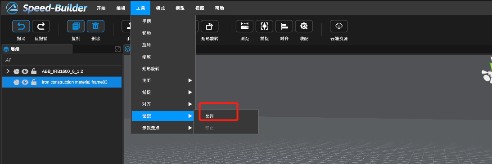

## 3.3 使用方式
### a 从模型库中选择一款机器人

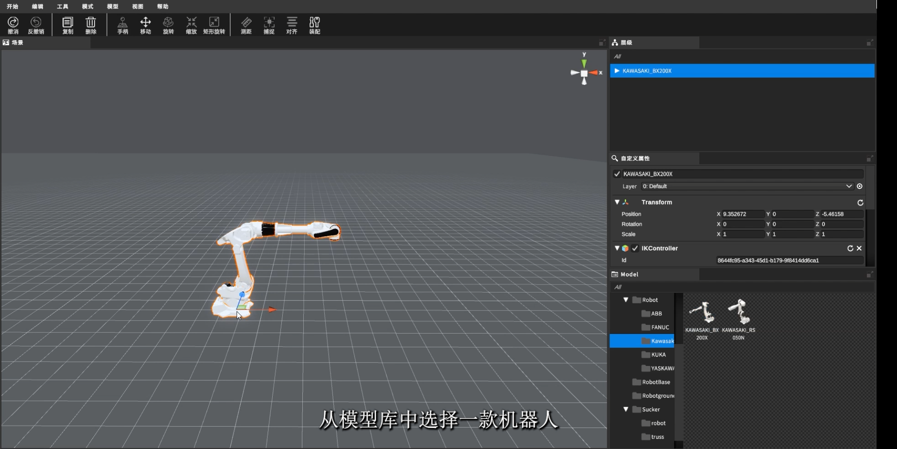

### b 选择一个抓手以进行装配，此时可装配的物体将显示绿色边框

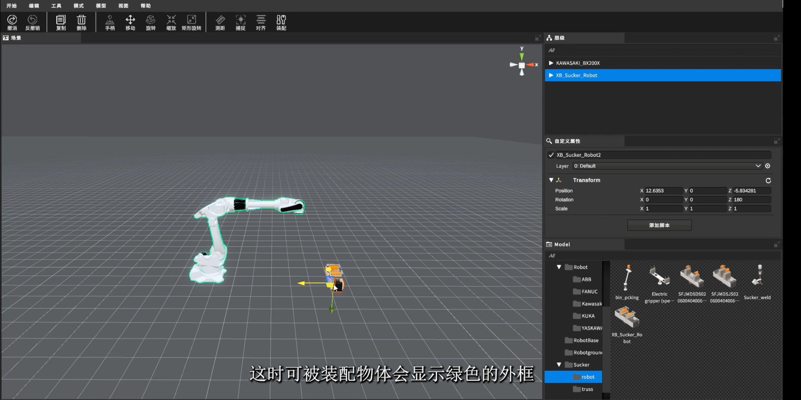

### c 点击机器人后，抓手将自动装配到机器人末端点上

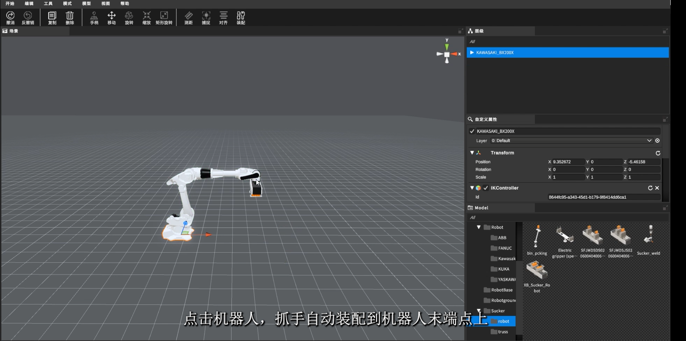

### d 选择一个相机，然后点击抓手，相机将自动装配到抓手上

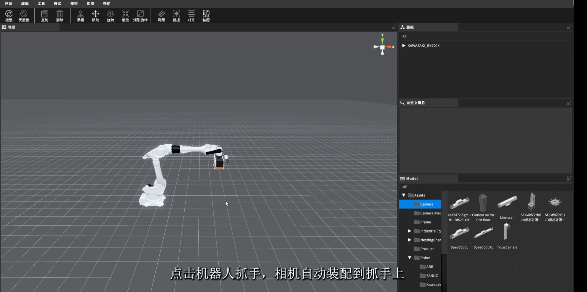

### e 选择一个机器人底座，然后点击机器人和底座，即可自动将它们装配起来

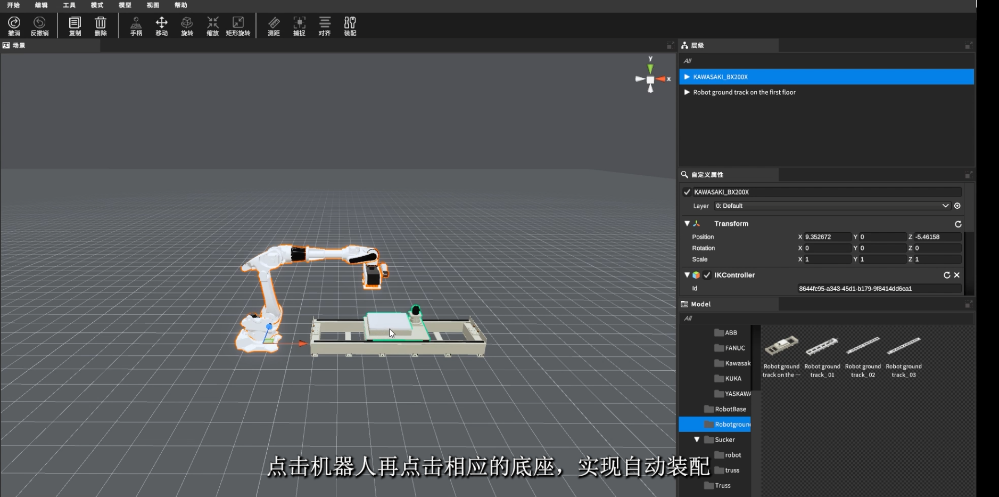

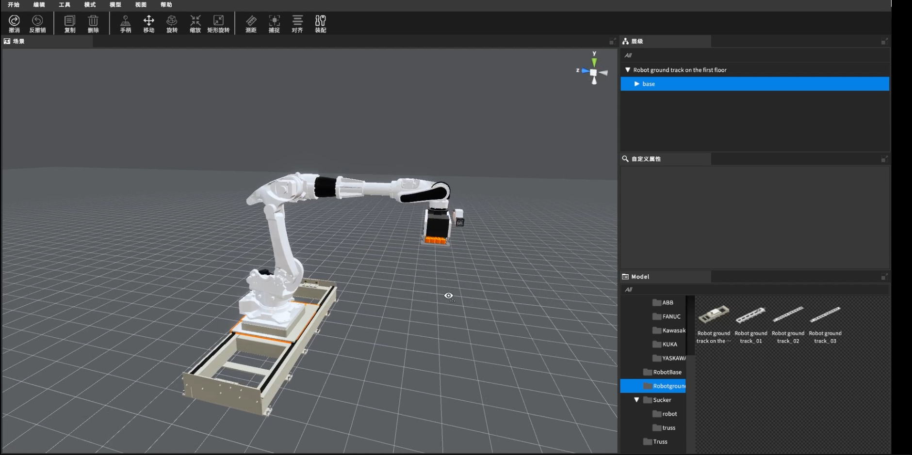

### f 点击工具栏装配按钮关闭装配功能

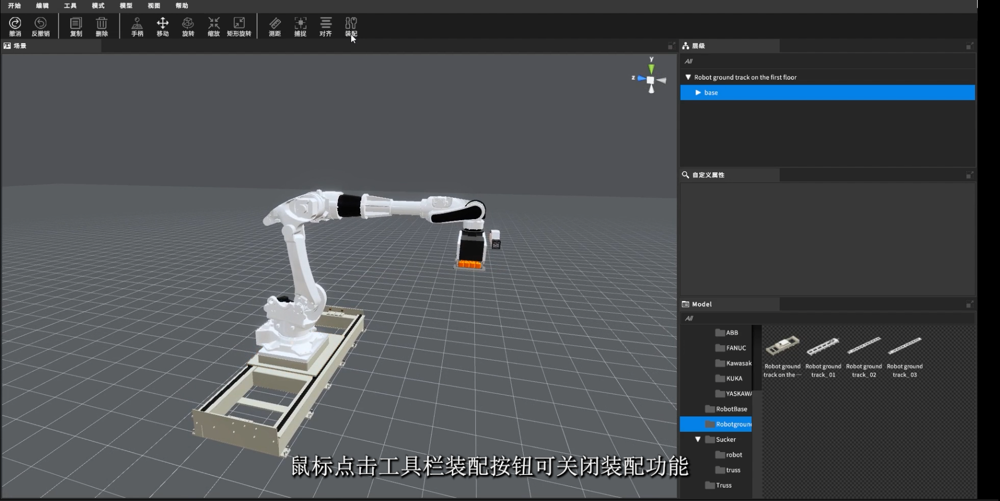

### g 已经装配好的物体，可以直接更换到其余未装配物体上

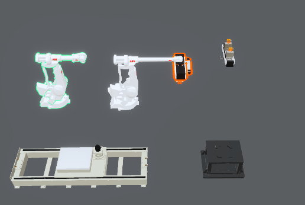

### h 拆卸功能（右键需要拆卸的物体就会拆下来放置到附近）

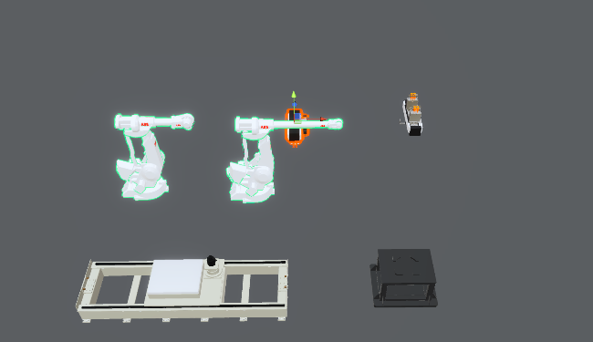

### i 装配完成

## 3.4 关闭装配功能（方式一）

点击工具栏->装配按钮->退出装配模式 

## 3.5 关闭装配功能（方式二）

点击菜单栏工具->装配->禁止 

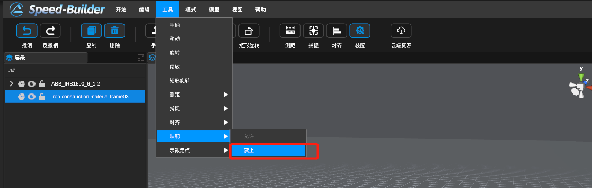