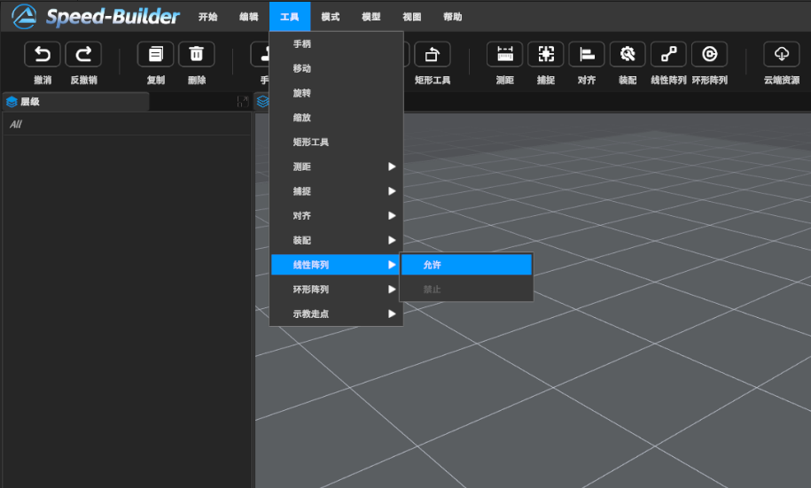
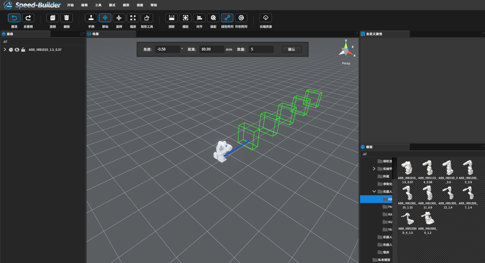
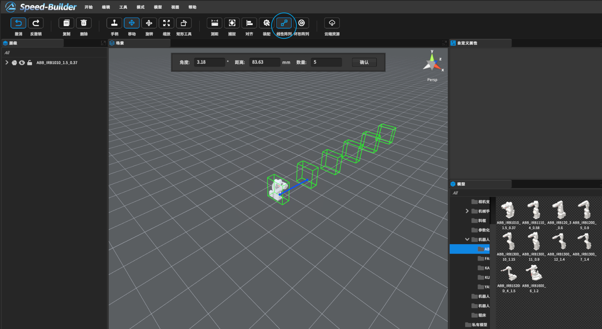
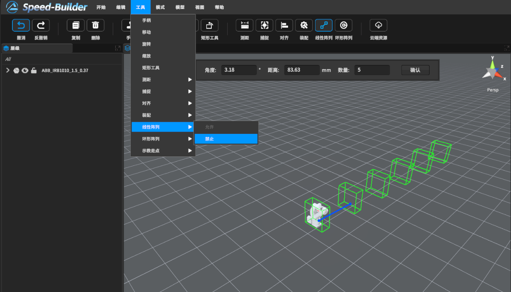
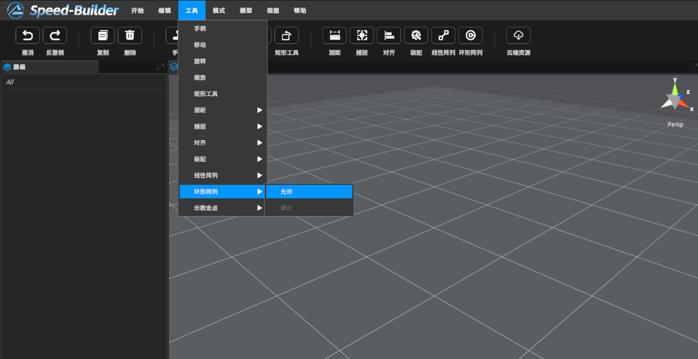
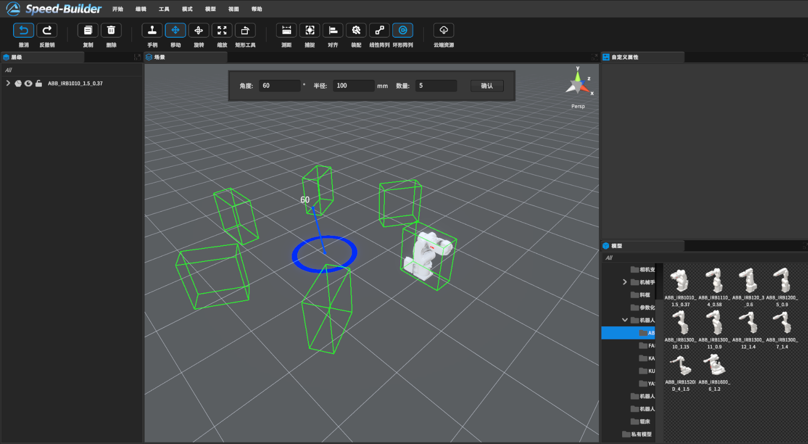
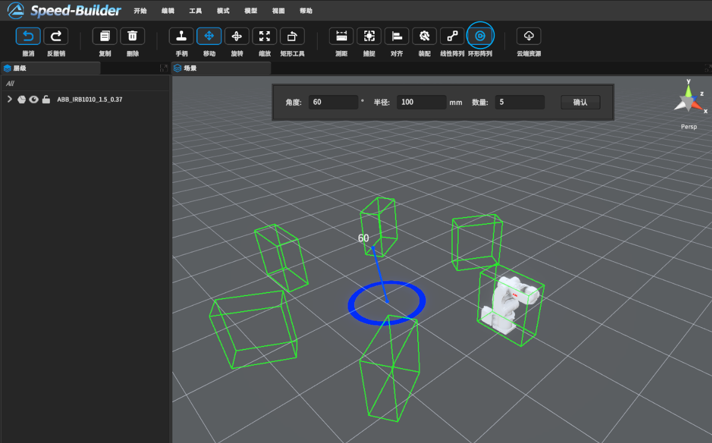
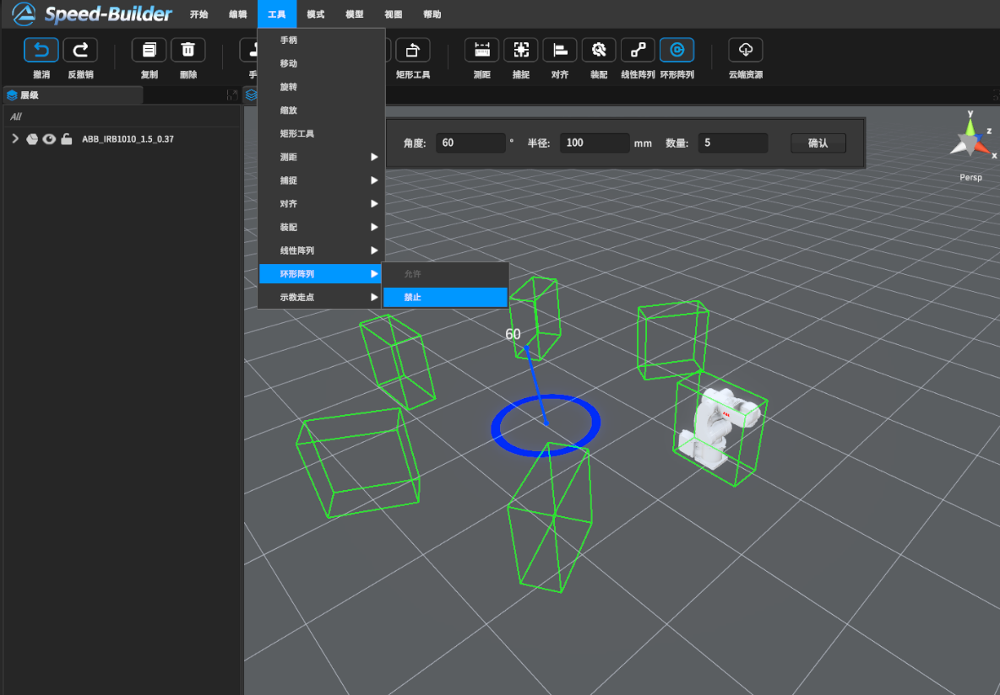

# 0 功能描述：

模型按照线性或者环形的形式进行均匀分布复制

# 1 线性阵列

## 1.1 视频教程

<video src="https://gitlab.com/MrVBian/Introduction/-/raw/a548f359de5e32aaaddc280462063d3acbfe2beb/20230818%E7%BA%BF%E6%80%A7%E9%98%B5%E5%88%97.mp4" style="width: 100%; height: 100%;" controls="controls"></video>

## 1.2 使用流程

### a 开启线性阵列模式（方式一）
点击工具栏->线性阵列按钮->进入线性阵列模式 

### - 开启线性阵列模式（方式二）
点击菜单栏工具->线性阵列->允许 

### - 使用方式
可在场景任意点击一次引出方向线，初步确定方向后再次点击。如果想要重新确定方向可按下Ctrl+Z键取消；初步确定后，可在上方的阵列面板修改具体的参数，包括角度、距离、数量；如果阵列完毕可点击确定按钮。 

### - 关闭线性阵列功能（方式一） 
点击工具栏->线性阵列按钮->退出线性阵列模式 

### - 关闭线性阵列功能（方式二） 
点击菜单栏工具->线性阵列->禁止 

# 环形阵列

## - 视频教程

<video src="https://gitlab.com/MrVBian/Introduction/-/raw/520355ab57c425a24c6b62d3897ef1040e24064e/20230818%E7%8E%AF%E5%BD%A2%E9%98%B5%E5%88%97.mp4" style="width: 100%; height: 100%;" controls="controls"></video>

## - 使用流程

### - 开启环形阵列模式（方式一）
点击工具栏->环形阵列按钮->进入环形阵列模式 

### - 开启环形阵列模式（方式二）
点击菜单栏工具->环形阵列->允许 

### - 使用方式
点击场景某点作为环形原点，通过鼠标在半径线上移动改变间隔角度；初步确定后，可在上方的阵列面板修改具体的参数，包括角度、距离、数量；如果阵列完毕可点击确定按钮。 

### - 关闭环形阵列功能（方式一） 
点击工具栏->环形阵列按钮->退出环形阵列模式 

### - 关闭环形阵列功能（方式二） 
点击菜单栏工具->环形阵列->禁止 

