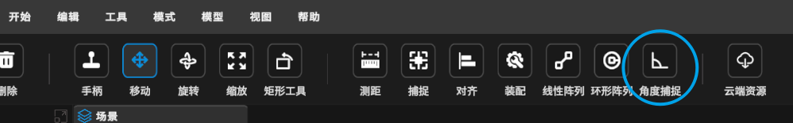
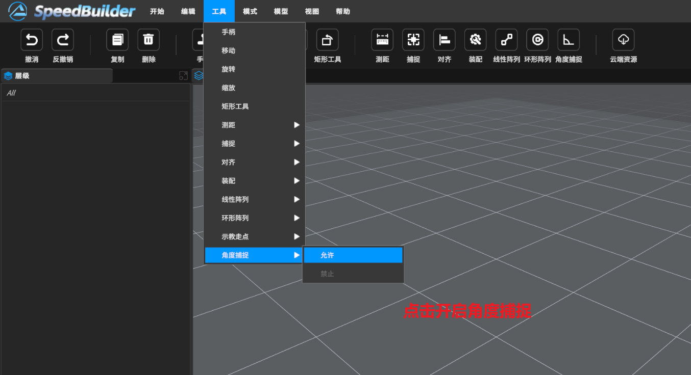
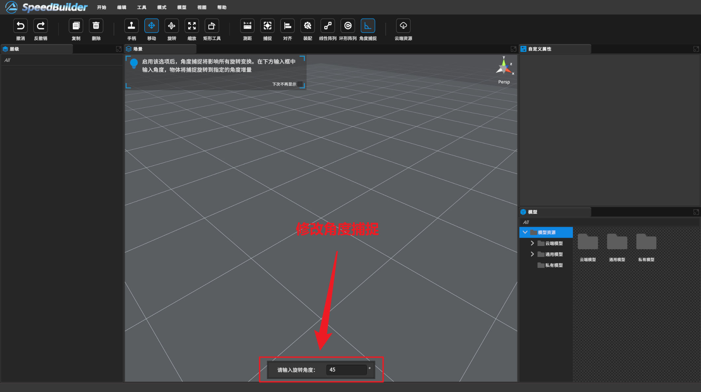
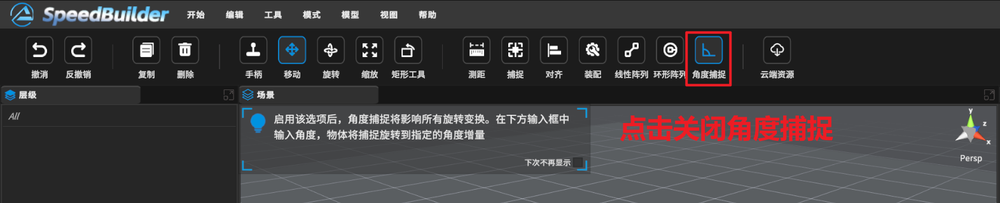
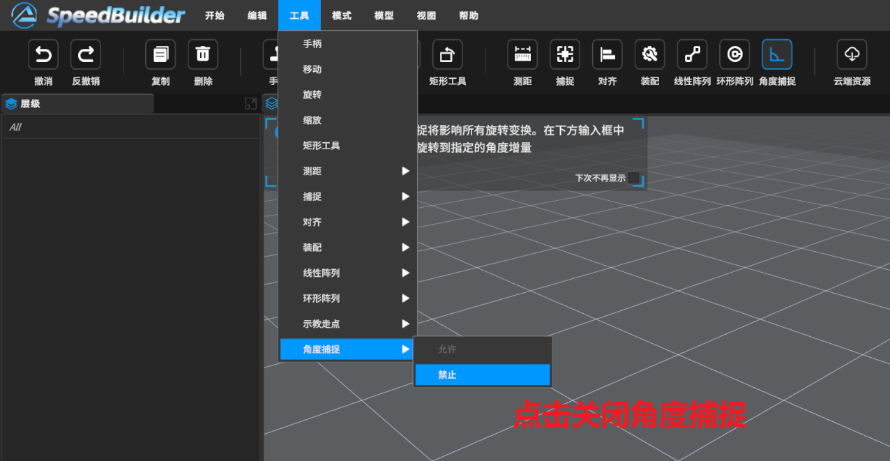

[TOC]

# 0 功能描述
角度捕捉功能可以按照预定义的步长来精确地旋转对象。通过启用角度捕捉，可以将旋转限制在特定角度。

# 1 视频教程

<video src="https://gitlab.com/MrVBian/Introduction/-/raw/566ea6b1ebde8b89c855cdfb68a24cabb38004e8/%E8%A7%92%E5%BA%A6%E6%8D%95%E6%8D%89.mp4" style="width: 100%; height: 100%;" controls="controls"></video>

# 2 使用流程
## 2.1 开启捕捉模式（方式一）
点击工具栏->角度捕捉->进入角度捕捉模式 

## 2.2 开启捕捉模式（方式二）

点击菜单栏工具->角度捕捉->允许 

## 2.3 修改角度捕捉增量

进入模式，修改角度捕捉步长，再选择模型旋转 

## 2.4 关闭捕捉模式（方式一）
点击工具栏->角度捕捉->退出角度捕捉模式 

## 2.5 关闭捕捉模式（方式二）

点击菜单栏工具->角度捕捉->禁止 

