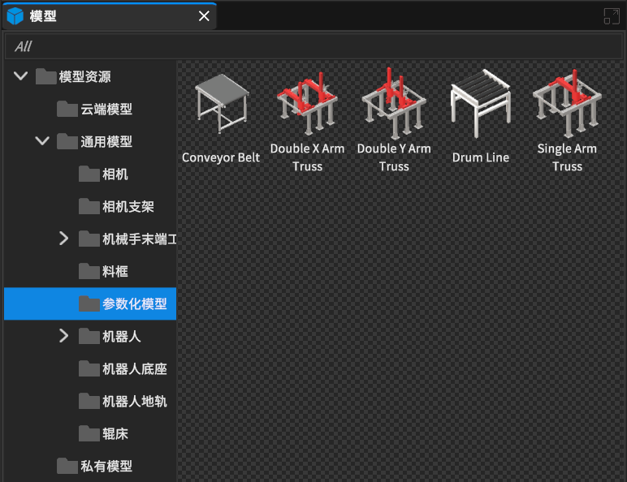
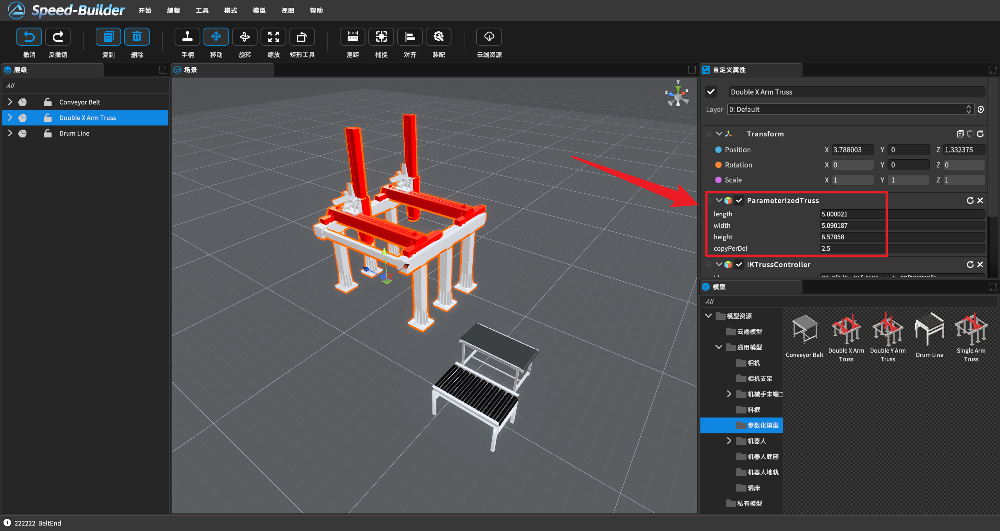

[TOC]

# 0 概述

参数化三维模型是一种使用参数来控制三维模型形状和属性的模型。通过调整参数值，可以改变模型的外形、尺寸等属性，从而实现对三维模型的形态和外观的灵活控制，以更好地拟合数据或实现特定的任务。

# 1 参数化模型

## 1.1 选取参数化模型

**模型库 -> 通用模型 -> 参数化模型**

 

## 1.2 调整参数

通过修改【自定义属性】的属性，即可完成参数化设备的调整

**注意事项：**
- **参数化桁架**支持**示教走点**
- **传送带**和**滚筒线**支持在场景视图内拖拽模型边缘拉伸
- **传送带**支持**向左和向右曲面传送带**的生成