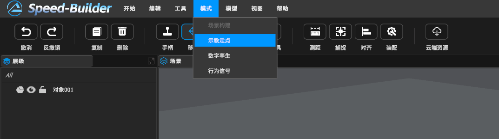
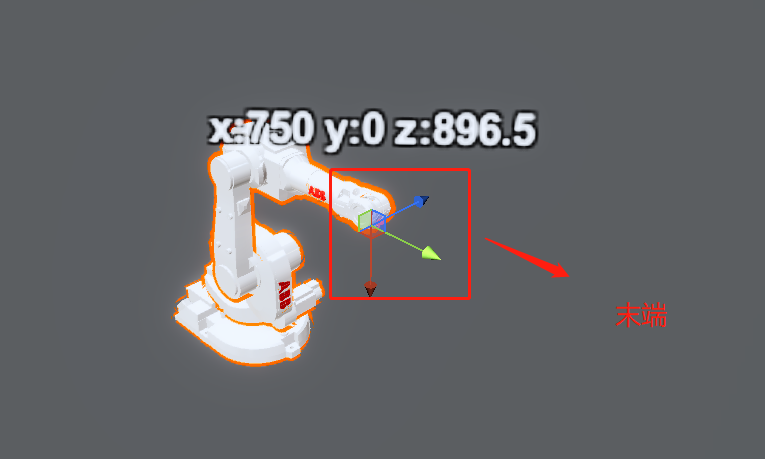
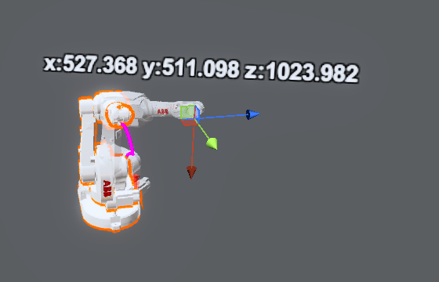
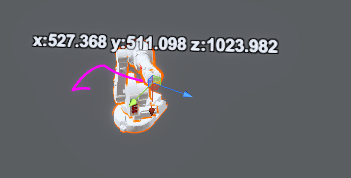
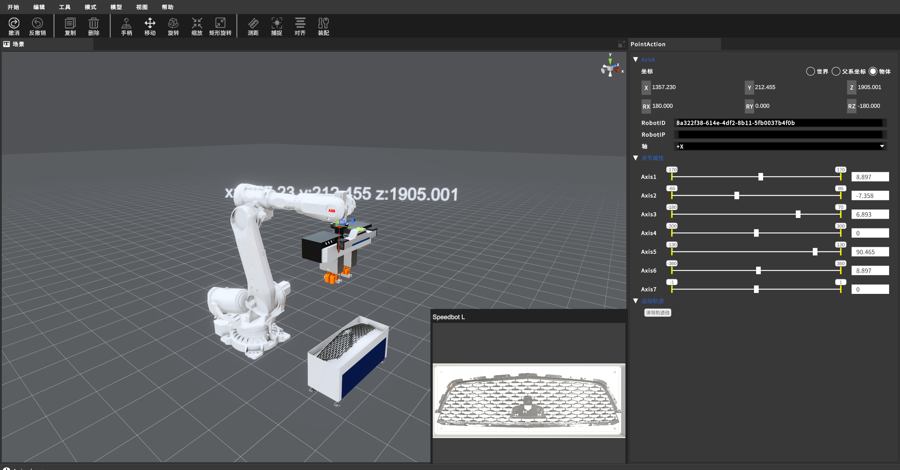

[TOC]

# 1 示教模式

按照**导航栏 -> 模式 -> 示教走点**顺序，进入示教模式

# 2 机器人示教应用方法

## 2.1 通过鼠标示教

### a 当用户使用鼠标选中机器人末端时，会弹出机器人当前的 x、y、z 坐标系数值和模型坐标系

### b 用户可以通过拖动坐标系来进行机器人的示教工作。

### c 在拖动坐标系的过程中，实际机器人不会发生变化，而是会显示一个半透明的虚拟机器人。

### d 虚拟机器人会随着鼠标拖动坐标系轴的变化而改变形状。

### e 当虚拟机器人抵达正确的位置后，用户可以按回车键，实际机器人将移动到目标位置，并与虚拟机器人重叠，并绘制出移动轨迹。

## 2.2 通过键盘示教

通过右侧的点动视图来修改参数，然后按回车键执行精确位置的调整(回车需要在渲染视图)

# 3 眼在手上相机示教

当借助**【工具 -> 装配】**功能装配相机后，机器人示教过程会实时显示相机视野

> **[注：点击此处跳转机器人属性面板里的Input和Output详细注解](https://dt.speedbot.net/web/#/48/671 "注：需要更深度的辊床功能点击此处跳转查看API")**