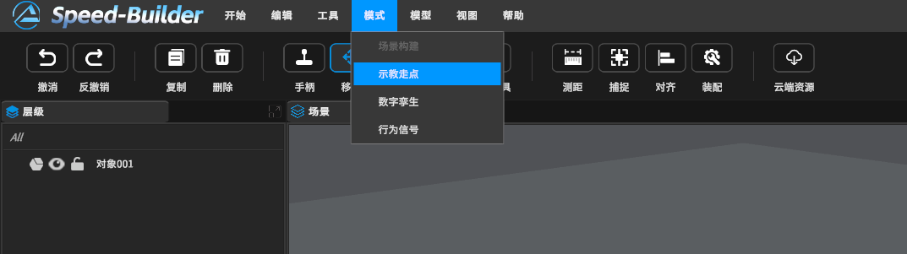
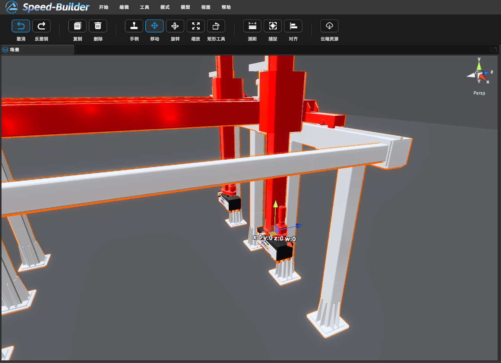
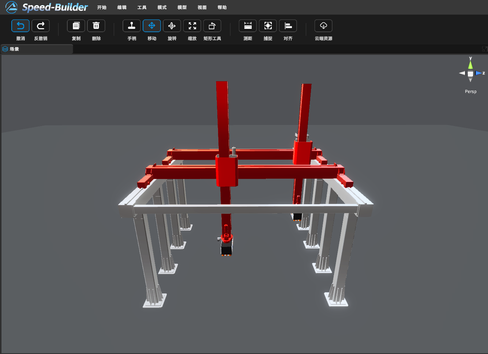
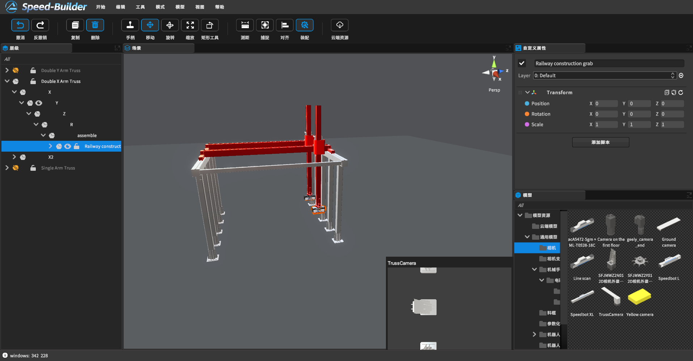

[toc]

# 0 概述

此篇幅是桁架的示教教程，如需桁架模型详细内容，点击[桁架模型](https://dt.speedbot.net/web/#/48/618 "桁架模型")跳转

# 1 示教模式

按照**导航栏 -> 模式 -> 示教走点**顺序，进入示教模式

# 2 桁架示教应用方法（X双臂为列）

## 2.1 当用户使用鼠标选中桁架其中一个抓手的时候，选中抓手弹出x、y、z 坐标系数值和模型坐标系

## 2.2 用户可以通过拖动坐标系来进行桁架的示教工作

## 2.3 确认到达位置，用户可以按回车键，桁架臂将移动到目标位置

# 3 眼在手上相机示教

当借助**【工具 -> 装配】**功能装配相机后，想看相机视野需选中想看的臂或者相机

