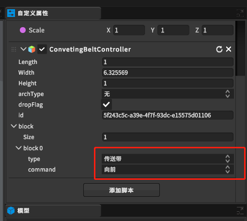

[toc]

# 0 概述

此篇幅是传送带的示教教程，如需传送带模型详细内容，点击[传送带](https://dt.speedbot.net/web/#/48/618 "桁架模型")跳转

# 1 传送带示教应用方法
## 1.1 渲染场景或场景大纲选中物体后查看属性面板驱动

> **[注：传送带ID可以自己定义但不允许重复，Id是用于http时驱动详细点击跳转](https://dt.speedbot.net/web/#/48/671 "注：需要更深度的辊床功能点击此处跳转查看API")**