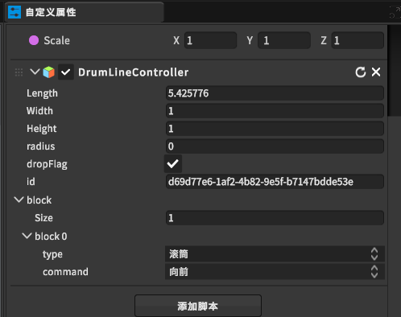

[toc]

# 0 概述

此篇幅是滚筒线的示教教程，如需滚筒线模型详细内容，点击[滚筒线](https://dt.speedbot.net/web/#/48/618 "滚筒线")跳转

# 1 滚筒线示教应用方法

**场景场景或层级视图选中物体后查看自定义属性视图**

> **[注：滚筒线ID可以自己定义但不允许重复，Id是用于http时驱动详细点击跳转](https://dt.speedbot.net/web/#/48/671 "注：需要更深度的辊床功能点击此处跳转查看API")**