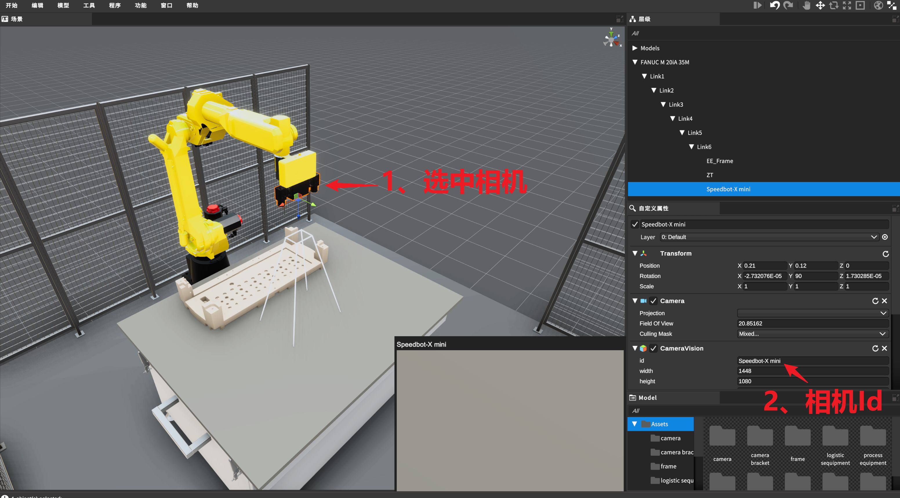
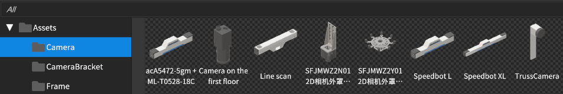
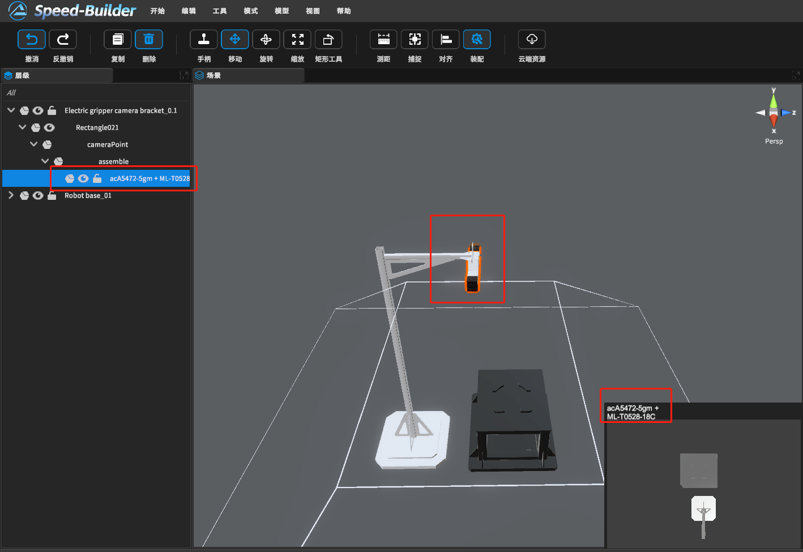
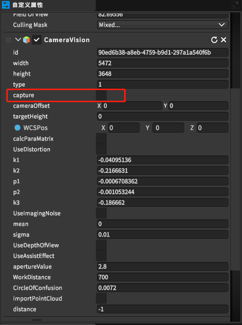

[TOC]

# 0 概述

选中相机模型或者选中装配好相机的物体，即可在【自定义属性视图->CameraVision】查看相机有关属性
其中【自定义属性视图->CameraVision】下的【id】为相机的唯一标识符

> 没有自定义属性视图？恢复默认窗口布局：菜单栏->窗口->布局->默认

# 1 相机设备

在模型库中选择选择相机分类，将需要的相机构建到场景视图中。

# 2 相机成像

渲染视图选中相机或者场景大纲选中相机

# 3 相机拍照保存

选中相机后查看属性面板，如下图，点击按钮，可进行拍照，拍照后图片存放路径
C:\Users\%username%\AppData\LocalLow\SpeedBot\SpeedBuilder\VisionImage

> **[注：需要更深度的相机功能点击此处跳转查看3.2相机接口数据解析API](https://dt.speedbot.net/web/#/48/671 "注：需要更深度的相机功能点击此处跳转查看API")**