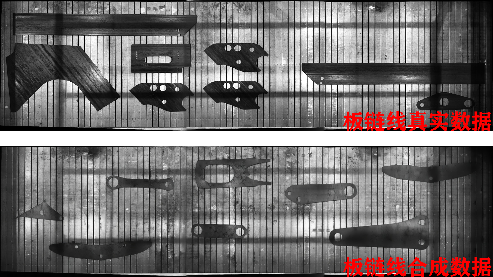
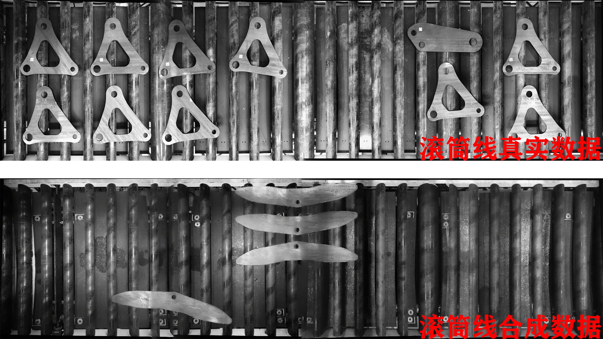
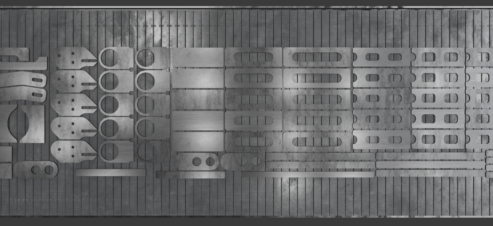
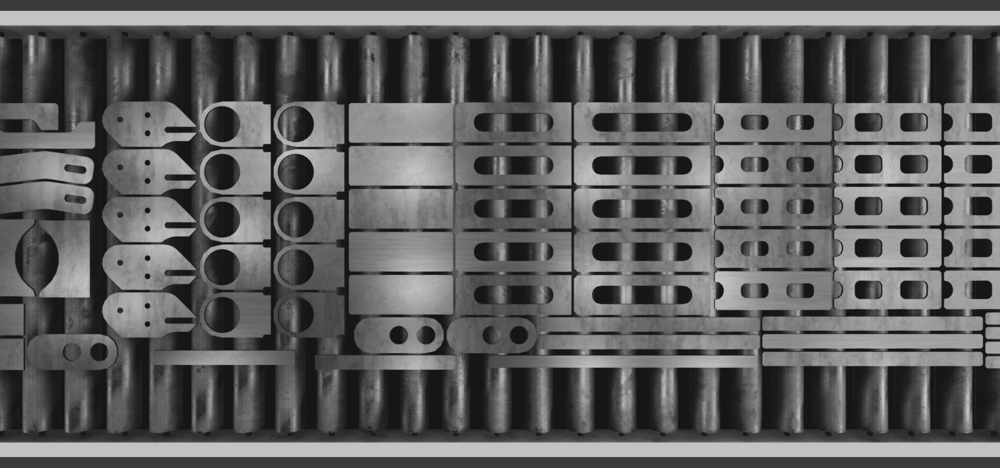
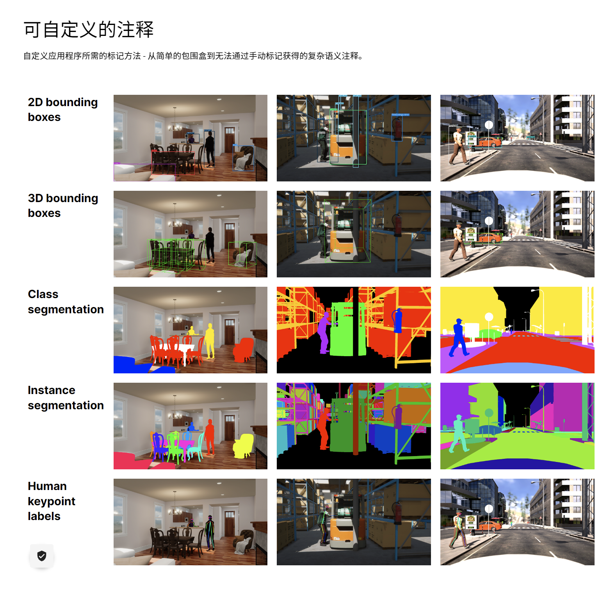
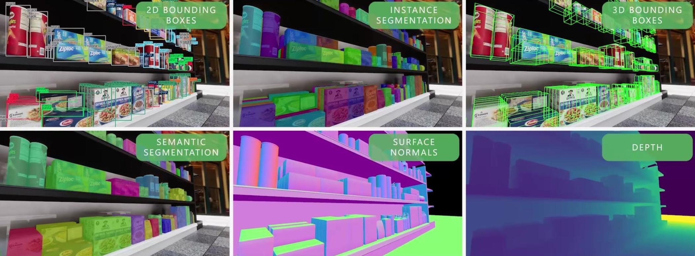

[TOC]

# 0 概述

虚拟数据增强是指使用计算机生成的虚拟数据来扩充和增强现有的数据集，以改善机器学习、计算机视觉和数据分析任务的性能和效果。通过虚拟数据增强，可以增加数据的多样性、数量和质量，从而提高模型的泛化能力和鲁棒性。

该功能暂不支持用户自定义操作，需要以下功能请联系数字孪生组。
邮箱：zwbian@speedbot.net

## 1 图像合成

使用计算机图形学技术，通过建立虚拟场景、物体模型、光照和纹理等，生成逼真的图像。这可以应用于计算机视觉任务如目标检测、图像分割、姿态估计等。

### 1.1 借助真实数据合成

### 1.2 纯虚拟视觉生成

## 2 复杂语义注释

