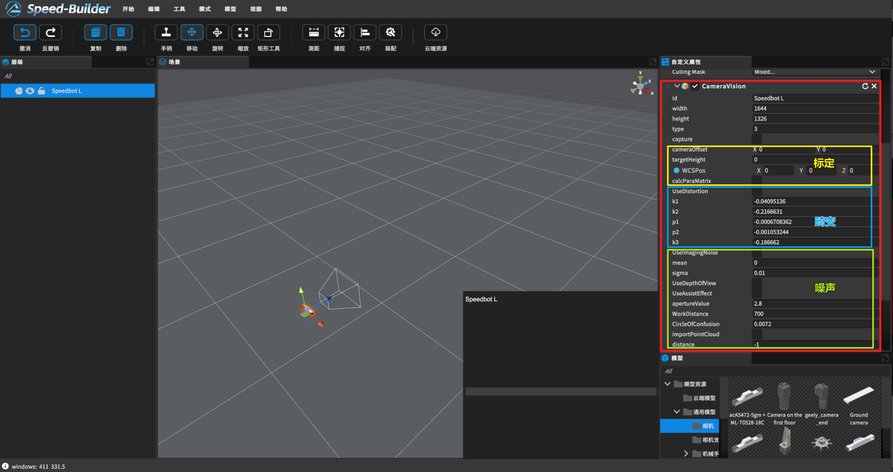
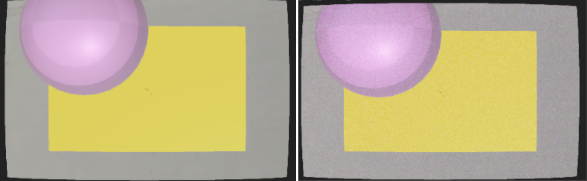

[TOC]

# 0 概述

相机标定、畸变和噪声处理在许多应用中都是必不可少的步骤。例如，在计算机视觉中，进行相机标定可以获得准确的相机参数，用于恢复三维场景的结构和姿态。畸变校正可以消除图像中的畸变，提高测量和识别的准确性。而噪声处理可以增强图像的质量、提高图像的可视性，并改善计算机视觉算法的性能。因此，相机标定、畸变和噪声处理对于实现精确的图像分析、计算机视觉任务和图像处理应用具有重要的意义。

具体参数在选中相机后，自定义属性面板中修改：

# 1 标定

相机标定：相机标定是指确定相机的内部参数和外部参数的过程。内部参数包括焦距、主点位置等，而外部参数包括相机在世界坐标系中的位置和姿态。相机标定的目的是建立相机的几何模型，以便将图像中的像素坐标映射到真实世界的三维空间坐标。相机标定对于视觉测量、三维重建和相机姿态估计等任务非常重要。

# 2 畸变

相机畸变：畸变是相机图像中的一种失真现象，由于相机透镜的形状和光学特性引起。常见的畸变包括径向畸变和切向畸变。径向畸变使得直线在图像中呈弯曲的形状，而切向畸变则使得图像的边缘部分产生拉伸或压缩。畸变会影响图像中物体的几何形状和尺寸，对于精确测量和计算机视觉算法的准确性具有负面影响。因此，通过进行相机畸变校正，可以恢复图像中物体的真实形状和尺寸。

opencv 四参数（k1 k2 p1 p2）畸变、五参数(k1 k2 k3 p1 p2)畸变模型

# 3 噪声

噪声：噪声是相机图像中的随机干扰，由于图像传感器和信号处理过程中的各种因素引起。常见的噪声类型包括高斯噪声、椒盐噪声、量化噪声等。噪声会模糊图像的细节、降低图像的信噪比和对比度，并对计算机视觉算法和图像处理任务产生负面影响。因此，噪声的建模、分析和去除是图像处理和计算机视觉中的重要问题之一。

实现类opencv addGaussianNoise()函数，仿真图像噪声，其中包含mean（噪声随机均值）和sigma（噪声标准差/强度）

