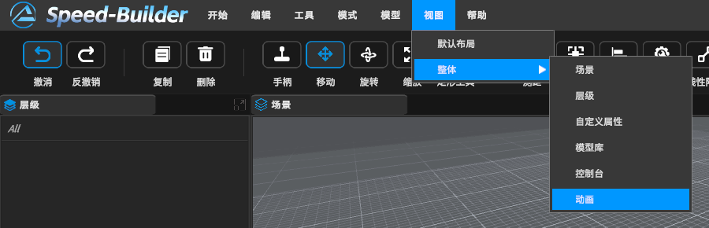
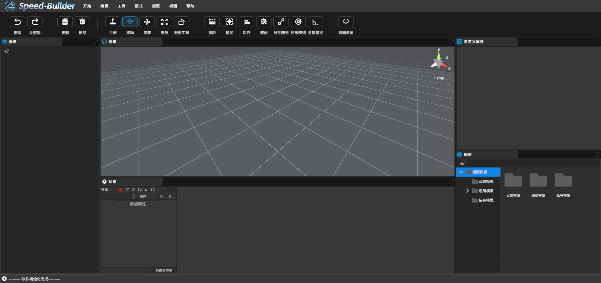
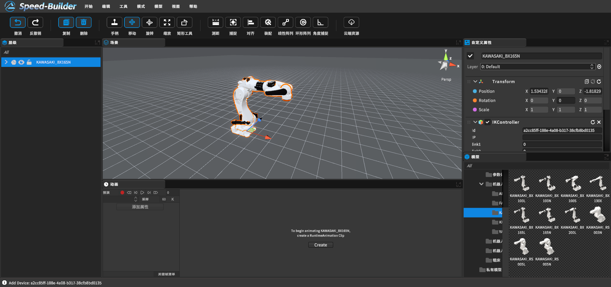
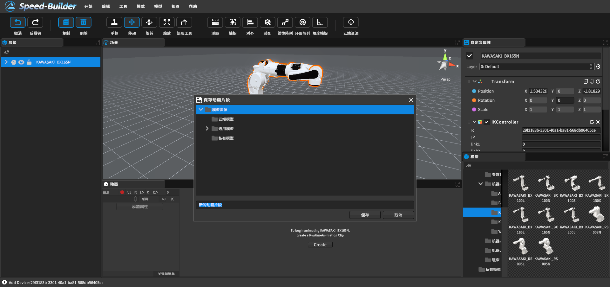
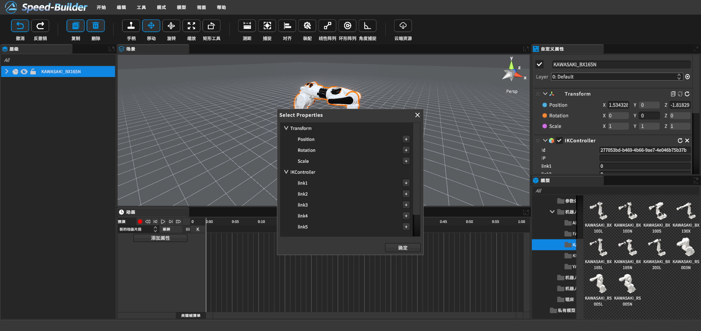
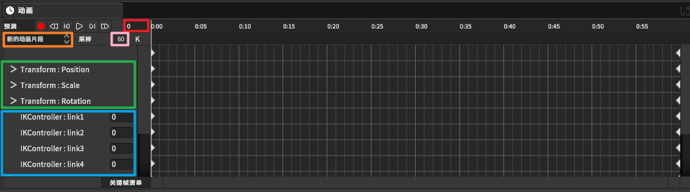
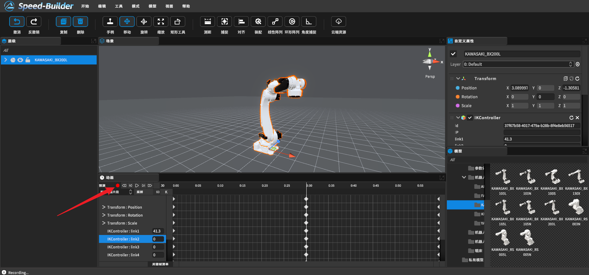
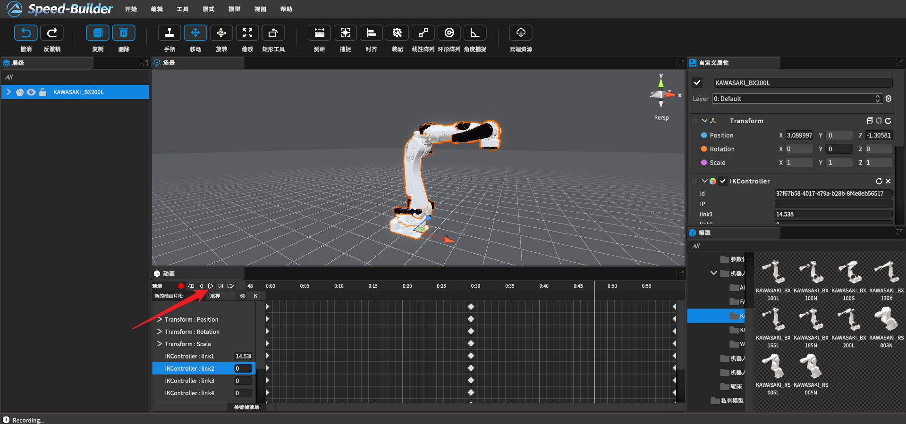
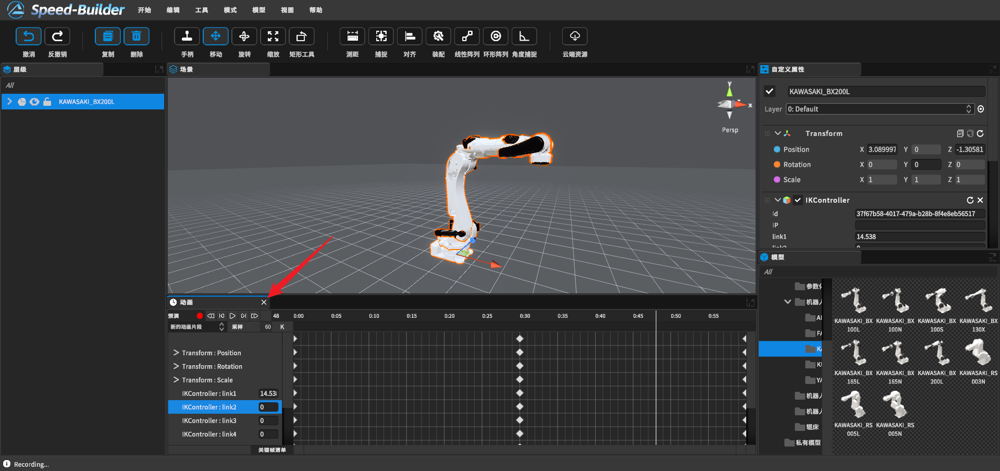

[TOC]

# 0 概述

关键帧动画，就是给需要动画效果的属性，准备一组与时间相关的值，这些值都是在动画序列中比较关键的帧中提取出来的，而其他时间帧中的值，可以用这些关键值，采用特定的插值方法计算得到，从而达到比较流畅的动画效果

# 1 使用流程

## 1.1 开启动画制作窗口

点击菜单栏视图->整体->动画

## 1.2 使用方式

a. 开启动画窗口后，将窗口吸附到方便操作的位置

b. 选中需要制作动画的模型，点击Create来创建一个属于这个模型的动画片段

c. 点击Create后，会出现一个保存动画片段的窗口，这是用户需要先将动画片段进行重新命名后保存到选中的本地文件夹中

d. 点击添加属性，我们就可以对物体的位置，旋转，缩放属性进行关键帧操作，并且如果模型有子对象，我们还可以将需要运动的子对象也添加到属性栏中，这些子对象可以进行旋转属性进行关键帧操作

e. 确定属性后，红色框为当前时间轴指针所在的关键帧；黄色框为当前动画片段名；粉色款为录制帧率，默认为60帧；绿色框为父对象的属性；蓝色框为子对象属性

f. 点击录制红点开始录制，开始录制后，轴指针所在的关键帧就会被记录下来

g. 点击播放按钮可以预览动画

## 1.3 关闭动画制作窗口

点击×关闭动画控制面板，结束动画制作功能

