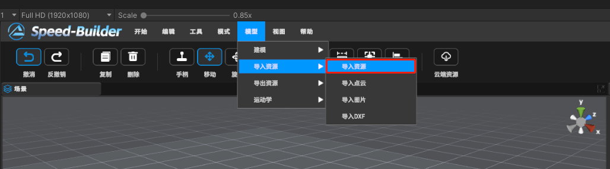
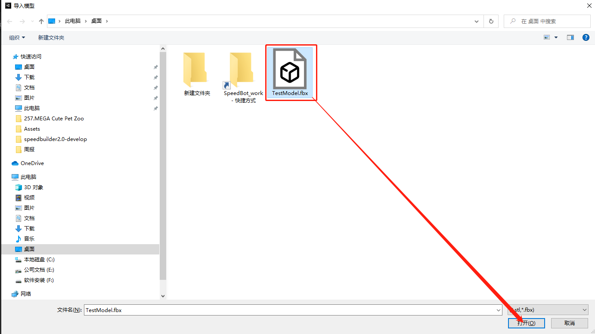
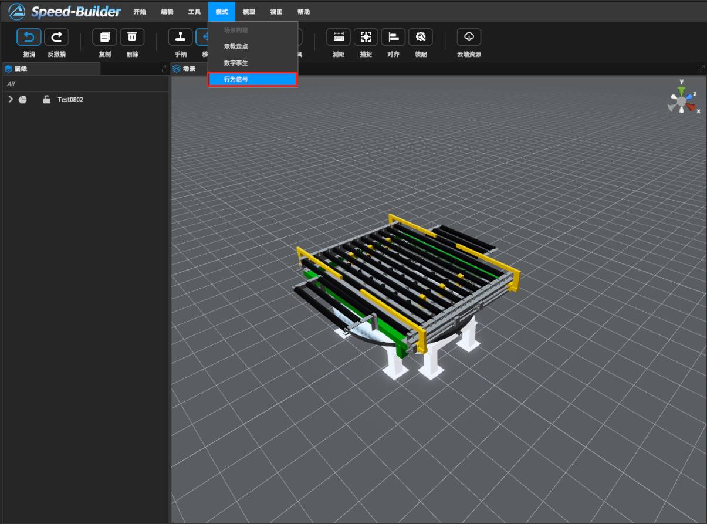
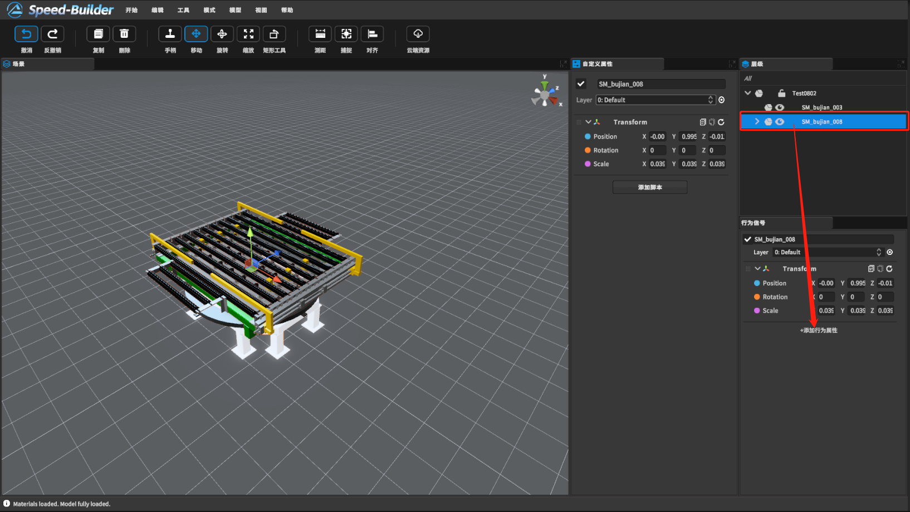
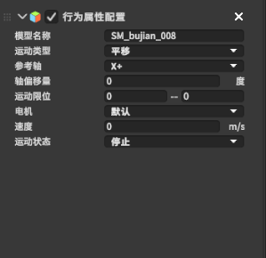
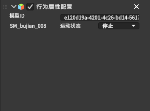
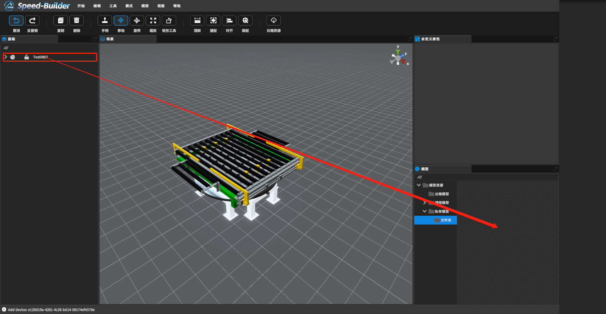

[TOC]

# 0 概述

对用户导入的非标模型进行运动学配置。当用户想要对自己私有的模型进行运动学配置时，在导入模型后，选择行为配置模式，在行为配置模式下，对该私有模型的子模型运动类型等进行配置，配置完成后，即可通过HTTP接口对该模型进行运动控制

# 1 视频教程

<video src="https://gitlab.com/MrVBian/Introduction/-/raw/master/%E8%A1%8C%E4%B8%BA%E5%B1%9E%E6%80%A7%E9%85%8D%E7%BD%AE%E5%85%A8%E6%B5%81%E7%A8%8B.mp4" style="width: 100%; height: 100%;" controls="controls"></video>

# 2 使用流程
## 2.1 用户导入自定义模型

首先用户在导航栏中依次选择“模型->导入资源->导入资源”；

然后选择相应的fbx模型文件进行导入；

## 2.2 行为配置

模型导入后，选中需要配置行为属性的模型，然后在导航栏中依次选择 “模式->行为配置”；

打开行为配置模式后，选择需要添加行为的子模型，然后在行为配置窗口中点击“添加行为配置”按钮；

用户根据模型的运动属性，在行为配置窗口中进行配置，行为配置窗口参数如下图：

- 模型名称：标识该模型的名称。
- 运动类型：模型的运动形式，包括平移、旋转、平移往复、旋转往复、被动平移（应用于传送带滚床等类型模型的运动形式）。
- 参考轴：表示运动沿着哪个参考轴的方向进行移动。
- 偏移量：表示参考轴的偏移量。例如“x+”轴偏移量45，表示当前参考轴方向为“x+”轴顺时针旋转45度。
- 运动约束：运动的限位，表示模型从起始位置到结束位置的距离，通过改变模型的Transform值或拖拽选择好模型的起始运动和结束运动的位置，计算运动范围进行填写。
- 电机：表示是否具有电机。有电机表示具有速度，根据速度进行运动，无电机表示需要填入目标位置的值。
- 速度：有电机时，设置运动速度
- 运动状态：包含开始、停止、复位、反向四个状态

配置过属性之后，可以在模型的根部进行统一管理：

所有的行为属性配置完成后，退出行为配置模式，选择场景构建模式。

## 2.3 用户导入模型生成软件内部模型

进入场景构建模式，在“模型”窗口中，添加文件夹用来存储生成的内部模型，新建完成后，选择层级窗口中配置行为属性的模型，拖拽至新建的文件夹中，在弹窗中选择确认即可，新建的内部模型存储在本地了而且已经包含运动属性。

## 2.4 HTTP接口

查看运动学HTTP接口：[详见2.2自定义设备](https://dt.speedbot.net/web/#/48/671 "详见2.2自定义设备")